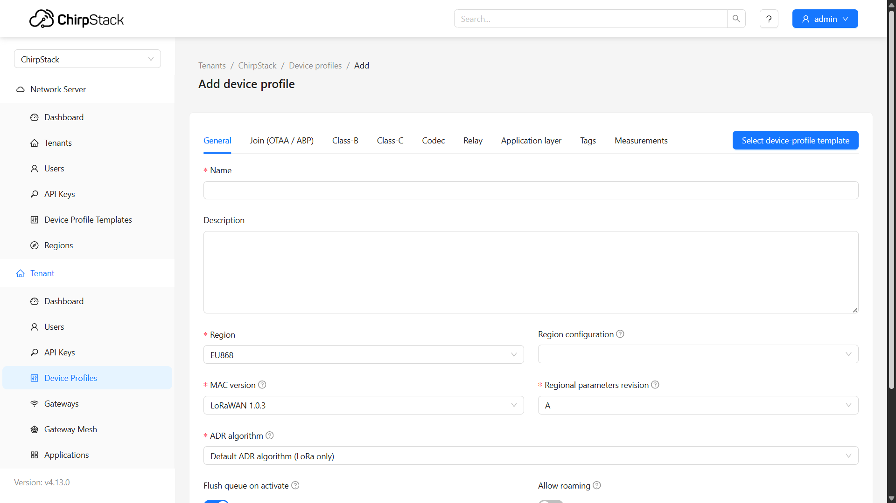
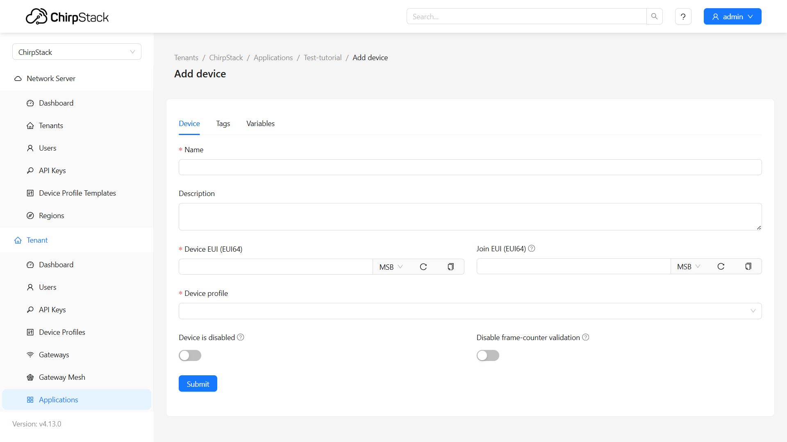
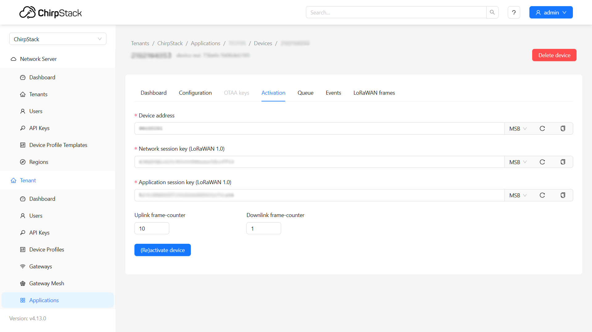
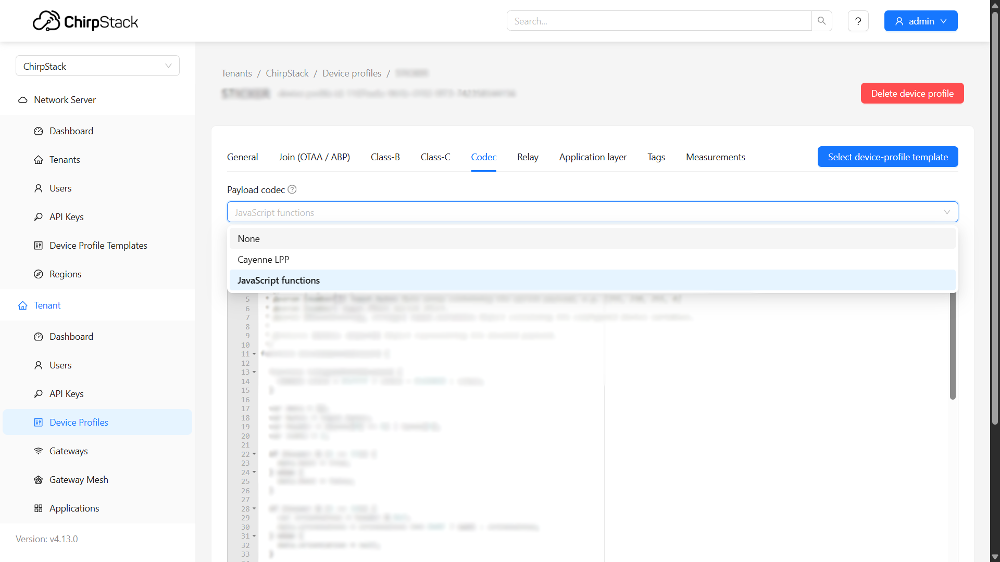

import Image from '@theme/IdealImage';

# ChirpStack v4 Configuration

This tutorial walks you through the process of adding gateways, creating device profiles, registering devices, decoding payloads, and setting up integrations in ChirpStack v4.  

---

## 1. Gateways  

The first step is to add your gateways into ChirpStack.  
From the left navigation menu, under tenant, select **Gateways** and then click the **Add Gateway** button in the top right.  

A form will appear where you can enter gateway information such as:  
- **Name**  
- **Gateway ID**  
- **Stats Interval**  

Once completed, click **Submit**.  

:::info
If you are using our **Ember gateway**, the **Gateway ID** can be found through **[MikroTik software](/ember/mikrotik-gateway-configuration#c-link-lora-device-to-the-new-server)**.  
:::

---

## 2. Device Profiles  

After adding gateways, the next step is to create device profiles in ChirpStack.  

1. In the navigation bar, click **Device Profiles**.  
2. Click **Add Device Profile** (top right).  

3. Enter the required information such as:  
   - Name  
   - Region  
   - MAC Version  
   - ADR Algorithm  
   - Expected Uplink Interval  

---

### Example for HARDWARIO devices

If you are using Chester or Sticker as an end device, you can find examples of device profile configurations in the following links:

| **Device** | **Documentation Link** |
|-------------|-------------------------|
| **CHESTER** | https://docs.hardwario.com/chester/platform-connectivity/lorawan-radio#chirpstack-configuration |
| **STICKER** | https://docs.hardwario.com/sticker/getting-started#chirpstack-v4-configuration-for-sticker |

---

## 3. Applications – Adding Devices  

Next, create an application:  

1. In the navigation bar, select **Applications** (bottom of the menu).  

2. Create a new application and open it.  

3. Add devices by providing details such as:  
   - **Name**  
   - **Device EUI**  
   - **Device Profile**  

Click **Submit**.  

After creating the device, go to the **Activation** tab and enter:  
- **Device Address**  
- **Network Session Key**  
- **Application Session Key**  

Finally, click **(Re)activate Device**.  

---

## 4. Codec  

LoRaWAN data is transmitted in a compressed format and needs to be decoded.  

1. Go to **Device Profiles → Codec**.  
2. Select **Payload Codec** and paste your decoding code.  

For **STICKER**, choose **JavaScript functions** as the payload codec, then click **Submit**.  

#### Viewing Decoded Data  

1. Navigate to **Applications → Events**.  
2. Select **Up** to view uplink messages.  
3. You will now see **decoded data**.  

#### Example of Codec (STICKER)

import EditCodeBlock from './edit-code-block.js';

<EditCodeBlock initialText={`
/**
 * Decode uplink function
 * 
 * @param {object} input
 * @param {number[]} input.bytes Byte array containing the uplink payload, e.g. [255, 230, 255, 0]
 * @param {number} input.fPort Uplink fPort.
 * @param {Record<string, string>} input.variables Object containing the configured device variables.
 * 
 * @returns {{data: object}} Object representing the decoded payload.
 */
function decodeUplink(input) {

  function toSignedInt16(value) {
    return value > 0x7fff ? value - 0x10000 : value;
  }

  var data = {};
  var bytes = input.bytes;
  var header = (bytes[0] << 8) | bytes[1];
  var index = 2;

  if (header & (1 << 15)) {
    data.boot = true;
  } else {
    data.boot = false;
  }

  if (header & (1 << 14)) {
    var orientation = header & 0xf;
    data.orientation = orientation === 0x0f ? null : orientation;
  } else {
    data.orientation = null;
  }

  if (header & (1 << 13)) {
    var voltage = bytes[index++];
    data.voltage = voltage === 0xff ? null : voltage / 50;
  } else {
    data.voltage = null;
  }

  if (header & (1 << 12)) {
    var temperature = (bytes[index++] << 8) | bytes[index++];
    data.temperature = temperature === 0x7fff ? null : toSignedInt16(temperature) / 100;
  } else {
    data.temperature = null;
  }

  if (header & (1 << 11)) {
    var humidity = bytes[index++];
    data.humidity = humidity === 0xff ? null : humidity / 2;
  } else {
    data.humidity = null;
  }

  if (header & (1 << 10)) {
    var illuminance = (bytes[index++] << 8) | bytes[index++];
    data.illuminance = illuminance === 0xffff ? null : illuminance * 2;
  } else {
    data.illuminance = null;
  }

  if (header & (1 << 9)) {
    var ext_temperature_1 = (bytes[index++] << 8) | bytes[index++];
    data.ext_temperature_1 = ext_temperature_1 === 0x7fff ? null : toSignedInt16(ext_temperature_1) / 100;
  } else {
    data.ext_temperature_1 = null;
  }

  if (header & (1 << 8)) {
    var ext_temperature_2 = (bytes[index++] << 8) | bytes[index++];
    data.ext_temperature_2 = ext_temperature_2 === 0x7fff ? null : toSignedInt16(ext_temperature_2) / 100;
  } else {
    data.ext_temperature_2 = null;
  }

  if (header & (1 << 7)) {
    var motion_count = (bytes[index++] << 24) | (bytes[index++] << 16) | (bytes[index++] << 8) |
      bytes[index++];
    data.motion_count = motion_count === 0xffffffff ? null : motion_count;
  } else {
    data.motion_count = null;
  }

  if (header & (1 << 6)) {
    var altitude = (bytes[index++] << 8) | bytes[index++];
    data.altitude = altitude === 0x7fff ? null : toSignedInt16(altitude) / 10;
  }
  else {
    data.altitude = null;
  }

  if (header & (1 << 5)) {
    var pressure = (bytes[index++] << 24) | (bytes[index++] << 16) | (bytes[index++] << 8) |
      bytes[index++];
    data.pressure = pressure === 0xffffffff ? null : pressure;
  } else {
    data.pressure = null;
  }

  return {
    data: data,
    warnings: [],
    errors: []
  };
}
/**
 * Encode downlink function.
 * 
 * @param {object} input
 * @param {object} input.data Object representing the payload that must be encoded.
 * @param {Record<string, string>} input.variables Object containing the configured device variables.
 * 
 * @returns {{bytes: number[]}} Byte array containing the downlink payload.
 */
function encodeDownlink(input) {
  return {
    // bytes: [225, 230, 255, 0]
  };
}

`} />

---

## 5. Integrations  

Finally, you can set up integrations.  
Within your **Application**, go to the **Integrations** tab and choose the integration method you need, for example:  
- Visualization platforms  
- External services  
- Custom APIs  

---

:::tip
If you need further assistance or a visual demonstration of the process described in this guide, consult the [Video Guide](https://docs.hardwario.com/apps/videos-apps/chirpstack-configuration).
:::

---

## Ember Gateways – MikroTik Software  

If you are using our **EMBER** as the gateway, all of its configuration must be done directly in the **MikroTik system**.
Once configured, the gateway should become visible and ready to connect with the ChirpStack system.

Here is the link to the **step-by-step guide** for ****configuring the gateway via MikroTik**:
https://docs.hardwario.com/ember/mikrotik-gateway-update

Here is the link to the **step-by-step guide** for **updating the gateway via MikroTik**:
https://docs.hardwario.com/ember/mikrotik-gateway-configuration