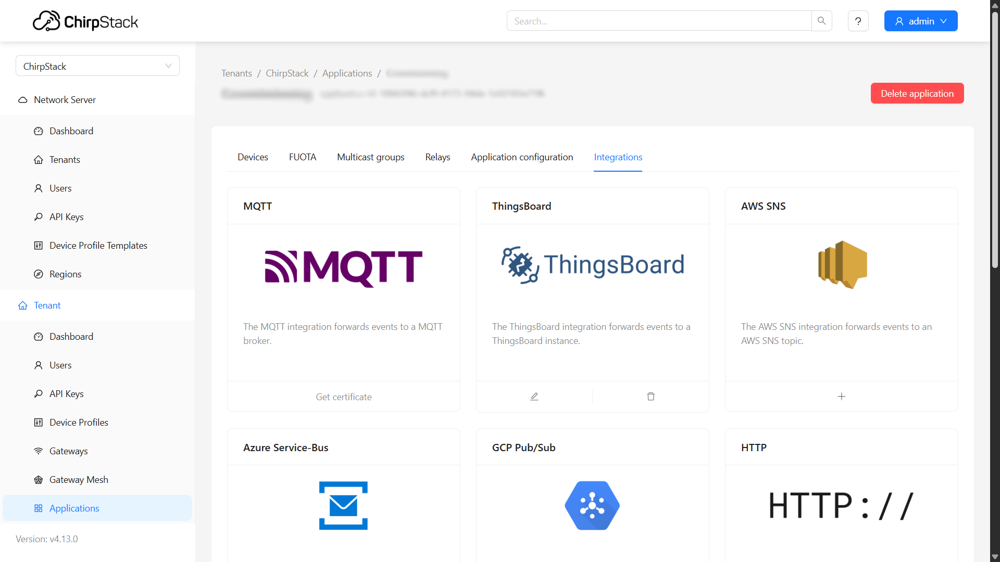

import Image from '@theme/IdealImage';

# Chirpstack v4 Integrations 

This tutorial shows you where to access the integration endpoints within your ChirpStack application so you can route device data to external platforms.

---

Within your **Application**, go to the **Integrations** tab and choose the integration method you need, for example:  
- Visualization platforms  
- External services  
- Custom APIs  

---

