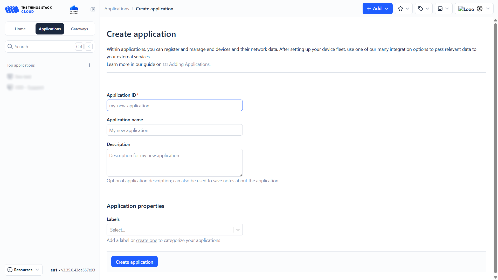
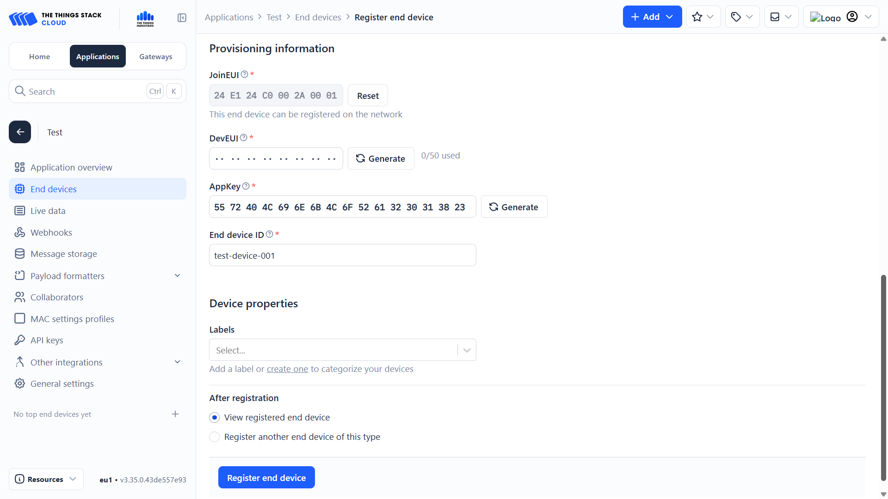
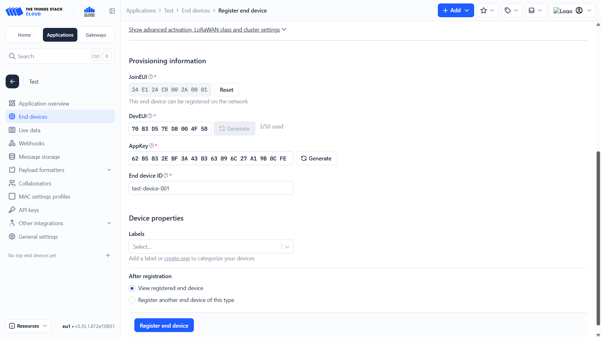

import Image from '@theme/IdealImage';

# End Devices Configuration Guide

This tutorial guides you through the process of creating device profiles and adding end devices in The Things Stack.

---

## Creating an Application

1. On the **Home** tab, click **Create application**.  
   - If you are on a different tab, click the blue **+ Add** button in the top right and choose **Add application**.

2. You will be taken to the application creation page. Fill in the following fields:
   - **Application ID (app id)**
   - **Application Name (app name)**
   - (Optional) **Description**
   - (Optional) **Label** — It is recommended to use the same label for the application, end devices, and gateways.

3. Click the blue **Create application** button.

---

## Registering End Devices

In The Things Stack, end devices can be registered in two ways:
- Using a predefined device from the LoRaWAN Device Repository
- Manually, by entering all device parameters

---

### Predefined Devices

1. Inside the application, click the blue **+ Register end device** button.  
   - Alternatively, click **+ Add** and choose **Register end device in an application**.

2. Select **Select the end device in the LoRaWAN Device Repository**.

3. Search for the manufacturer and model of your device and select it.  
   - Using a predefined device automatically fills in most technical parameters.

:::info
This method is recommended whenever the device is available in the LoRaWAN Device Repository, as it minimizes configuration errors.
:::

4. Fill in the required identifiers:
   - **JoinEUI (AppEUI)**  
     - Available in our documentation or in the manufacturer’s documents.
   - **DevEUI**  
     - Unique for each device, printed on the device itself.
   - **AppKey**  
     - Available in our documentation or the manufacturer’s documents.
   - **Device ID**  
     - Your chosen identifier for the device.

5. (Optional) Add the same **label** you used for the application and gateway.

6. Click the blue **Register end device** button.

---

### Manual Configuration

This method is used when the device is **not available** in the LoRaWAN Device Repository or when **full manual control** over device parameters is required.

1. Inside the application, click **+ Register end device**.

2. Select **Enter end device specifics manually**.

---

#### End Device Type

3. Configure the basic LoRaWAN parameters:

   - **Frequency plan**  
     - Select the regional frequency plan (e.g. **Europe 863–870 MHz**).
   - **LoRaWAN version**  
     - Select the LoRaWAN specification supported by the device  
       (commonly **LoRaWAN Specification 1.0.4**).
   - **Regional Parameters version**  
     - Select the matching regional parameters version  
       (e.g. **RP002 Regional Parameters 1.0.4**).

---

#### Provisioning Information

4. Enter the **JoinEUI (AppEUI)** of the device.

5. Click **Confirm**.  

---

#### Device Identifiers

6. Fill in the remaining required identifiers:

   - **DevEUI**  
     - Unique identifier of the device (printed on the device or packaging).
   - **AppKey**  
     - Application key provided by the manufacturer.
   - **Device ID**  
     - Your chosen identifier for the device within the application.

7. (Optional) Add a **label** matching the application and gateway.

8. Click the blue **Register end device** button.

---

## End Device Ready

Your end device is now registered and ready to communicate with The Things Stack.

## Video Tutorial

:::tip
If you need **further assistance** or a visual walkthrough, consult the  
[**Video Guide**](https://docs.hardwario.com/apps/videos-apps/tts-end-devices).
:::
