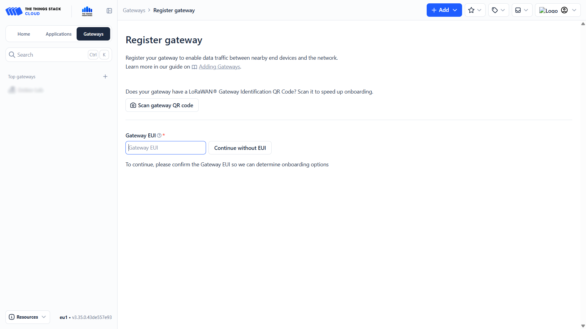

import Image from '@theme/IdealImage';

# Gateways Configuration Guide

This tutorial guides you through the process of adding and configuring a gateways in The Things Stack.

---

## Creating a New Gateway

1. On the **Home** tab, click **Register gateway**.  
   - If you are on a different tab, click the blue **+ Add** button in the top right and choose **Add new gateway**.

2. You will be redirected to the gateway registration page.
   - TTS will first request the **Gateway EUI**.
   - You can find the Gateway EUI printed on your physical gateway.

3. After entering the Gateway EUI, fill in the following fields:
   - **Gateway ID**
   - **Gateway Name**
   - **Frequency Plan** → select **Europe 868.1 MHz**
   - (Optional) **Label**

4. Check the box **Require authenticated connection**.

5. Enable the following:
   - **Generate API key for CUPS**
   - **Generate API key for LNS**

6. Click **Register gateway**.

---

## Downloading API Keys

A window titled **Download gateway API keys** will appear.

- Download both API keys (CUPS & LNS).
- Store them in a secure and reliable location on your computer.

:::info
  **These keys are required when configuring the gateway interfaces** (see the documentation for your specific gateway under the *LNS & CUPS* section).
:::

After downloading:
- The window will close automatically, or
- Click **I have downloaded the keys**.

---

## Gateway Ready

Your gateway is now ready to use, and you can begin connecting individual end devices.

:::tip
If you need **further assistance** or a visual demonstration of the process described in this guide, consult the [**Video Guide**](https://docs.hardwario.com/apps/videos-apps/tts-gateways).
:::

## Removing Gateway

When deleting a gateway in The Things Stack, its **Gateway ID is not fully removed from the server**. Even though the gateway disappears from the console, the ID remains reserved in the backend.  
This means it is **not possible to create a new gateway with the same ID** unless the ID is manually released.

Only a **system administrator** has the rights to free or purge the gateway ID from the server.  
For regular users, the only available solution is to **create the gateway again using a new, different ID**.

