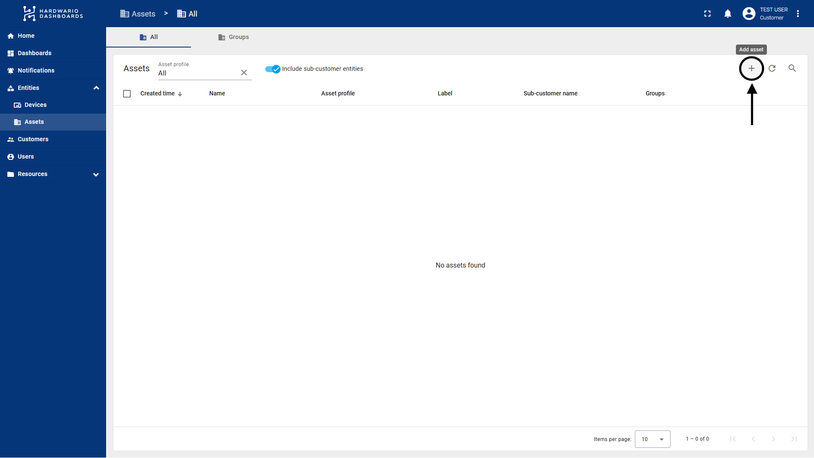
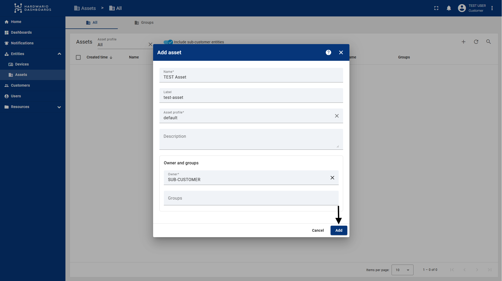
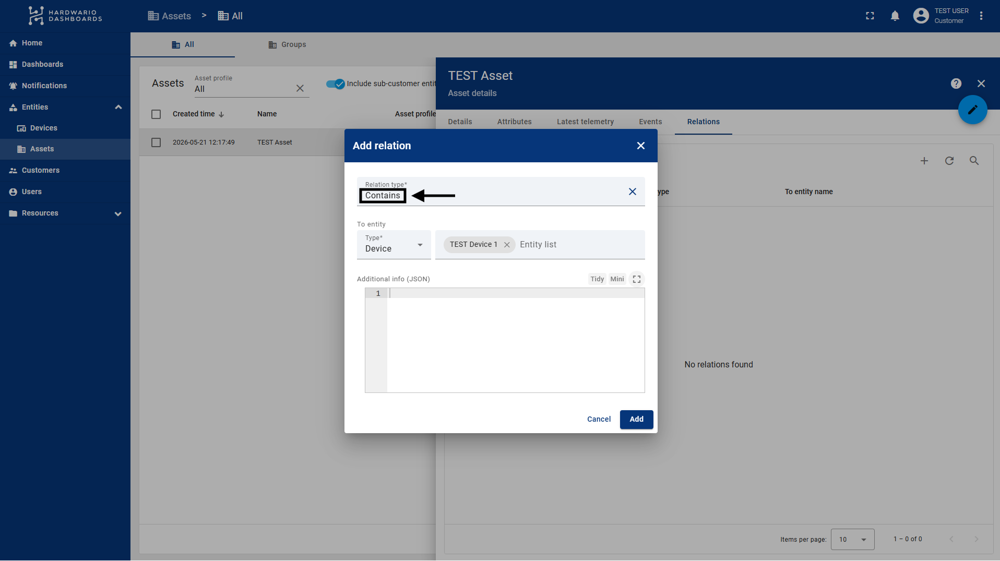

import Image from '@theme/IdealImage';

# Assets

Assets are logical containers that represent real-world objects — buildings, floors, zones, or equipment — in your ThingsBoard environment. Unlike devices (which represent physical hardware sending data), assets are used to organize your project's overall structure and define how data and access rights are distributed across your customers.

---

## What Are Assets and What Are They Good For?

**Main benefits of using Assets:**
- **Logical hierarchy:** You can create a structure such as *Region → City → Street → Building*.
- **Scalability:** Instead of managing hundreds of individual sensors, you manage a single Asset (e.g., "Hall A") to which those sensors are assigned.
- **Access control:** Access rights for customers can be defined at the Asset level. If you share an Asset with a customer, they can automatically gain access to the devices that belong to it (through relations).
- **Dashboard abstraction:** Dashboards can be dynamic. A single dashboard can adapt its data based on which Asset the user selects.

---

## How to Create an Asset

### Step 1: Log In

Log in to ThingsBoard as a *Customer Administrator*.

### Step 2: Navigate to Assets

In the left navigation menu, navigate to **Entities** → **Assets**.

### Step 3: Add a New Asset

Click the **"+"** icon in the top right corner and select **Add new asset**.

### Step 4: Fill In the Details

Enter the asset information:
- **Name:** The name of the asset (e.g., *Barrandov Complex*).
- **Asset Profile:** Select a profile (the default is *default*). Profiles determine the rules for data processing.
- **Label:** An optional label for better organization and filtering.

### Step 5: Save

Click **Add**. The Asset is now created.

### Step 6: Add Relations (Optional)

In the **Relations** tab, you can create relations to other devices or parent Assets (e.g., creating a "Contains" relation pointing down to your sensors).

---

## Hierarchy and Sharing with Sub-customers

Assets are a key element for **Multi-tenancy** (managing multiple customers within a single environment).

### Assigning Devices

You can "insert" various devices into Assets using relations. For example, an Asset named "Building A" might contain 10 specific sensors (Devices) installed inside it.

### Sharing with Customers

If you have a sub-customer (Customer), you can share an entire Asset with them. ThingsBoard will then automatically ensure that the users under that customer can see this Asset and everything connected to it.

### Dynamic Dashboard Views

Thanks to this structure, you can create **one universal dashboard** for all your customers:
- **Customer A** logs in and, in the source selection (e.g., the *Entities Hierarchy* widget), sees only their own Assets and the devices assigned to them.
- **Customer B** logs into the exact same dashboard but sees completely different data (only their own).
- **Parent Customer / Tenant Admin**, who has access to everything, sees the complete tree of all customers and all assets in the same dashboard, which is ideal for a global overview and maintenance.
