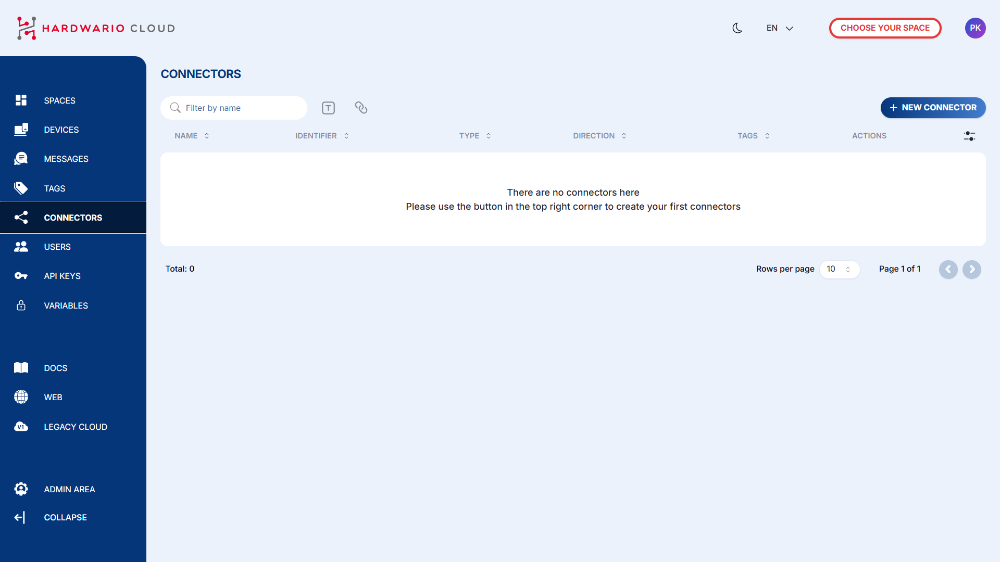
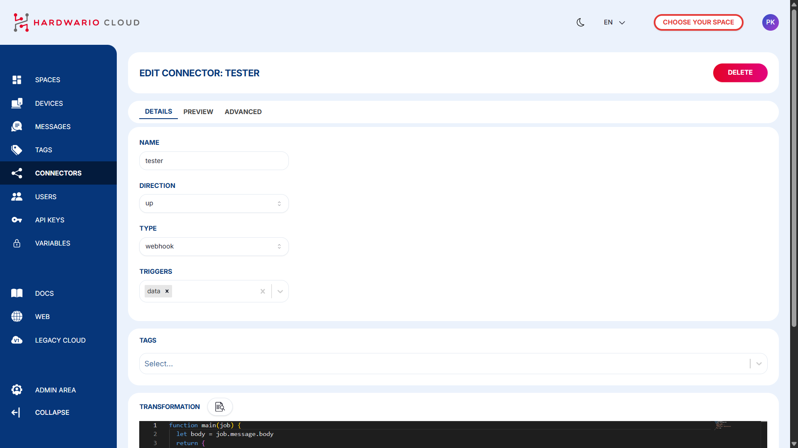
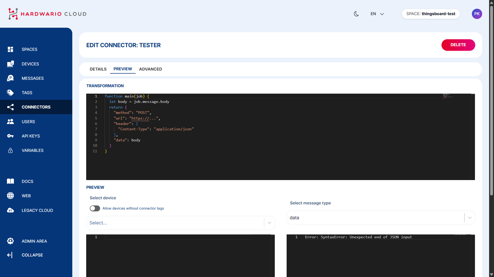
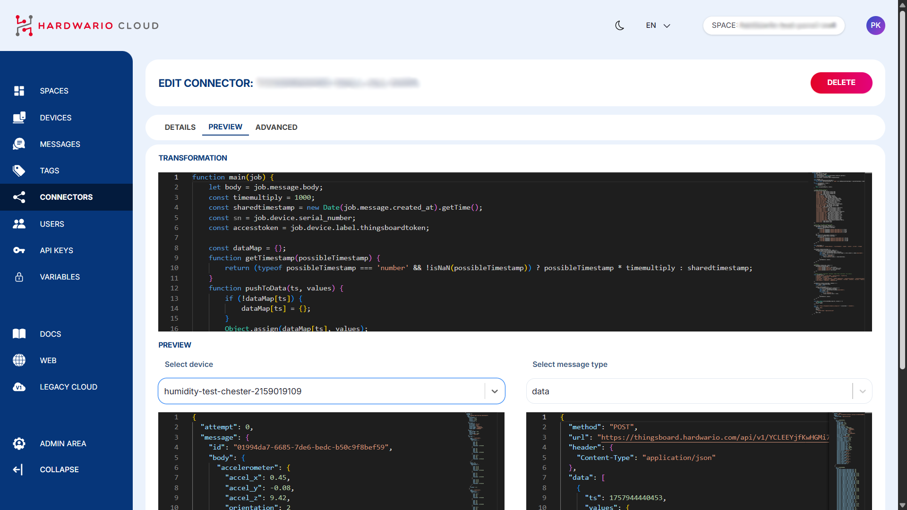
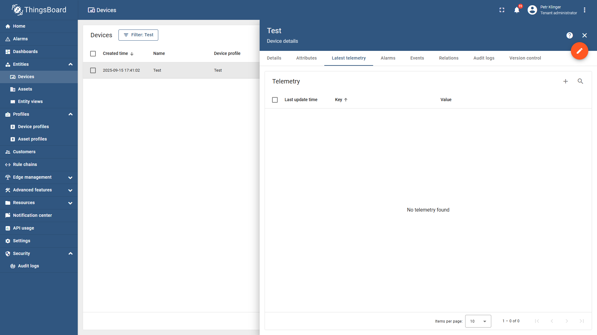

import Image from '@theme/IdealImage';
import EditCodeBlock from './edit-code-block.js';

### Step-by-Step Instructions

1. #### **Create a New Connector**  
   To establish communication with ThingsBoard, go to the `Connectors` section in the left-hand menu.  
   Click `+ New Connector` and configure the following:  
   • `Name` – give your connector a name  
   • `Type` – select `Webhook` for ThingsBoard integration  
   • `Trigger` – choose `Data`  
   • `Tag` – assign the tag you created earlier
   
   
   
2. #### **Transform Data for ThingsBoard Format**  
   ThingsBoard requires a specific data format. You need to adjust your device data using a **transformation code**.  
   In the connector page, scroll down to the `Transformation` section and click the magnifying glass icon 📄🔍 to open the code editor.

   
   

3. #### **Insert the Transformation Code**  
   Add the transformation logic that converts incoming data to a ThingsBoard-compatible format.

   

   **Example of transformation code here:**

<EditCodeBlock initialText={`function main(job) {
    let body = job.message.body;
    const timemultiply = 1000;
    const sharedtimestamp = new Date(job.message.created_at).getTime();
    const sn = job.device.serial_number;
    const accesstoken = job.device.label.thingsboardtoken;

    const dataMap = {};
    function getTimestamp(possibleTimestamp) {
        return (typeof possibleTimestamp === 'number' && !isNaN(possibleTimestamp)) ? possibleTimestamp * timemultiply : sharedtimestamp;
    }
    function pushToData(ts, values) {
        if (!dataMap[ts]) {
            dataMap[ts] = {};
        }
        Object.assign(dataMap[ts], values);
    }

    // Common CHESTER parameters
    pushToData(sharedtimestamp, {
        'current_load': body.system?.current_load,
        'voltage_load': body.system?.voltage_load,
        'voltage_rest': body.system?.voltage_rest,
        'uptime': body.system?.uptime,
        'message.version': body.message?.version,
        'message.sequence': body.message?.sequence,
        'message.timestamp': body.message?.timestamp,
        'attribute.vendor_name': body.attribute?.vendor_name,
        'attribute.product_name': body.attribute?.product_name,
        'attribute.hw_variant': body.attribute?.hw_variant,
        'attribute.hw_revision': body.attribute?.hw_revision,
        'attribute.fw_name': body.attribute?.fw_name,
        'attribute.fw_version': body.attribute?.fw_version,
        'attribute.serial_number': body.attribute?.serial_number,
        'backup.line_voltage': body.backup?.line_voltage,
        'backup.batt_voltage': body.backup?.batt_voltage,
        'backup.state': body.backup?.state,
        'thermometer.temperature': body.thermometer?.temperature,
        'accelerometer.accel_x': body.accelerometer?.accel_x,
        'accelerometer.accel_y': body.accelerometer?.accel_y,
        'accelerometer.accel_z': body.accelerometer?.accel_z,
        'accelerometer.orientation': body.accelerometer?.orientation,
        'network.parameter.eest': body.network?.parameter?.eest,
        'network.parameter.ecl': body.network?.parameter?.ecl,
        'network.parameter.rsrp': body.network?.parameter?.rsrp,
        'network.parameter.rsrq': body.network?.parameter?.rsrq,
        'network.parameter.snr': body.network?.parameter?.snr,
        'network.parameter.plmn': body.network?.parameter?.plmn,
        'network.parameter.cid': body.network?.parameter?.cid,
        'network.parameter.band': body.network?.parameter?.band,
        'network.parameter.earfcn': body.network?.parameter?.earfcn,
        'network.imei': body.network?.imei,
        'network.imsi': body.network?.imsi
    });

    // BLE Tags - use index instead of addr
    body.ble_tags?.forEach((tag, tagIndex) => {
        tag.humidity?.measurements.forEach(m => {
            const ts = getTimestamp(m.timestamp);
            pushToData(ts, {
                [\`ble_tags.\${tagIndex}.humidity.measurement.min\`]: m?.min,
                [\`ble_tags.\${tagIndex}.humidity.measurement.max\`]: m?.max,
                [\`ble_tags.\${tagIndex}.humidity.measurement.avg\`]: m?.avg,
                [\`ble_tags.\${tagIndex}.humidity.measurement.mdn\`]: m?.mdn
            });
        });
        tag.temperature?.measurements.forEach(m => {
            const ts = getTimestamp(m.timestamp);
            pushToData(ts, {
                [\`ble_tags.\${tagIndex}.temperature.measurement.min\`]: m?.min,
                [\`ble_tags.\${tagIndex}.temperature.measurement.max\`]: m?.max,
                [\`ble_tags.\${tagIndex}.temperature.measurement.avg\`]: m?.avg,
                [\`ble_tags.\${tagIndex}.temperature.measurement.mdn\`]: m?.mdn
            });
        });
    });

    const sensorTypes = [
        'w1_thermometers', 'analog_channels', 'rtd_thermometer', 'weight', 'counter', 'current', 'voltage'
    ];

    sensorTypes.forEach(sensorType => {
        body[sensorType]?.forEach((entry, index) => {
            entry.measurements?.forEach(measurement => {
                const ts = getTimestamp(measurement.timestamp);
                const prefix = \`\${sensorType}.\${entry.serial_number || entry.channel || index}.measurement\`;
                const values = {};
                for (const key in measurement) {
                    if (key !== 'timestamp') {
                        values[\`\${prefix}.\${key}\`] = measurement[key];
                    }
                }
                pushToData(ts, values);
            });
        });
    });

    // Buttons
    body.buttons?.forEach((btn, index) => {
        pushToData(sharedtimestamp, {
            [\`button_\${index}.button\`]: btn?.button,
            [\`button_\${index}.count_click\`]: btn?.count_click,
            [\`button_\${index}.count_hold\`]: btn?.count_hold,
            [\`button_\${index}.events\`]: btn?.events
        });
    });

    // Weather Station, Hygrometer, Barometer, Radon Probe, IAQ Sensor, Soil Sensors
    const nestedSensors = [
        ['weather_station', ['wind_speed', 'wind_direction', 'rainfall']],
        ['hygrometer', ['temperature', 'humidity']],
        ['barometer', ['pressure']],
        ['radon_probe', ['chamber_humidity', 'chamber_temperature', 'concentration_daily', 'concentration_hourly']],
        ['iaq_sensor', ['temperature', 'humidity', 'illuminance', 'altitude', 'pressure', 'co2_conc', 'motion_count', 'press_count']],
        ['soil_sensors', ['moisture', 'temperature']]
    ];

    nestedSensors.forEach(([sensorKey, subkeys]) => {
        const sensor = body[sensorKey];
        if (!sensor) return;

        subkeys.forEach(subkey => {
            sensor?.[subkey]?.measurements?.forEach(m => {
                const ts = getTimestamp(m.timestamp);
                const prefix = \`\${sensorKey}.\${subkey}.measurements\`;
                const values = {};
                for (const k in m) {
                    if (k !== 'timestamp') {
                        values[\`\${prefix}.\${k}\`] = m[k];
                    }
                }
                pushToData(ts, values);
            });
        });
    });

    const data = Object.entries(dataMap).map(([ts, values]) => ({
        ts: Number(ts),
        values: values
    }));

    const url = "https://thingsboard.hardwario.com/api/v1/" + accesstoken + '/telemetry';
    return {
        method: "POST",
        url: url,
        header: {
            "Content-Type": "application/json"
        },
        data: data
    };
}`} />

4.  #### **Assign Devices to Connector**  
    Scroll down and select which devices (with the matching tag) should be connected.  
    On the left side, you'll see **incoming data** from the device.  
    On the right side, you'll see the **transformed data** being sent to ThingsBoard.

---

Once everything is properly configured, your device’s data should begin flowing into ThingsBoard automatically.

:::tip
You can test the data by opening your device in ThingsBoard and checking whether the variables are being updated in real-time.  You can find them by clicking on the device and then selecting the **Latest Telemetry** tab.
:::

