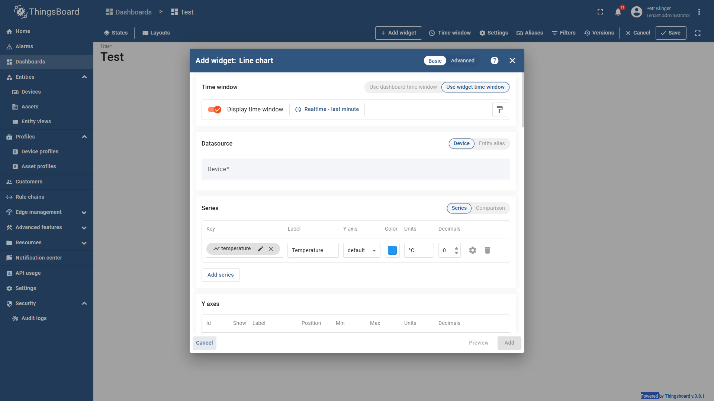

import Image from '@theme/IdealImage';

In this guide, you will learn how to create a dashboard, add a simple variable display, and build a basic chart. This will allow you to visualize and monitor your device data in real time.

---

## Step-by-Step Instructions

### 1.How to Create a Dashboard

   1. Navigate to the **left navigation bar**.  
   2. Click on the **Dashboards** tab.  
   3. In the top right corner, click the **➕ button** to add a new dashboard.  
   4. Select **Create new dashboard**.  

   5. Enter the **Title, Description, Image**, and any other required details.  
   6. Click **Add**.  

   7. You will be redirected to your newly created dashboard.  

---

### 2.How to Create a Simple Variable Display

   1. Inside your dashboard, click on the **+ Add new widget** button.  
      - Alternatively, you can use the **+ Add widget** option in the top menu bar. 

   2. A **Widgets Bundles** menu will appear.  

   3. For a simple variable display, choose the **Cards** widget bundle.  
   4. From the available options, select **Label & Value Card**.  

   5. A configuration window will open:  
      - Choose the **device** and the **variable** you want to display.  
      - Customize the widget’s appearance (label, color, icon, etc.).  
   6. Once finished, click **Add**. 

   7. The widget will now appear on your dashboard.  

   8. Resize the widget by dragging its corners.  

   9.  Re-edit the widget by hovering over it and clicking the **pencil icon** in the top right corner.  

---

### 3.How to Create a Simple Chart

   1. Inside your dashboard, click on the **+ Add new widget** button.  
      - Alternatively, use the **+ Add widget** option in the top menu bar.  

   2. A **Widgets Bundles** menu will appear.  

   3. For a simple line chart, choose the **Charts** widget bundle.  
   4. From the available options, select **Line Chart**.  

   5. A configuration window will open:  
      - Select the **data source** and the **variable** you want to display under **Series → Key**.  
      - Customize the widget’s appearance (label, units, color, decimals, etc.).  
      - To add multiple variables, click **Add Series**.  
      - Scroll down to configure **Y-axes, legend, and other chart settings**.  
   6. Once finished, click **Add**.  

   7. The chart will now appear on your dashboard.  

   8. Resize the chart by dragging its corners.  

   9.  Re-edit the chart by hovering over it and clicking the **pencil icon** in the top right corner.  
   

### Example of a Created Dashboard

## Video Tutorial

:::tip
If you need further assistance or a visual demonstration of the process described in this guide, consult the [Video Guide](https://docs.hardwario.com/apps/videos-apps/thingsboard-dashboard).
:::

