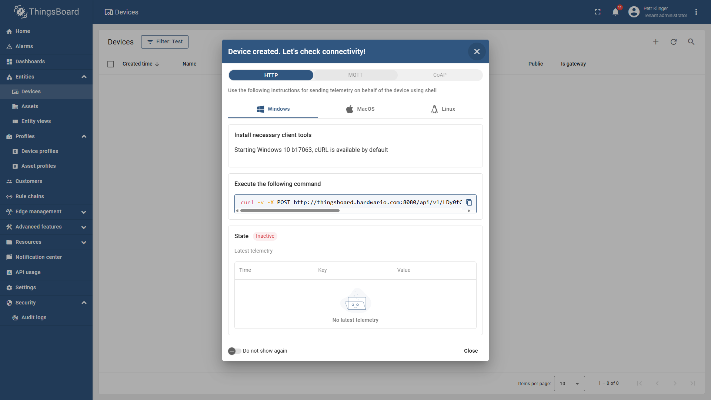

import Image from '@theme/IdealImage';

In this guide, you will learn how to create a new device in ThingsBoard and manage its details. Once created, the device will appear in your list and provide access to telemetry data.

---

## Step-by-Step Instructions

1. **Navigate to Devices and Add a New Device**  
   In the left navigation bar, click on **Entities**, then select **Devices**.  
   In the top-right corner, click the **➕ (plus)** button and choose **Add Device**.

---

3. **Fill in Device Details**  
   A window will appear where you can enter:
   - **Name**
   - **Label**
   - **Description**
   - and other optional fields.  
   After filling in the details, click **Next**.

---

4. **Configure Connectivity**  
   Another window will appear for connectivity settings.  
   - If you don’t need to change anything, simply press **Enter** on your keyboard or close the dialog.

---

5. **Device Created**  
   Your new device is now created and added to the list.
   

---

6. **View Device Information**  
   By clicking on the device, you can see:
   - **Details**
   - **Attributes**
   - **Latest Telemetry**
   - and more.

## Video Tutorial

:::tip
If you need further assistance or a visual demonstration of the process described in this guide, consult the [Video Guide](https://docs.hardwario.com/apps/videos-apps/thingsboard-new-device).
:::