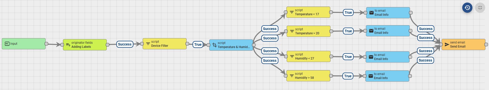
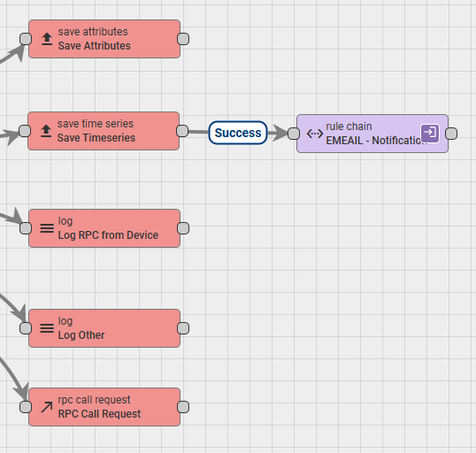

import Image from '@theme/IdealImage';

# Setting Up Email Notifications

## Example Overview
In this tutorial, we will build a custom Rule Chain that monitors telemetry data (temperature and humidity) from specific devices (e.g., "Library" and "Archive"). When the values cross predefined thresholds, the system will trigger an email notification. 

We will also extract the device's assigned "Label" to use in the email text, and we will use a script to convert the default Unix timestamp into a human-readable Central European Time (CET) format. 

Here is what the final notification Rule Chain will look like:



---

## Prerequisites
Before you begin, ensure that your ThingsBoard instance has an outgoing SMTP server configured. Go to **Settings** -> **Outgoing Mail** and configure your SMTP credentials. You can use the "Send Test Mail" button to verify it works.

---

## Step-by-Step Guide

### 1. Enrichment: Originator Fields (Adding Labels)
By default, ThingsBoard does not pass the "Label" of a device into the rule engine metadata. We need to fetch it first so we can use it in our scripts and emails.
* **Node Type:** `Enrichment` -> `originator fields`
* **Name:** Adding Labels
* **Configuration:** Click "Add mapping".  
  * Source field: `Label`  
  * Target key: `deviceLabel`  
  * Add mapped originator fields to: `Metadata`

### 2. Filter: Script (Device Filter)
We only want to process alerts for specific devices based on their labels.
* **Node Type:** `Filter` -> `script`
* **Name:** Device Filter
* **Language:** Switch from TBEL to **`JavaScript`**
* **Code:**

```javascript
var deviceLabel = metadata.deviceLabel;
// Replace the numbers/strings with your actual device labels or IDs
return deviceLabel === '2159020251' || deviceLabel === '2159020252';
```

* **Connection:** Connect the Adding Labels node to this node using the Success link.

### 3. Transformation: Script (Formatting Data)
Telemetry keys often contain dots (e.g., hygrometer.temperature.avg), which can break the default email templating. Also, the default timestamp is in Unix milliseconds (UTC). This script extracts the values safely and formats the time to a readable format (adding 1 hour for CET).

* **Node Type:** `Transformation` -> `script`
* **Name:** Temperature & Humidity Formatting
* **Language:** Switch from TBEL to **`JavaScript`**
* **Code:**

```javascript
// Initialize default values to prevent "is not defined" errors in email templates
metadata.formattedTemperature = "N/A";
metadata.formattedHumidity = "N/A";

// Get Temperature
var temp = msg['hygrometer.temperature.avg'];
if (temp != null) {
    metadata.formattedTemperature = temp; 
}

// Get Humidity
var hum = msg['hygrometer.humidity.avg'];
if (hum != null) {
    metadata.formattedHumidity = hum;
}

// Get Timestamp and convert to Date object
var date = metadata.ts ? new Date(Number(metadata.ts)) : new Date();

// Shift time from UTC to local time (+1 hour for CET)
date.setHours(date.getHours() + 1);

// Format to DD.MM.YYYY HH:MM:SS
var pad = function(n) { return n < 10 ? '0' + n : n; };
var day = pad(date.getDate());
var month = pad(date.getMonth() + 1);
var year = date.getFullYear();
var hours = pad(date.getHours());
var minutes = pad(date.getMinutes());
var seconds = pad(date.getSeconds());

metadata.formattedTime = day + "." + month + "." + year + " " + hours + ":" + minutes + ":" + seconds;
return {msg: msg, metadata: metadata, msgType: msgType};
```
* **Connection:** Connect the Device Filter node to this node using the True link.

### 4. Filter: Script (Threshold Filters)
Now we split the flow based on specific conditions. Create a filter for each condition. For example, to check for low temperature:

* **Node Type:** `Filter` -> `script`
* **Name:** Temperature < 17
* **Language:** **`JavaScript`**
* **Code:**
```javascript
return msg['hygrometer.temperature.avg'] < 17;
```
*(Repeat this step to create parallel filters for other thresholds, e.g., Temperature > 20, Humidity < 27, Humidity > 58).*

* **Connection:** Connect the Temperature & Humidity Formatting node to all your threshold filters using Success links.

### 5. Transformation: To Email (Email Info)
This node constructs the actual email subject and body. You can choose whether to send a simple Plain Text email or a formatted HTML email. Create one for each threshold filter.

* **Node Type:** `Transformation` -> `to email`
* **Name:** Email Info
* **From:** `"System Alert" <dashboards@hardwario.com>`
* **To:** `your.email@example.com` *(Note: Write the email address as plain text, do NOT use `${}` variables for a static address)*
* **Subject:** `Alert: Device ${deviceName} - Low Temperature`

**Option A: Plain Text Email**
If you want a simple email without any special formatting, select Plain Text. Line breaks (pressing Enter) will work naturally.
* **Mail body type:** Select `Plain Text` (or uncheck the HTML option depending on your ThingsBoard version)
* **Body:**
```text
Hello, measured values in your facility have exceeded the defined limits:

Facility: ${deviceName}
Device: ${deviceLabel}
Sensor: Temperature
Value: ${formattedTemperature} °C
Measurement Time: ${formattedTime}

Your HARDWARIO IoT Team
```

**Option B: HTML Email**
If you want to use formatting, select HTML. Note that in HTML, normal line breaks are ignored, so you must use the `<br>` tag to create a new line. You can also use tags like `<b>text</b>` for **bold** text or `<i>text</i>` for *italics*.
* **Mail body type:** Select `HTML`
* **Body:**
```html
Hello, measured values in your facility have exceeded the defined limits:<br><br>

Facility: <b>${deviceName}</b><br>
Device: <i>${deviceLabel}</i><br>
Sensor: Temperature<br>
Value: <b>${formattedTemperature} °C</b><br>
Measurement Time: ${formattedTime}<br><br>

Your HARDWARIO IoT Team
```

*(Make sure to adjust the text for Humidity nodes, changing "Temperature" to "Humidity" and the variable to `${formattedHumidity}` %).*

* **Connection:** Connect your respective threshold filter (e.g., Temperature < 17) to this node using the True link.

### 6. Action: Send Email
This is the final execution node that communicates with your SMTP server to dispatch the constructed emails.

* **Node Type:** `Action` -> `send email`
* **Name:** Send Email
* **Configuration:** Leave as default (it uses the System SMTP settings).
* **Connection:** Connect all your Email Info nodes to this single Send Email node using Success links.

### 7. Connecting to the Root Rule Chain
Your custom notification Rule Chain is now fully built, but ThingsBoard doesn't know it should route incoming telemetry to it. We need to link it inside the main Root Rule Chain.

1. Go to **Rule Chains** and open your **Root Rule Chain** (the default chain that handles all incoming messages).
2. Locate the **Message Type Switch** node.
3. Follow the **Post telemetry** link coming out of the switch. It should lead to a **Save Timeseries** node.
4. From the left menu, find the **Rule Chain** node (under the Rule Chains category) and drag it onto the canvas.
5. In the node settings, select the new Rule Chain you just created (e.g., "EMAIL - Notifications").
6. Drag a connection from the **Save Timeseries** node to your newly added Rule Chain node.
7. Select **Success** as the link label.
8. Click the **Apply changes** button (the checkmark in the bottom right corner).

Here is how the connection in the Root Rule Chain should look:
*(The data will now successfully flow from the device, save to the database, and proceed to your custom email notification chain!)*

