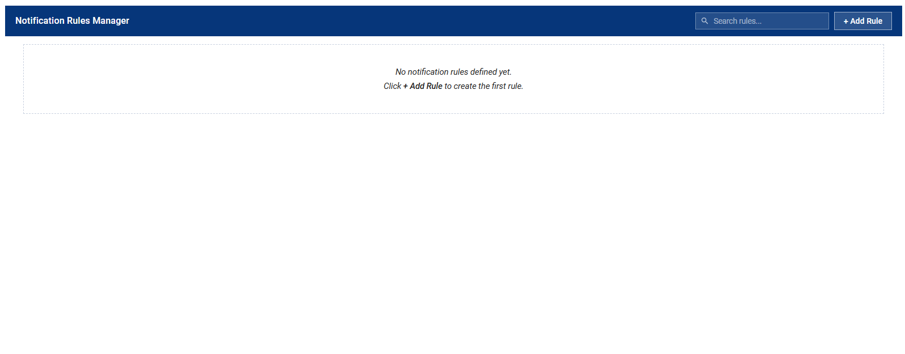
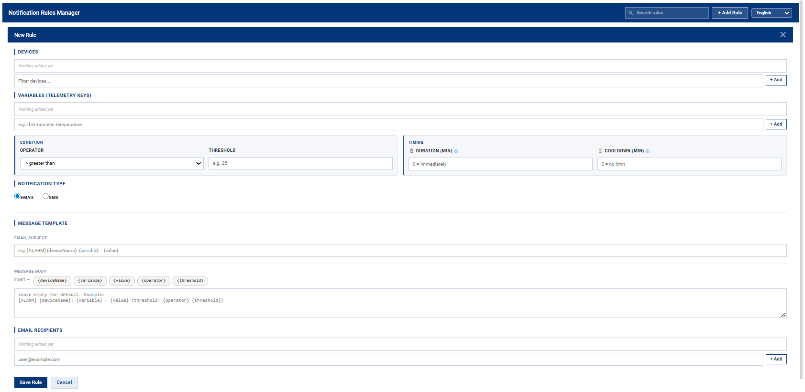
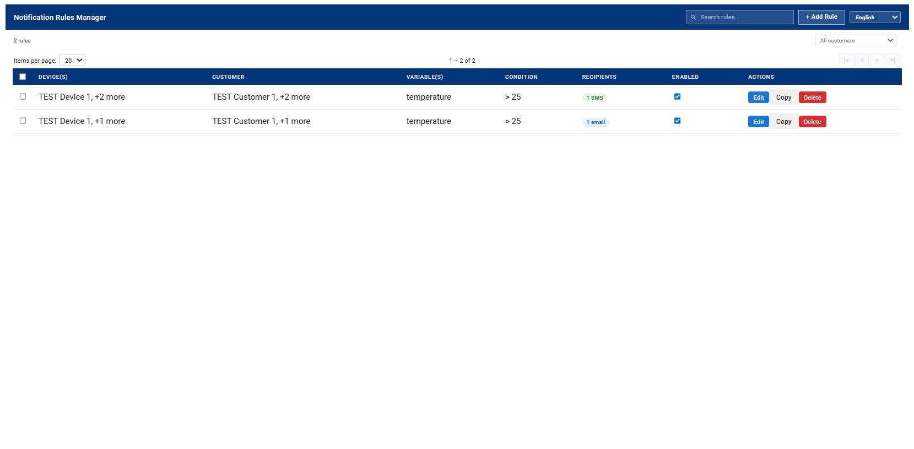

import Image from '@theme/IdealImage';

# Notification Rules Manager

## What is the Notification Rules Manager?

The **Notification Rules Manager** is a tool for setting up automatic alerts based on data from your IoT devices (sensors, meters, etc.). It lets you define precise conditions under which you receive an e-mail or SMS — for example when temperature exceeds a set value, humidity drops below a threshold, or a device reports an unexpected reading.

:::info Example use case
A customer operating warehouses wants to be notified when the temperature in any warehouse exceeds 28 °C. They create a rule: *Device = Warehouse_Sensor_A, Variable = temperature, Condition = > 28, Recipient = manager@company.com*. From that point on, an e-mail is sent automatically whenever the sensor reads above 28 °C.
:::

---

## Logging in and accessing the dashboard

1. Log in to the platform at **app.hardwario.cloud** with your e-mail and password.
2. In the left navigation menu, click **Notifications**.
3. The **Notification Rules Manager** dashboard opens. If this is your first visit, the rules table will be empty.

:::caution Note
The **Notifications** menu item is only visible to customers who have been granted access to this dashboard. If you cannot see it, please contact your platform administrator.
:::

---

## Interface overview

### Table columns explained

| Column | Description |
|--------|-------------|
| **Device(s)** | The first monitored device. If there are more, a **+N more** badge appears — hover to see the full list. |
| **Customer** | The customer(s) the devices belong to (shown when sub-customers exist). If devices span multiple customers, shows the first one with **+N more**. |
| **Variable(s)** | The telemetry key(s) being watched. |
| **Condition** | The trigger condition and threshold, plus Duration/Cooldown badges if set. |
| **Recipients** | Number and type of recipients (email or SMS). Hover to see the list. |
| **Enabled** | Toggle to enable/disable the rule without deleting it. |
| **Actions** | **Edit** · **Copy** · **Delete** |

---

## Creating a new rule

Click **+ Add Rule** in the top-right corner of the widget. The rule form opens below the header.

### Selecting devices

In the **DEVICES** section, select the device(s) this rule should monitor. A single rule can watch multiple devices at the same time.

1. Click the **Filter devices...** field — a dropdown list of available devices appears.
2. Start typing to filter by name, or scroll and select from the list.
3. Click the device in the dropdown or press **+ Add**. It appears as a tag above the field.
4. Repeat for additional devices. Remove a device by clicking **×** on its tag.

:::tip
Adding multiple devices means the rule will be evaluated for *each* device independently. A notification fires whenever *any* of the selected devices meets the condition.
:::

### Selecting variables

In the **VARIABLES** section, select or type the telemetry key(s) to monitor.

**Using the variable picker (recommended):**

Once at least one device is selected, click the variable field — a dropdown appears showing all telemetry keys that the selected devices have already sent. When multiple devices are selected, the keys are grouped:

- **Common to all devices (N)** — keys available on every selected device. These are the most useful for multi-device rules.
- **Per-device groups** — keys that exist only on specific devices.

Click a key to add it as a tag. Already-added keys are marked with ✓ and cannot be added twice.

**Typing a key manually:**

Type any key name directly in the field and press **Enter** or click **+ Add**. This is useful for devices that have not yet sent any telemetry.

:::caution Important
The variable name must match the telemetry key exactly as sent by the device (case-sensitive). To verify available keys, open the device in ThingsBoard → *Latest Telemetry* tab.
:::

### Setting the condition

In the **CONDITION** block, define when the notification should fire.

| Field | Description | Example |
|-------|-------------|---------|
| **Operator** | Comparison operator: greater than, less than, equals, greater or equal, less or equal. | > greater than |
| **Threshold** | The value to compare the telemetry reading against. | 28 |

Example: *Operator = > greater than, Threshold = 28* means: "Send a notification when the variable value exceeds 28."

### Timing settings

The **TIMING** block contains two optional fields for fine-grained control. Leave them at 0 for default behaviour.

| Field | Description | Default |
|-------|-------------|---------|
| **Duration (min)** | The condition must be met continuously for this many minutes before a notification is sent. Eliminates short spikes. | 0 = send immediately |
| **Cooldown (min)** | Minimum time between two notifications for this rule. Prevents notification flooding. | 0 = no limit |

### Notification recipients

**Notification type** — Select **Email** or **SMS** in the **NOTIFICATION TYPE** section. The appropriate recipient field will appear.

**Email recipients:**
1. Type an e-mail address in the *user@example.com* field.
2. Press **Enter** or click **+ Add**. The address appears as a tag.
3. Repeat for additional recipients.

**SMS recipients:**  
Enter a phone number in international format: `+420600123456`. Adding works the same way as for e-mail.

:::tip
You can add any number of recipients to one rule — the notification is sent to all of them simultaneously.
:::

### Saving the rule

Once all required fields are filled in, click **Save Rule**. The rule is saved immediately and starts being evaluated in an enabled state. It appears in the rules table.

:::caution Required fields
- At least one device
- At least one variable
- A threshold value
- At least one recipient (e-mail or SMS)
:::

---

## Managing existing rules

### Editing a rule

Click **Edit** on the rule you want to change. The form opens with pre-filled values. Make your changes and click **Save Rule**.

### Copying a rule

Click **Copy**. A new rule form opens with the same values as the original. Adjust what you need (e.g. different threshold or device) and save.

:::tip
Copying is ideal when you want a similar rule for a different device or threshold, without filling in everything from scratch.
:::

### Deleting a rule

Click **Delete**. A confirmation dialog appears. Once confirmed, the rule is permanently removed from all devices it was saved on.

:::caution Warning
Deletion is permanent and cannot be undone. If you only want to temporarily stop notifications, use the **Enabled** toggle instead.
:::

### Enabling / disabling a rule

Each rule has a toggle switch in the **Enabled** column. Switching it off deactivates the rule — no notifications will be sent, but the rule remains saved and can be re-enabled at any time.

---

## Filtering and sorting rules

### Search

Use the *Search rules...* field in the top-right corner. Results update in real time across all fields (device name, variable, recipient, etc.).

### Customer filter

If your organisation manages sub-customers, a dropdown filter appears in the top bar. Selecting a customer shows only rules for devices belonging to that customer.

### Sorting

Click any sortable column header to sort. Click again to reverse the order. An arrow indicator ˅/˄ shows the active sort direction. Sortable columns:

- **Device(s)** — device name
- **Customer** — customer name
- **Variable(s)** — variable name
- **Recipients** — notification type (email / SMS)
- **Enabled** — active / inactive

---

## Understanding Duration and Cooldown

| Setting | What it does | When to use it |
|---------|-------------|----------------|
| **Duration** *(minutes)* | The condition must be continuously met for this many minutes before a notification is sent. A brief spike will not trigger an alert. | You want to ignore short or random fluctuations and only react to a sustained state. |
| **Cooldown** *(minutes)* | Minimum time between two notifications for this rule. Even if the condition remains met, the next message will not be sent until this interval has elapsed. | You want to limit notification frequency — e.g. at most one alert per hour, not fifty. |

:::info Recommended starter settings
If you are unsure, set **Duration = 0** and **Cooldown = 30**. Notifications fire immediately when the condition is met, but no more than once every 30 minutes.
:::

---

## Frequently asked questions

**I did not receive a notification even though the condition should have been met. What should I check?**
- Is the rule enabled? Check the **Enabled** toggle in the table.
- Is the variable name spelled correctly? It must exactly match the telemetry key sent by the device.
- Is **Duration** set to a high value? The condition must be met continuously for the full duration.
- Is **Cooldown** active and has it not elapsed yet?
- Is the e-mail address or phone number entered correctly?
- Check your spam/junk folder — the notification e-mail may have been filtered.

**Can I set one rule to apply to multiple devices and multiple variables at the same time?**  
Yes. Add multiple devices and multiple variables when creating the rule. The rule is evaluated for each device + variable combination independently. When multiple devices are selected, the variable picker automatically shows which telemetry keys are common to all selected devices and which are specific to individual ones.

**The language of the interface changed — how do I switch it back?**  
Use the language selector in the top-right corner of the widget. Your choice is saved per user account — other users are not affected.

**What happens when I delete a rule that was saved on multiple devices?**  
The rule is removed from all devices it was saved on. This action is irreversible.

**How do I find out which telemetry keys my device sends?**  
Open the device detail in ThingsBoard (section *Devices*), then click the *Latest Telemetry* tab. All keys and their current values are listed there.

**Can I set a rule for a sub-customer's device?**  
Yes. If you manage sub-customers, select the relevant customer using the filter in the top bar. Only that customer's devices will be shown when creating a rule.

**What does the "1 email" or "1 SMS" badge in the table mean?**  
It shows the number and type of recipients for that rule. Hover over the badge to see the actual addresses or phone numbers.

**How do I know if a rule fired?**  
You will receive an e-mail or SMS as configured. The notification contains the device name, variable, measured value and the condition that was triggered.
