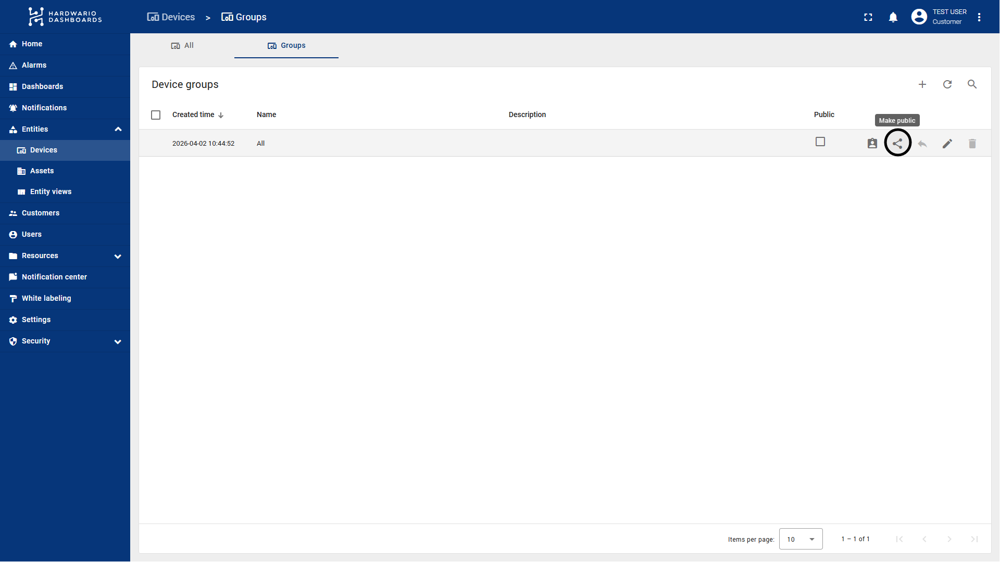
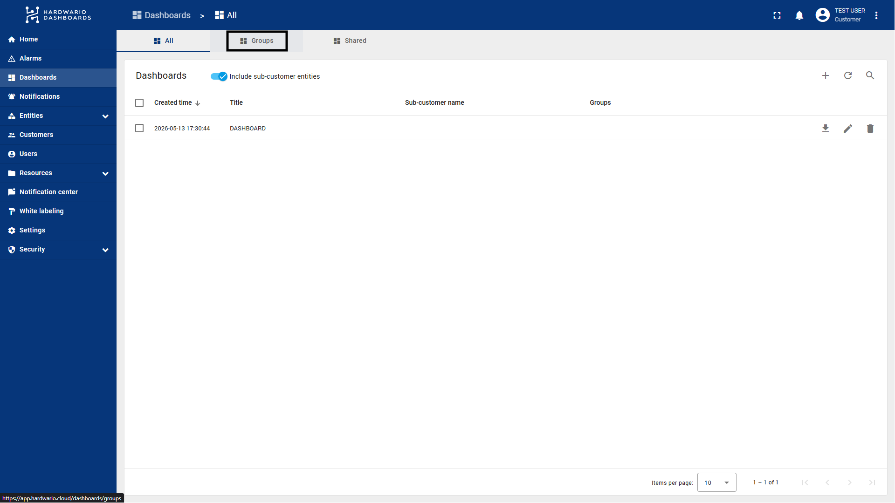
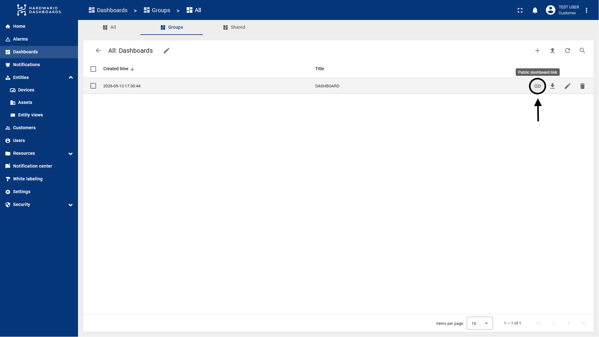
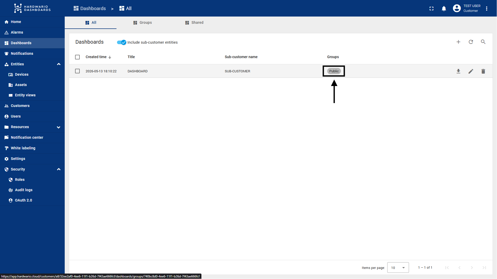

import Image from '@theme/IdealImage';
import Tabs from '@theme/Tabs';
import TabItem from '@theme/TabItem';

# How to Create a Read-Only Public Link

This tutorial explains how to share a ThingsBoard dashboard via a public URL. This allows external users to view the dashboard and its telemetry data without needing a ThingsBoard account. By default, this public access is strictly **read-only**, ensuring your data remains secure.

---

:::info
#### ⚠️ Important Note: Working with Sub-customers

If you are configuring this public link for a specific sub-customer, you might not see their specific Device or Dashboard groups while logged in as a Tenant Administrator. 

To resolve this, you must log in as a **Customer Administrator** for that specific customer:
1. **Navigate** to **Customers** in the left menu.
2. **Find** the customer, click the **Manage customer users** icon, and log in as one of their administrators. 
3. **Workaround:** If the sub-customer does not have any Customer Administrator accounts yet, you can create a temporary test profile. You do not need to use a real email address (e.g., `test@temp.local`). Create the user, log in as them to complete this tutorial, and delete the temporary user account afterward.

*(Alternatively, if you only need to grab the public link without logging in as the sub-customer, check out the [**Pro Tip below**](#-pro-tip-how-to-get-the-link-without-logging-in-as-a-sub-customer)!)*
:::
---

## Step 1: Make the Device Group Public

For the dashboard to display data properly, the public user needs read access to the devices feeding the dashboard. 

**(Optional) How to create a new Device Group:**
If you do not have a specific group yet, you can create one:
1. **Navigate** to **Devices -> Groups** in the left-hand menu.
2. **Click** the **"+"** (plus) icon in the top right corner.
3. **Enter** a name for your new group and click **Add**.

**Make the Device Group public:**
1. **Navigate** to **Devices -> Groups** in the left-hand menu.

2. **Locate** the Device Group containing the devices you want to display on the dashboard.
   > **Tip:** You can use a custom group, or you can use the default **"All"** group. If you make the "All" group public, any new devices added to this customer in the future will automatically become visible to the public link without requiring further configuration.
3. **Click** the **Share icon** (the icon with three connected dots) on the right side of the group's row. **Alternatively**, click the arrow/edit icon on the row and select **"Make entity group public"**.
4. **Result:** ThingsBoard will automatically assign read-only permissions for this device group to the system's public user.

---

## Step 2: Make the Dashboard Group Public

Next, you need to share the dashboard itself.

**(Optional) How to create a new Dashboard Group:**
If you do not have a specific group for your dashboards yet:
1. **Navigate** to **Dashboards -> Groups** in the left-hand menu.
2. **Click** the **"+"** (plus) icon in the top right corner.
3. **Enter** a name for your new group and click **Add**.

**Make the Dashboard Group public:**
1. **Navigate** to **Dashboards -> Groups** in the left-hand menu.

2. **Locate** the Dashboard Group that contains the dashboard you want to share.
3. **Click** the **Share icon** (the icon with three connected dots) on the right side of the group's row. **Alternatively**, click the arrow/edit icon on the row and select **"Make entity group public"**.

---

## Step 3: Obtain the Public Link

Now that both the devices and the dashboard are public, you can generate and share the working URL.

1. **Stay** in the **Dashboards -> Groups** section.
2. **Click** directly on the **name** of the Dashboard Group you just made public. This will open the group and display a list of all dashboards inside it.
3. **Locate** the specific dashboard you want to share.
4. **Click** the very first icon on the right side of the dashboard's row—the **Chain link icon (🔗)** titled "Public dashboard link".
5. **Result:** The URL is now copied to your clipboard. 

You can now send this link to your clients or users. Anyone with this link can view the dashboard and its real-time data directly in their browser without needing to log in.

## 💡 Pro Tip: How to Get the Link Without Logging in as a Sub-customer

If you are operating at the parent customer level (Tenant Administrator) and want to grab the public link without the hassle of logging in as the sub-customer's administrator, you can use this shortcut:

1. **Navigate** to your main **Dashboards** (or Devices) list where you can see all dashboards/devices across your entire system, including those belonging to sub-customers.
2. **Locate** the specific dashboard you want to share.
3. **Find** the **Groups** column in the row of that dashboard.
4. **Click** directly on the name of the group in that column.

5. **Result:** This will redirect you straight to the group's content page. From here, you can easily click the **Chain link icon (🔗)** to copy the public link, just as described in [**Step 3**](#step-3-obtain-the-public-link) above. 

