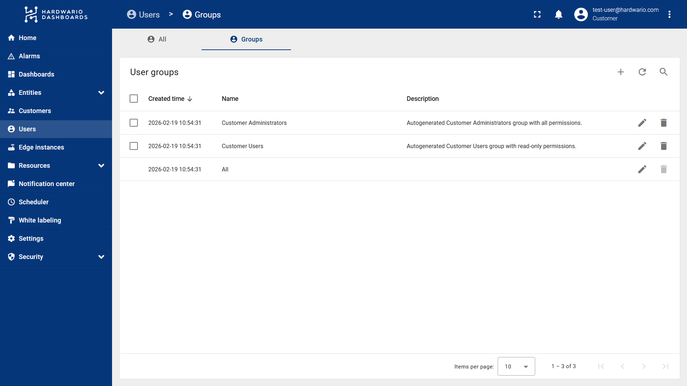
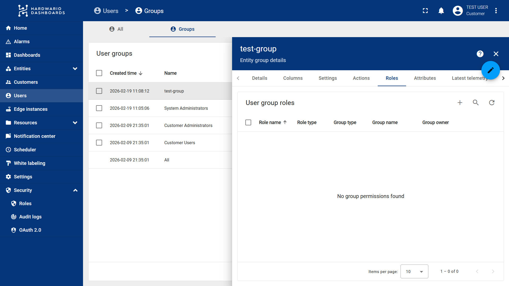
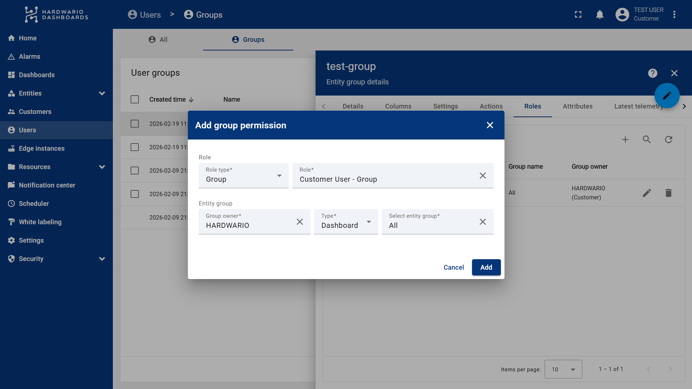
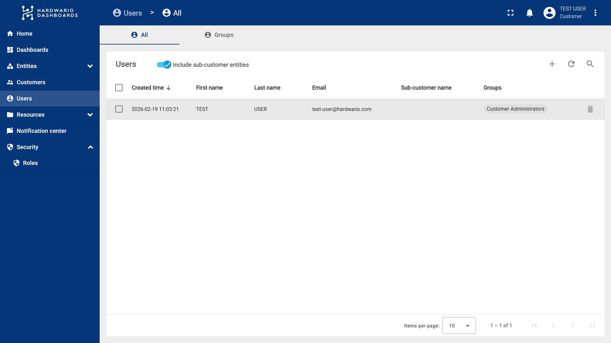
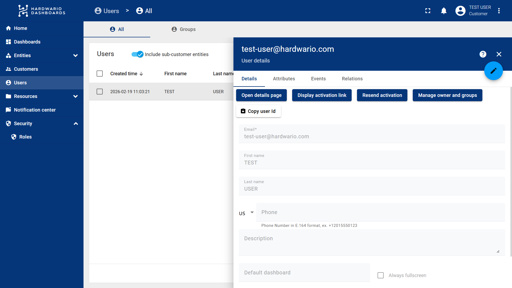
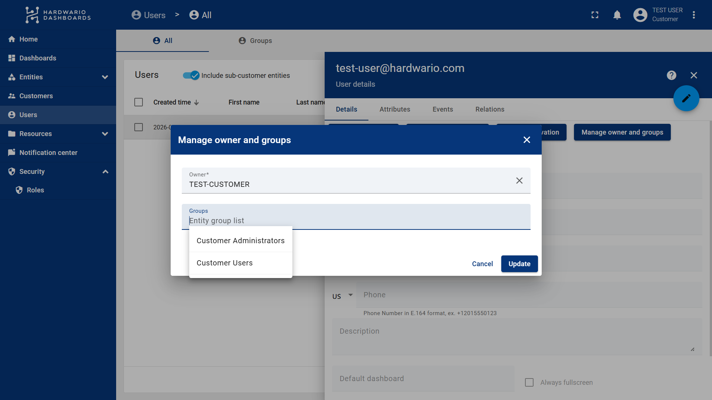

import Image from '@theme/IdealImage';

# User Groups

**Groups** determine exactly what users within that specific group can see (such as dashboards or devices) and what actions they are allowed to perform with those items.

## How to Create Groups with Different Permissions

Follow these steps to configure user groups and manage their roles in ThingsBoard:

1. Select **Users** from the left-hand navigation menu.

1. Navigate to the **Groups** tab.
2. Here, you have two options:
   * Modify the permissions of the automatically generated **Customer User** and **Customer Administrator** groups to suit your needs.
   * Create a new group by clicking the **"+" (Plus)** button located in the top right corner above the groups list.

3. If creating a new group, enter a **Name** and an optional **Description**, then save.
4. Click on the specific group you want to modify and navigate to the **Roles** tab.
5. Click the **"+" (Plus)** button to assign a new role.

6. You will be prompted to choose a Role Type: **Generic** or **Group**. 
   > **Understanding Role Types:**
   > * **Generic:** Applies globally to all entities (all device groups, all dashboards, etc.).
   > * **Group:** Applies only to a specific entity group (e.g., a specific set of devices or specific dashboards).
7. Select your desired role. If you chose the **Group** role type, you must also:
   * Select the **Group owner type** (e.g., Dashboard, Device, etc., depending on what you want the user to access).
   * Select the specific device group or dashboard group you want to assign to this role.
8.  Click **Add** to confirm the role assignment.

9.  Finally, simply assign a user to this newly configured group (as shown in the **next tutorial**), and you are all set!

## How to Assign Groups to Users

Follow these steps to assign Groups and manage user permissions in ThingsBoard:

1. Select **Users** from the left-hand navigation menu.
2. Click on the specific user you want to modify.

3. In the **Details** tab, click on the **Manage owner and groups** button.

4. Here, select the **Customer** and the desired **User Group**. 

   
:::info   
> **Note:** Each group has different permissions, which are determined by the specific roles assigned to that group.
:::