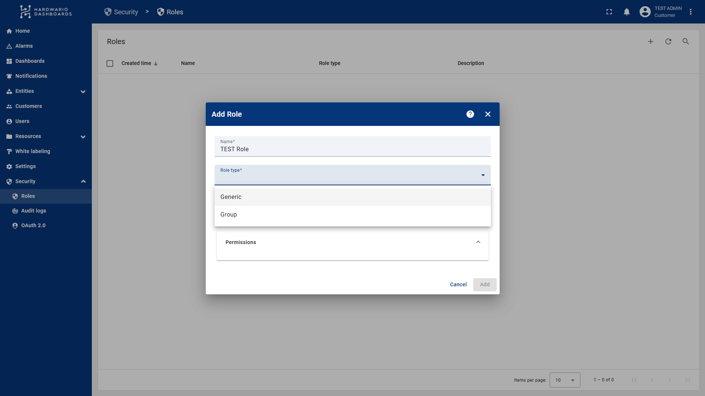
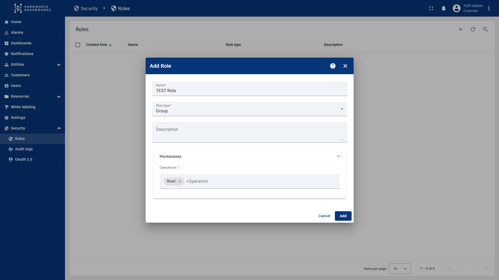
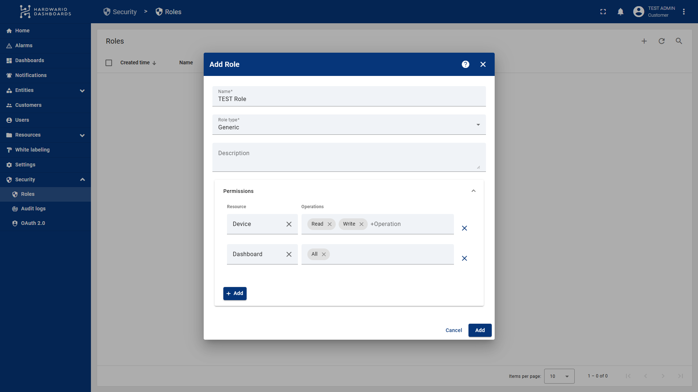
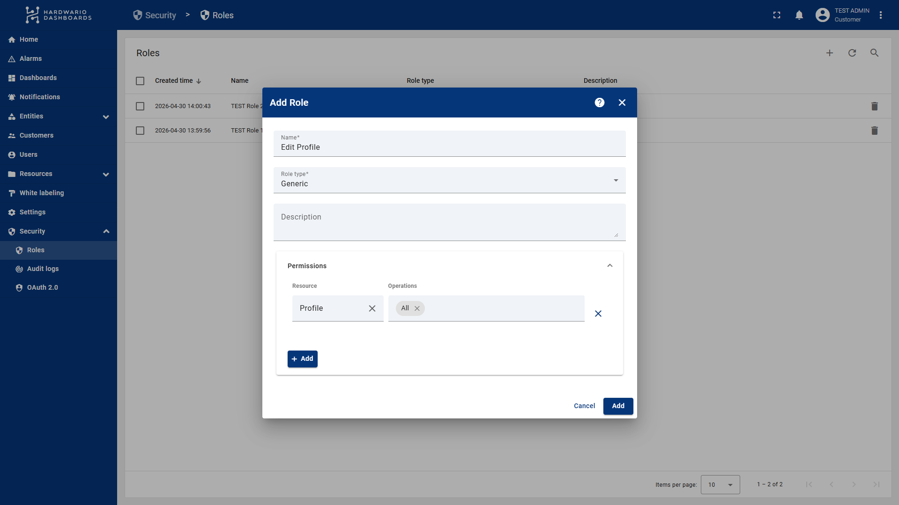
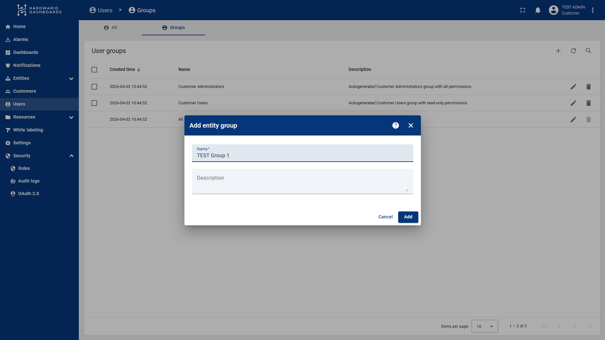
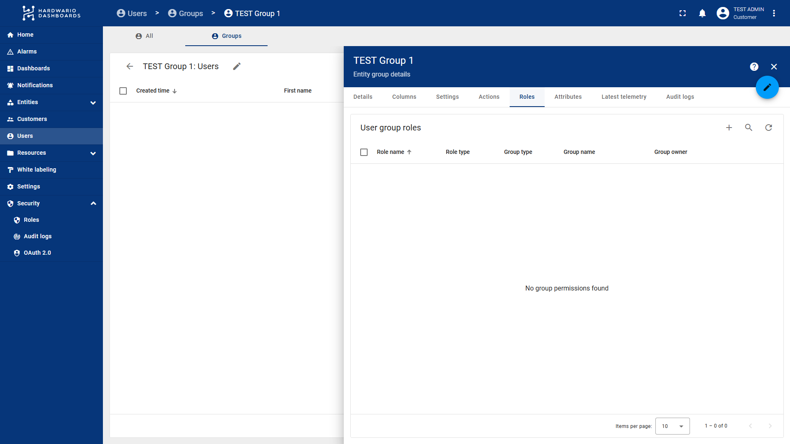
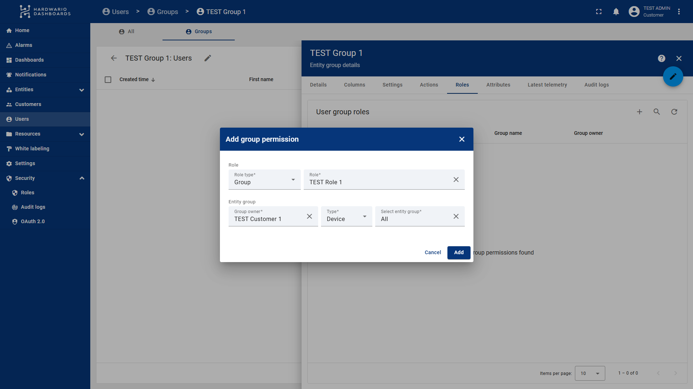
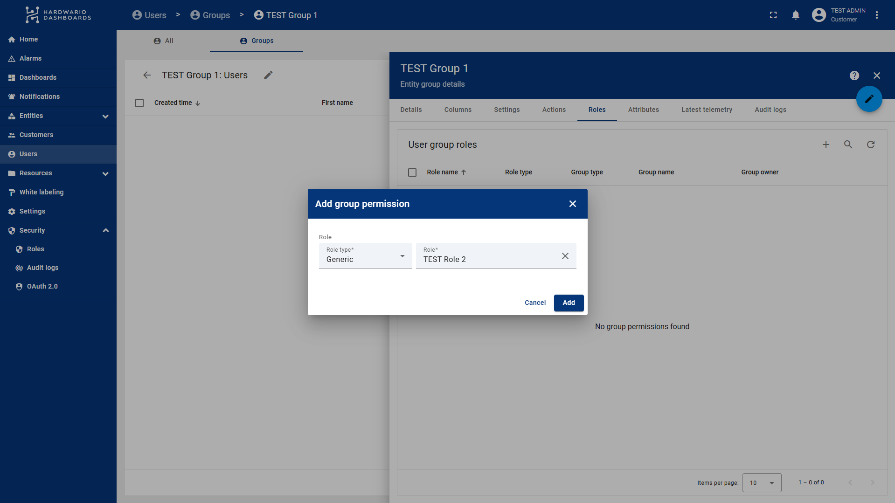
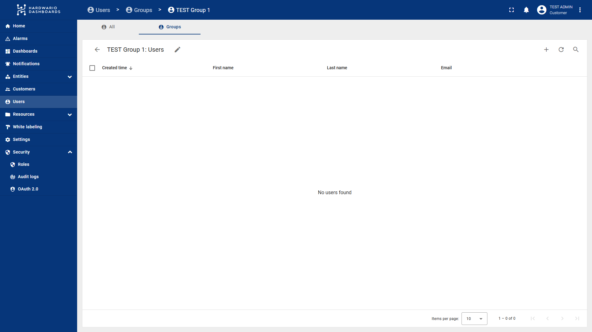
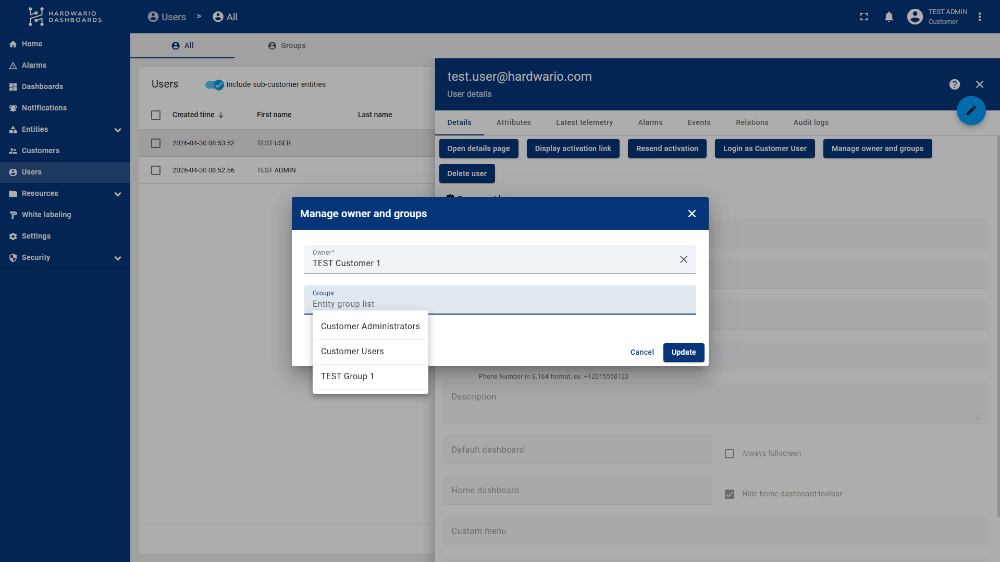

import Image from '@theme/IdealImage';
import Tabs from '@theme/Tabs';
import TabItem from '@theme/TabItem';

# Managing User Visibility and Permissions in ThingsBoard

ThingsBoard is incredibly powerful because it allows us to **completely determine what a customer can and cannot see**, and precisely define what they can and cannot do within the system. This ensures a clean and secure environment for all your users.

---

## 1. Creating User Roles

The first step is to define roles, which act as sets of permissions.

1.  Go to the **Security** section in the left menu (the last item).
2.  Expand it and select **Roles**.
3.  To create a new role, click the **plus (+) icon** in the top right corner.
4.  Enter the **Role Name**, **Description**, and choose the **Role Type**.

### Difference between Role Types:
* **Group:** In this type, you only specify the operations (e.g., read, write) the user can perform. This role is linked to a specific entity (device, dashboard, etc.) later when setting up user groups.
* **Generic:** Here, you define exactly what the user can and cannot do globally. Note: If you grant access to "Devices" here, the user will see **all devices** belonging to that customer, not just a specific group.

<Tabs>
  <TabItem value="lte" label="Group">

  </TabItem>
  <TabItem value="lora" label="Generic">

  </TabItem>
</Tabs>

**IMPORTANT (User Profile Management):**
For users with restricted access, it is recommended to create a **Generic** role where you allow **All** operations for the **Profile** resource. Adding this role to a user group allows users to change their own passwords and account details.

---

## 2. Creating User Groups

Next, you need to create groups to which you will assign the roles created above.

1.  Go to the **Users** section and select the **Groups** tab.
2.  You will see default groups: *Customer Administrators* (full access) and *Customer Users* (read-only access to everything).
3.  Click the **plus (+) icon** in the top right, enter a name and description.

4.  Once created, click the arrow to the left of your group name to enter the group settings.
5.  Navigate to the **Roles** tab.

### Adding Permissions to the Group:
1.  Click the **plus (+) icon** located to the left of the search bar.
2.  Select your **Role Type** and the specific role.
3.  If you selected **Group role type**, you must also specify:
    * **Group Owner:** Usually yourself or the specific customer.
    * **Type:** Define what the rules apply to (e.g., *Device* or *Dashboard*).
    * **Entity Group:** The specific group of entities the user should have access to.

:::info
You must have your **Entity Groups** ready beforehand. This means your devices or dashboards should already be organized into groups. You will pair these groups with the user group in this step. Creating groups for devices/dashboards is similar to creating user groups.
:::

If you are adding a **Generic** role (like the profile editing role), you only need to select the role, and it will apply globally to the user's account permissions.

---

## 3. Adding Users to the Group

You can add users to your newly configured group in two ways:

1.  **New Users:** Directly within your group (under the Users tab), click the **plus (+) icon**.

2.  **Existing Users:** * Go to the main **Users** -> **Users** section.
    * Click on a specific user.
    * In the **Details** tab, click the **Manage owner and groups** button.
    * Select the desired user group and click **Update**.

