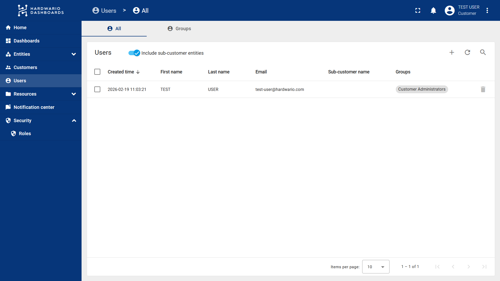
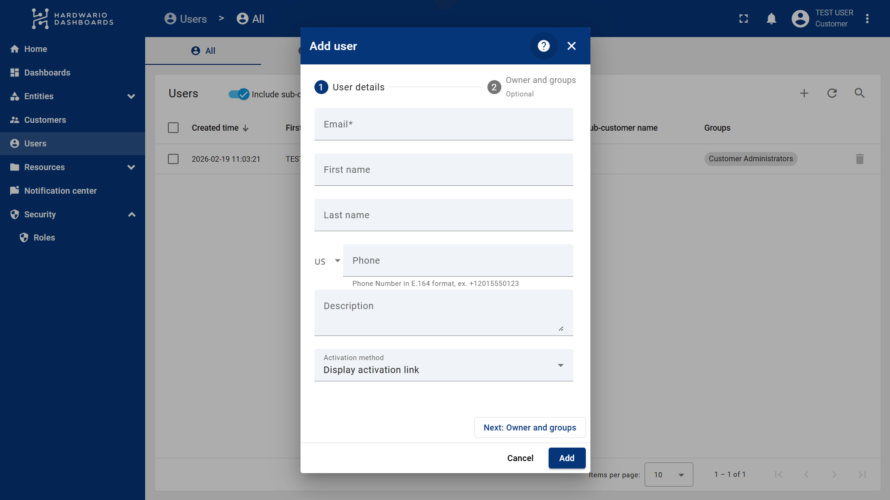
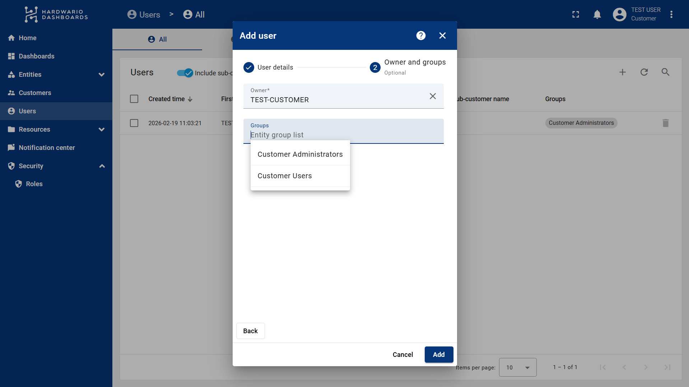
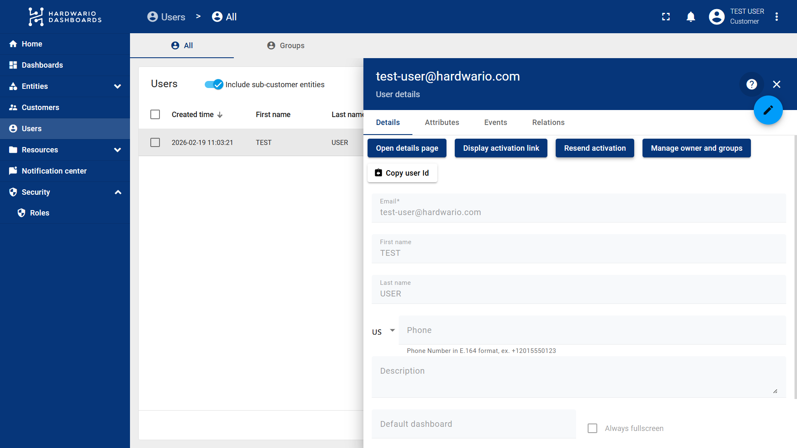

import Image from '@theme/IdealImage';

# Users

## How to Create New Users

Follow these steps to add a new user, assign them to a group, and manage their activation in ThingsBoard:

1. Select **Users** from the left-hand navigation menu.
2. Click the **"+" (Plus)** button on the right side of the screen.

3. Enter the required information about the user.
4. At the bottom, locate the **Activation method** section. You have two options for inviting the user to ThingsBoard (this can also be done later):
   * **Display activation link:** Generates a link that you can manually copy and send to the user yourself.
   * **Send activation mail:** Sends an automated email directly from ThingsBoard containing the activation link.

5. Next, click on **Owner and groups** at the top right.
6. Select the **Customer** and the **User Group** the user will belong to. 
   > **Reminder:** The assigned group determines which dashboards and devices the user will be able to see, as well as their specific permissions.

7. Finally, click **Add**. 

You have successfully created a new user!

:::info
**Need to manage user access?** See the tutorial: [**How to Create Groups with Different Permissions**](apps\thingsboard\user-groups.md). It covers how to create new groups, assign generic or entity-specific roles, and control access to specific devices or dashboards.
:::

---

## Inviting a User / Resending Activation

If you skipped the activation step during creation, or if you need to resend the invite so the user can log in and create a password, do the following:

1. Click on the specific user from your Users list.
2. In the **Details** tab, choose one of the following actions:
   * **Resend activation:** Automatically sends an email with the activation link to the user.
   * **Display activation link:** Displays a URL that you can manually copy and send to the user. Once they click this link, they will be prompted to create their new password.

