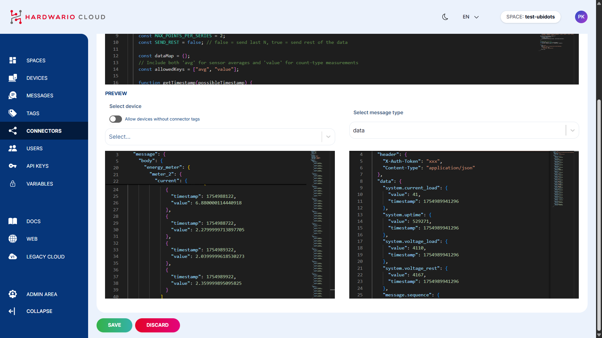

import Image from '@theme/IdealImage';


Before sending data to Ubidots, you need to set up your device and integration within the [HARDWARIO Cloud](https://hardwario.cloud/).  
This tutorial will walk you through each step required to create a device, configure tags, and connect via a webhook connector.

---

#### Step-by-Step Instructions

1. **Create a New Space**  
   After logging into the HARDWARIO Cloud, open the left-hand navigation bar and click on `Spaces`.  
   In the top-right corner, click `+ New Space`.

   

2. **Name Your Space**  
   Enter a name for your space and click `Create`.

   

3. **Add a New Device**  
   Inside your new space, click the `+ New Device` button in the upper-right corner.

   

4. **Enter Device Details**  
   Fill in the required fields:  
   • `Name`  
   • `Serial Number`  
   • `Claim Token`  
   • `Tags`

   

5. **Create Tags for Device Grouping**  
   Tags help group devices and connect them to connectors.  
   From the left-hand navigation menu, go to `Tags`, then click `+ New Tag`.  
   Set the tag’s `name` and `color`, and click `Create`.

   

6. **Assign Tags to Devices**  
   After creating the tag, return to your device and assign the tag accordingly.

   

7. **Create a New Connector**  
   To establish communication with Ubidots, go to the `Connectors` section in the left-hand menu.  
   Click `+ New Connector` and configure the following:  
   • `Name` – give your connector a meaningful name  
   • `Type` – select `Webhook` for Ubidots integration  
   • `Trigger` – choose `Data`  
   • `Tag` – assign the tag you created earlier
   
   
   
8. **Transform Data for Ubidots Format**  
   Ubidots requires a specific data format. You need to adjust your device data using a **transformation code**.  
   In the connector page, scroll down to the `Transformation` section and click the magnifying glass icon 📄🔍 to open the code editor.

   

9. **Insert the Transformation Code**  
   Add the transformation logic that converts incoming data to a Ubidots-compatible format.

   

   Example of transformation code here: 
```
function main(job) {
    let body = job.message.body;
    const timemultiply = 1000;
    const sharedtimestamp = new Date(job.message.created_at).getTime();
    const sn = job.device.label.ubidots;
    const token = "BBUS-i9qwiVOeDgluDwlRjQfHK3F8n2Q6Rt";

    // Configuration: choose whether to send last N points or the older remaining points
    const MAX_POINTS_PER_SERIES = 2;
    const SEND_REST = false; // false = send last N, true = send rest of the data

    const dataMap = {};
    // Include both 'avg' for sensor averages and 'value' for count-type measurements
    const allowedKeys = ["avg", "value"];

    function getTimestamp(possibleTimestamp) {
        return (typeof possibleTimestamp === 'number' && !isNaN(possibleTimestamp))
            ? possibleTimestamp * timemultiply
            : sharedtimestamp;
    }

    function pushToData(variable, value, timestamp) {
        if (value == null) return;
        if (!dataMap[variable]) dataMap[variable] = [];
        dataMap[variable].push({ value, timestamp });
    }

    function flattenAndPush(prefix, obj, timestamp, filterKeys = null) {
        for (const [key, val] of Object.entries(obj || {})) {
            if (filterKeys && !filterKeys.includes(key)) continue;
            pushToData(`${prefix}.${key}`, val, timestamp);
        }
    }

    function processSeries(prefix, measurements) {
        const arr = measurements || [];
        let sliceArr;
        if (SEND_REST) {
            sliceArr = arr.slice(0, Math.max(0, arr.length - MAX_POINTS_PER_SERIES));
        } else {
            sliceArr = arr.slice(-MAX_POINTS_PER_SERIES);
        }
        sliceArr.forEach(m => {
            const ts = getTimestamp(m.timestamp);
            flattenAndPush(prefix, m, ts, allowedKeys);
        });
    }

    // Common CHESTER parameters: only when sending last N points
    if (!SEND_REST) {
        flattenAndPush("system", body.system, sharedtimestamp);
        flattenAndPush("message", body.message, sharedtimestamp);
        flattenAndPush("attribute", body.attribute, sharedtimestamp);
        flattenAndPush("backup", body.backup, sharedtimestamp);
        flattenAndPush("thermometer", body.thermometer, sharedtimestamp);
        flattenAndPush("accelerometer", body.accelerometer, sharedtimestamp);
        flattenAndPush("network.parameter", body.network?.parameter, sharedtimestamp);
        flattenAndPush("network", { imei: body.network?.imei, imsi: body.network?.imsi }, sharedtimestamp);
    }

    // BLE Tags
    body.ble_tags?.forEach((tag, i) => {
        processSeries(`ble_tags.${i}.humidity`, tag.humidity?.measurements);
        processSeries(`ble_tags.${i}.temperature`, tag.temperature?.measurements);
    });

    // Generic multi-sensor handler
    const sensorTypes = ['w1_thermometers', 'analog_channels', 'rtd_thermometer', 'weight', 'counter', 'current', 'voltage'];
    sensorTypes.forEach(type => {
        body[type]?.forEach((entry, i) => {
            const id = entry.serial_number || entry.channel || i;
            processSeries(`${type}.${id}`, entry.measurements);
        });
    });

    // Buttons (single values)
    if (!SEND_REST) {
        body.buttons?.forEach((btn, i) => {
            flattenAndPush(`button_${i}`, btn, sharedtimestamp);
        });
    }

    // Nested sensors
    const nestedSensors = [
        ['weather_station', ['wind_speed', 'wind_direction', 'rainfall']],
        ['hygrometer', ['temperature', 'humidity']],
        ['barometer', ['pressure']],
        ['radon_probe', ['chamber_humidity', 'chamber_temperature', 'concentration_daily', 'concentration_hourly']],
        ['iaq_sensor', ['temperature', 'humidity', 'illuminance', 'altitude', 'pressure', 'co2_conc', 'motion_count', 'press_count']],
        ['soil_sensors', ['moisture', 'temperature']]
    ];
    nestedSensors.forEach(([sensorKey, fields]) => {
        const sensor = body[sensorKey];
        if (!sensor) return;
        fields.forEach(field => {
            processSeries(`${sensorKey}.${field}`, sensor[field]?.measurements);
        });
    });

    // Convert to Ubidots payload format
    const result = {};
    for (const [key, datapoints] of Object.entries(dataMap)) {
        result[key] = datapoints.length === 1 ? datapoints[0] : datapoints;
    }

    return {
        method: "POST",
        url: `https://industrial.api.ubidots.com/api/v1.6/devices/${sn}`,
        header: {
            "X-Auth-Token": token,
            "Content-Type": "application/json"
        },
        data: result
    };
}
```

10. **Set Ubidots Token in Headers**  
    Make sure to include your **Ubidots device token** in the header of the transformation code to authorize data transmission.

   

11. **Assign Devices to Connector**  
    Scroll down and select which devices (with the matching tag) should be connected.  
    On the left side, you'll see **incoming data** from the device.  
    On the right side, you'll see the **transformed data** being sent to Ubidots.

   


---

Once everything is properly configured, your device’s data should begin flowing into Ubidots automatically.

:::tip
You can test the data by opening your device in Ubidots and checking whether the variables are being updated in real-time.
:::

