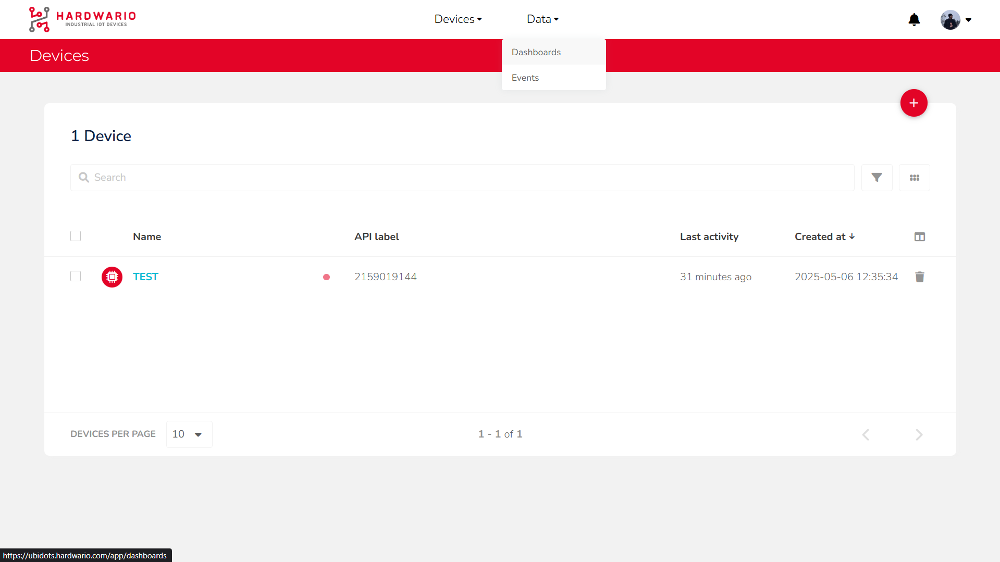
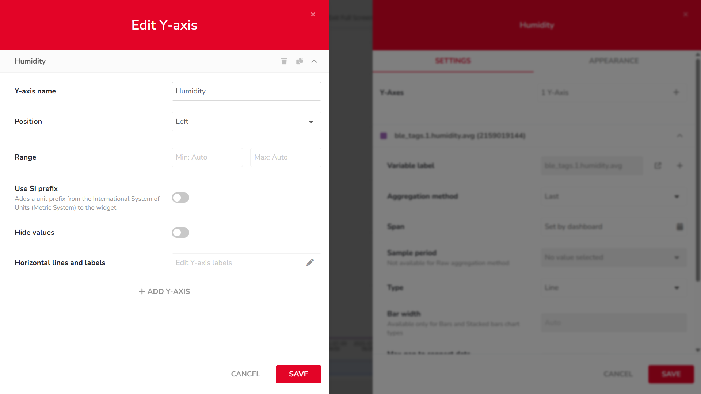

import Image from '@theme/IdealImage';
import EditCodeBlock from './edit-code-block.js';

After successfully connecting your device to the [HARDWARIO Cloud](https://hardwario.cloud/), follow these steps to create basic widgets on your dashboard:

---

## Step-by-Step Instructions

### Displaying the Current Value of a Variable (Metric)

1. #### **Open Dashboards**  
   In the top navigation bar, click on `Data`, then select `Dashboards`. This will open the dashboard management area.

   

---

2. #### **Add a New Widget**  
   Click the `Add new Widget` button (marked with a + icon).

   

---

3. #### **Choose a Widget Type**  
   From the list of available widgets, choose one of the `Metric` types (used to display numerical values).

   

---

4. #### **Add a Variable**  
   Click on `+ ADD VARIABLES`, then:  
   • Select your device  
   • Choose the desired variable  
   • Confirm the selection by clicking `SELECT`

   

---

5. #### **Configure Aggregation and Time Span**  
   Set the `Aggregation Method` (e.g. average, last value) and `Span` (time range).

   

---

6. #### **Edit Widget Appearance**  
   Switch to the `APPEARANCE` tab to customize display options such as:  
   • Label  
   • Color  
   • Font  
   • Date format  
   • ...  

    

---

7. #### **Save the Widget**  
   Click `SAVE` to add the widget to your dashboard.

    

---

### Displaying a Variable in a Basic Chart (Line Chart)

#### Step-by-Step Instructions

1. #### **Open Dashboards**  
   In the top navigation bar, click on `Data`, then select `Dashboards`. This will open the dashboard management area.

    

---

2. #### **Add a New Widget**  
   Click the `Add new Widget` button (marked with a + icon).

    

---

3. #### **Choose a Widget Type**  
   From the list of available widgets, scroll to the `Charts` section and choose a `Line Chart`.

    

---

4. #### **Add a Variable**  
   Click on `+ ADD VARIABLES`, then:  
   • Select your device  
   • Choose the desired variable  
   • Confirm the selection by clicking `SELECT`

    

---

5. #### **Configure Chart Settings**  
   In the `SETTINGS` tab, configure options such as:  
   • Aggregation Method  
   • Span  
   • Sample Period  
   • Bar Width  
   • ...

   

---

6. #### **Edit Y-Axis Settings**  
   In the same `SETTINGS` tab, click the `1 Y-Axis` button to adjust:  
   • Axis name  
   • Position  
   • Value range  
   • ...

    

---

7. #### **Edit Widget Appearance**  
   Switch to the `APPEARANCE` tab to modify visual elements such as:  
   • X-axis label  
   • Font  
   • Date format  
   • ...

   

---

8. #### **Resize the Chart**  
   Once the widget is added to your dashboard, resize it using the arrow icon in the bottom-right corner of the chart.

    

---

9. #### **View Data Points**  
   Hover over the chart line to view individual data values as tooltips.

    
    
---

:::tip
If you need further assistance or a visual demonstration of the process described in this guide, consult the [Video Guide](https://docs.hardwario.com/apps/videos-apps/ubidots-dashboard).
:::

### Displaying Variables on a Floor Plan (HTML Canvas)

1. #### **Open Dashboards**  
   In the top navigation bar, click on `Data`, then select `Dashboards`. This will open the dashboard management area.

   

---

2. #### **Add a New Widget**  
   Click the `Add new Widget` button (marked with a + icon).

   

---

3. #### **Choose a Widget Type**  
   From the list of available widgets, choose the `HTML Canvas`.

   

---

4. #### **Configure HTML Canvas Settings**  
In the **`SETTINGS`** tab, configure the available options.  
This is where you can enable or disable features such as:  

- **Preload dashboard data** (recommended: ON)  
- **Enable React.js** (optional, for dynamic rendering)  
- **Add third-party libraries** (for external JS/CSS resources)  

After configuration, click **`Edit code`** under **Code editor** and insert your HTML, CSS, and JavaScript.

---

5. #### **Add HTML Code to the Canvas**
In the **Code Editor**, insert your desired layout and logic.  

---

6. #### **Edit Canvas Appearance**  
Switch to the **`APPEARANCE`** tab to modify the visual style of your widget.  
You can set:  

- Widget **name**  
- Option to **hide the header**  
- Add a **custom style** (JSON format)

---

7. #### **Example of HTML Canvas (Floor Plan)**  

---

#### Example Code – HTML Floor Plan

<EditCodeBlock
  initialText={String.raw`

  
  

`}
/>

#### **Configure the Floor Plan Widget**

Before using the HTML code, you must update several parameters inside the **`CONFIG`** section of the script.  
These define your Ubidots connection, the floor plan image, and the BLE tag positions.

---

| Parameter | Description | Required |
|------------|-------------|-----------|
| `CONFIG.ubidots.token` | Your Ubidots **API token** (found under *API Credentials* in Ubidots). | ✅ |
| `CONFIG.ubidots.deviceLabel` | The **device label** that contains your BLE sensor variables. | ✅ |
| `CONFIG.floorplanUrl` | Public URL to your **PNG/JPG floor plan image**. You can host it via [Postimages](https://postimages.org) or [Imgur](https://imgur.com). | ✅ |
| `CONFIG.pollingMs` | How often to refresh values from Ubidots, in **milliseconds**. Default: `15000` (15 seconds). | ⚙️ Optional |
| `CONFIG.tags` | Array containing all BLE sensors with their names, indexes, and positions. Each entry represents one sensor pin on the floor plan. | ✅ |
| `room` | Display name (e.g., `"Server Room"`). | ✅ |
| `idx` | BLE tag index *(0–N)* — values are read from: `ble_tags.<idx>.temperature.avg` and `ble_tags.<idx>.humidity.avg`. | ✅ |
| `x`, `y` | Position in **percentages (0–100)** relative to the image dimensions. | ✅ |
| `loc.anchor` | Locator arrow direction — `"down"` (below), `"top"` (above), or `"diag"` (diagonal). | ⚙️ Optional |
| `loc.dx`, `loc.dy` | Fine offset adjustment for the locator position in **pixels**. | ⚙️ Optional |
| `loc.angle` | Rotation of the locator in **degrees** (used with `"diag"`). | ⚙️ Optional |
| `loc.mirror` | Flip the locator **horizontally** (`true` / `false`). | ⚙️ Optional |

---

### Displaying Variables in a Data Table (HTML Canvas)

1. #### **Open Dashboards**  
   In the top navigation bar, click on `Data`, then select `Dashboards`. This will open the dashboard management area.

   

---

2. #### **Add a New Widget**  
   Click the `Add new Widget` button (marked with a + icon).

   

---

3. #### **Choose a Widget Type**  
   From the list of available widgets, choose the `HTML Canvas`.

   

---

4. #### **Configure HTML Canvas Settings**  
In the **`SETTINGS`** tab, configure the available options.  
This is where you can enable or disable features such as:  

- **Preload dashboard data** (recommended: ON)  
- **Enable React.js** (optional, for dynamic rendering)  
- **Add third-party libraries** (for external JS/CSS resources)  

After configuration, click **`Edit code`** under **Code editor** and insert your HTML, CSS, and JavaScript.

---

5. #### **Add HTML Code to the Canvas**
In the **Code Editor**, insert your desired layout and logic.  

---

6. #### **Edit Canvas Appearance**  
Switch to the **`APPEARANCE`** tab to modify the visual style of your widget.  
You can set:  

- Widget **name**  
- Option to **hide the header**  
- Add a **custom style** (JSON format)

---

7. #### **Example of HTML Canvas (Data Table)**  

---

#### Example Code – HTML Data Table

<EditCodeBlock
  initialText={String.raw`<!-- ======== HTML TABLE: BLE TAGS STATUS ======== -->
<table id="tags-table" cellspacing="0" cellpadding="8"
  style="width:100%; border-collapse: collapse; text-align:center; font-family: system-ui, sans-serif;">
  <thead>
    <tr style="background:#e60000; color:#fff;">
      <th style="border:1px solid #ddd;">🏷️ Tag</th>
      <th style="border:1px solid #ddd;">🛰️ RSSI (dBm)</th>
      <th style="border:1px solid #ddd;">🔋 Voltage (V)</th>
      <th style="border:1px solid #ddd;">🌡️ Temperature (°C)</th>
      <th style="border:1px solid #ddd;">💧 Humidity (%)</th>
    </tr>
  </thead>
  <tbody id="tbody"></tbody>
</table>

`}
/>

#### **Configure the Table Widget**

Before using the HTML code, you must update several parameters inside the **`CONFIG`** section of the script.  

---

| Parameter | Description | Required |
|---|---|---|
| `CONFIG.ubidots.token` | Your Ubidots **API token** (found under API Credentials). | ✅ |
| `CONFIG.ubidots.deviceLabel` | Device label in Ubidots that contains the BLE variables. | ✅ |
| `CONFIG.pollingMs` | Refresh interval in **milliseconds**. Default: `15000`. | ⚙️ Optional |
| `CONFIG.tags` | Array of rows to display in the table. Each row maps to `ble_tags.<idx>.*`. | ✅ |
| `name` | Display name of the tag (table’s first column). | ✅ |
| `idx` | BLE tag index *(0–N)* used to read: `rssi`, `voltage`, `temperature.avg`, `humidity.avg`. | ✅ |

---

#### These widgets will allow you to build a simple, clear dashboard for monitoring real-time or historical sensor data.
