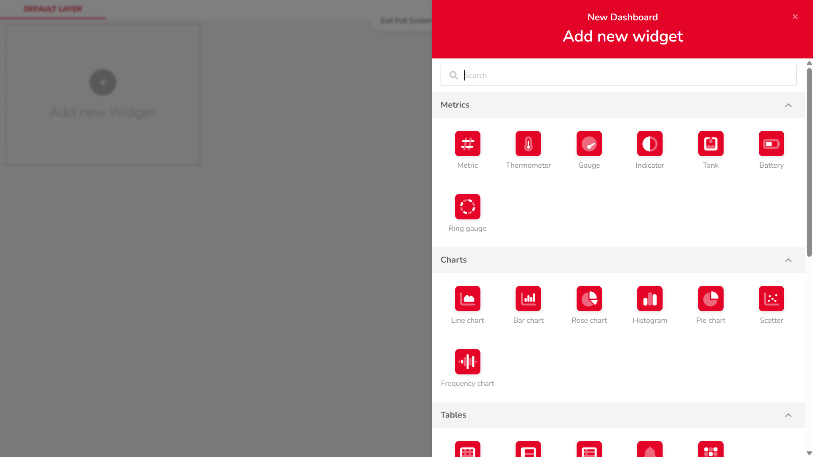

import Image from '@theme/IdealImage';

After successfully connecting your device to the Ubidots cloud, follow these steps to create basic widgets on your dashboard:

---

### Displaying the Current Value of a Variable (Metric)

#### Step-by-Step Instructions

1. #### **Open Dashboards**  
   In the top navigation bar, click on `Data`, then select `Dashboards`. This will open the dashboard management area.

   

2. #### **Add a New Widget**  
   Click the `Add new Widget` button (marked with a + icon).

   

3. #### **Choose a Widget Type**  
   From the list of available widgets, choose one of the `Metric` types (used to display numerical values).

   

4. #### **Add a Variable**  
   Click on `+ ADD VARIABLES`, then:  
   • Select your device  
   • Choose the desired variable  
   • Confirm the selection by clicking `SELECT`

   

5. #### **Configure Aggregation and Time Span**  
   Set the `Aggregation Method` (e.g. average, last value) and `Span` (time range).

   

6. #### **Edit Widget Appearance**  
   Switch to the `APPEARANCE` tab to customize display options such as:  
   • Label  
   • Color  
   • Font  
   • Date format  
   • ...  

    

7. #### **Save the Widget**  
   Click `SAVE` to add the widget to your dashboard.

    

---

### Displaying a Variable in a Basic Chart (Line Chart)

#### Step-by-Step Instructions

1. #### **Open Dashboards**  
   In the top navigation bar, click on `Data`, then select `Dashboards`. This will open the dashboard management area.

    

2. #### **Add a New Widget**  
   Click the `Add new Widget` button (marked with a + icon).

    

3. #### **Choose a Widget Type**  
   From the list of available widgets, scroll to the `Charts` section and choose a `Line Chart`.

    

4. #### **Add a Variable**  
   Click on `+ ADD VARIABLES`, then:  
   • Select your device  
   • Choose the desired variable  
   • Confirm the selection by clicking `SELECT`

    

5. #### **Configure Chart Settings**  
   In the `SETTINGS` tab, configure options such as:  
   • Aggregation Method  
   • Span  
   • Sample Period  
   • Bar Width  
   • ...

   

6. #### **Edit Y-Axis Settings**  
   In the same `SETTINGS` tab, click the `1 Y-Axis` button to adjust:  
   • Axis name  
   • Position  
   • Value range  
   • ...

    

7. #### **Edit Widget Appearance**  
   Switch to the `APPEARANCE` tab to modify visual elements such as:  
   • X-axis label  
   • Font  
   • Date format  
   • ...

   

8. #### **Resize the Chart**  
   Once the widget is added to your dashboard, resize it using the arrow icon in the bottom-right corner of the chart.

    

9. #### **View Data Points**  
   Hover over the chart line to view individual data values as tooltips.

    
---

#### These widgets will allow you to build a simple, clear dashboard for monitoring real-time or historical sensor data.

:::tip
You can combine different widget types, overlay multiple variables, or group related data visually for more advanced dashboards.
:::