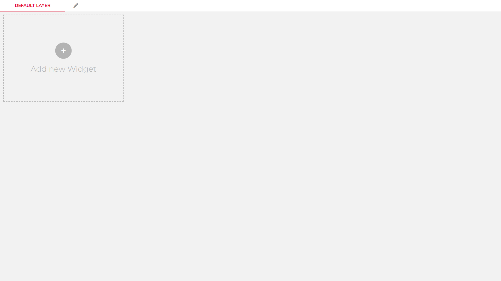
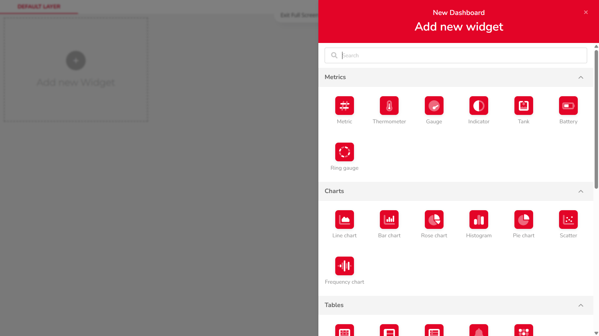
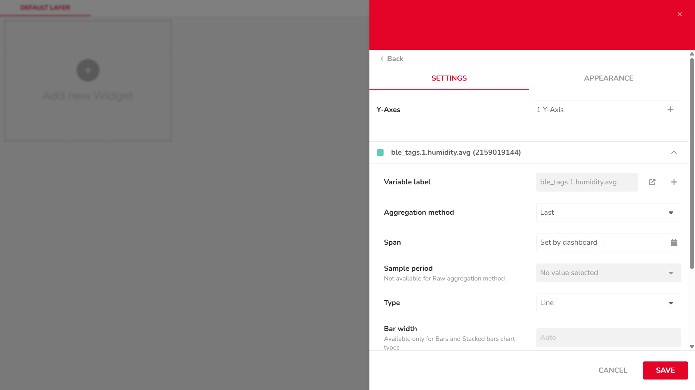
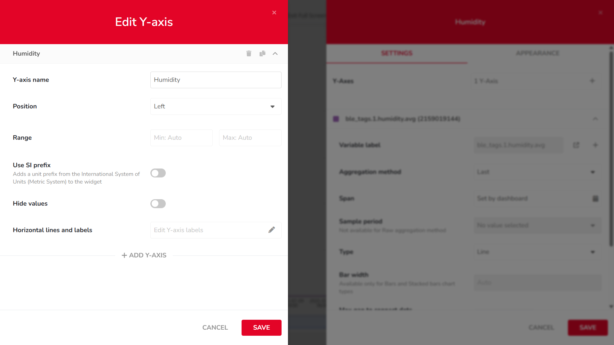

import Image from '@theme/IdealImage';

# Displaying a Variable in a Basic Chart (Line Chart)

This widget allows you to visualize how your variable changes over time. It’s perfect for tracking trends, comparing multiple variables, or analyzing time-based performance.

---

## Step-by-Step Instructions

1. #### **Open Dashboards**  
   In the top navigation bar, click on `Data`, then select `Dashboards`. This will open the dashboard management area.

    

---

2. #### **Add a New Widget**  
   Click the `Add new Widget` button (marked with a + icon).

    

---

3. #### **Choose a Widget Type**  
   From the list of available widgets, scroll to the `Charts` section and choose a `Line Chart`.

    

---

4. #### **Add a Variable**  
   Click on `+ ADD VARIABLES`, then:  
   • Select your device  
   • Choose the desired variable  
   • Confirm the selection by clicking `SELECT`

    

---

5. #### **Configure Chart Settings**  
   In the `SETTINGS` tab, configure options such as:  
   • Aggregation Method  
   • Span  
   • Sample Period  
   • Bar Width  
   • ...

   

---

6. #### **Edit Y-Axis Settings**  
   In the same `SETTINGS` tab, click the `1 Y-Axis` button to adjust:  
   • Axis name  
   • Position  
   • Value range  
   • ...

    

---

7. #### **Edit Widget Appearance**  
   Switch to the `APPEARANCE` tab to modify visual elements such as:  
   • X-axis label  
   • Font  
   • Date format  
   • ...

   

---

8. #### **Resize the Chart**  
   Once the widget is added to your dashboard, resize it using the arrow icon in the bottom-right corner of the chart.

    

---

9. #### **View Data Points**  
   Hover over the chart line to view individual data values as tooltips.

    
    
---

:::tip
If you need further assistance or a visual demonstration of the process described in this guide, consult the [Video Guide](https://docs.hardwario.com/apps/videos-apps/ubidots-dashboard).
:::