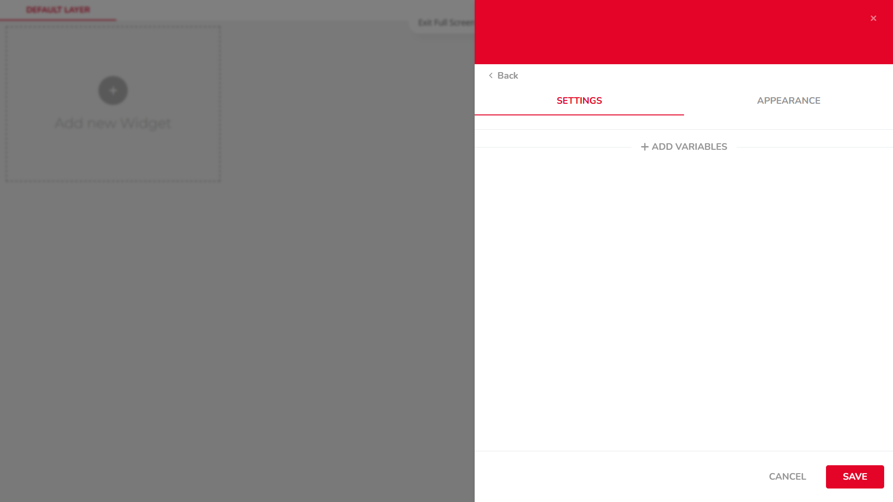

import Image from '@theme/IdealImage';

# Displaying the Current Value of a Variable (Metric)

This widget allows you to display a single numerical value — such as temperature, humidity, or any sensor reading — in a clear and simple format. It’s ideal for showing the latest or average reading at a glance.

---

## Step-by-Step Instructions

1. #### **Open Dashboards**  
   In the top navigation bar, click on `Data`, then select `Dashboards`. This will open the dashboard management area.

   

---

2. #### **Add a New Widget**  
   Click the `Add new Widget` button (marked with a + icon).

   

---

3. #### **Choose a Widget Type**  
   From the list of available widgets, choose one of the `Metric` types (used to display numerical values).

   

---

4. #### **Add a Variable**  
   Click on `+ ADD VARIABLES`, then:  
   • Select your device  
   • Choose the desired variable  
   • Confirm the selection by clicking `SELECT`

   

---

5. #### **Configure Aggregation and Time Span**  
   Set the `Aggregation Method` (e.g. average, last value) and `Span` (time range).

   

---

6. #### **Edit Widget Appearance**  
   Switch to the `APPEARANCE` tab to customize display options such as:  
   • Label  
   • Color  
   • Font  
   • Date format  
   • ...  

    

---

7. #### **Save the Widget**  
   Click `SAVE` to add the widget to your dashboard.

    

---

:::tip
If you need further assistance or a visual demonstration of the process described in this guide, consult the [Video Guide](https://docs.hardwario.com/apps/videos-apps/ubidots-dashboard).
:::