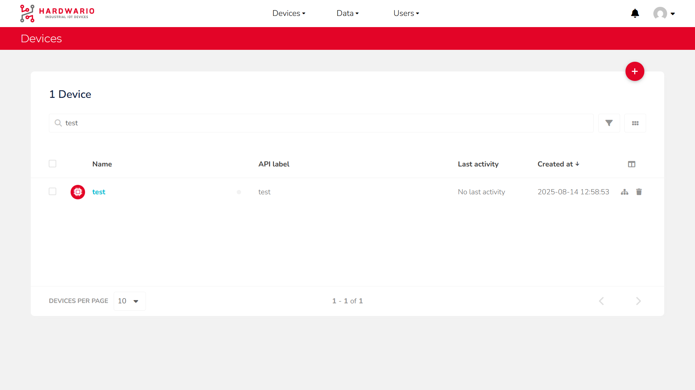
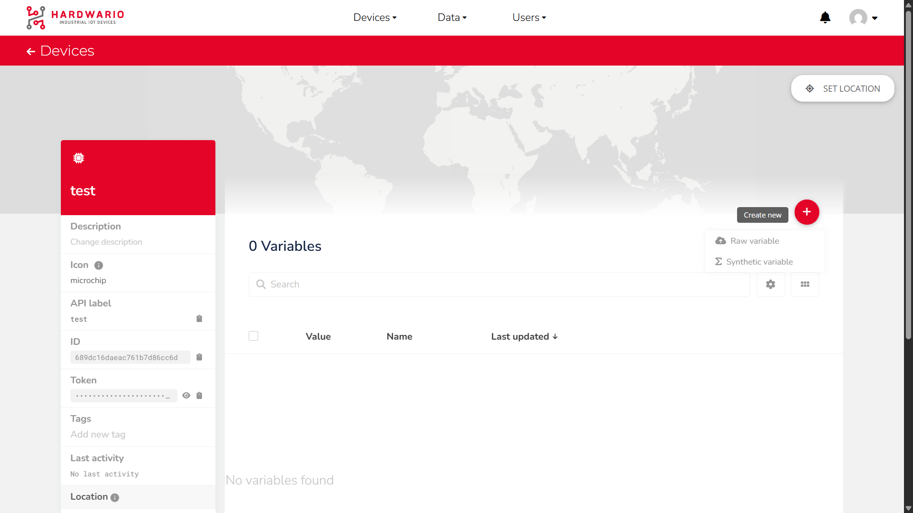
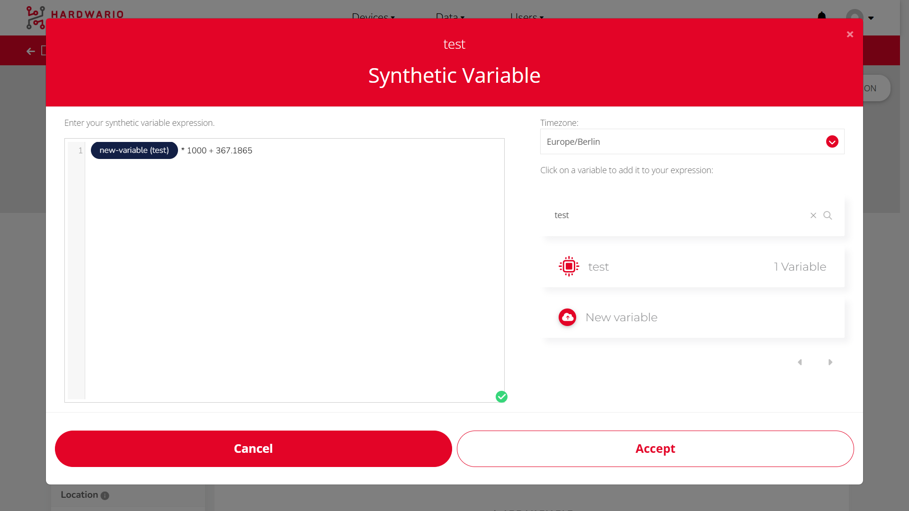

import Image from '@theme/IdealImage';

# Creating a Custom Variable in Ubidots (Synthetic Variable)

If you need to create a new variable derived from your existing data (for example, an average, a conversion, or a mathematical combination), you can do this directly in **Ubidots** by creating a **Synthetic Variable**.

---

## Step-by-Step Instructions

1. #### **Open the Devices Section**  
   In the top navigation bar, click on `Devices`.  
   You will see a list of all your devices.  
   Find your device and click on it.

   

---

2. #### **Add a New Variable**  
   In the top-right corner, click the red `+` button  
   and select **Synthetic Variable** from the menu.

   

---

3. #### **Select Device and Variables**  
   On the **right side**, select:  
   • Your device  
   • The variables you want to use in your calculation  

   On the **left side**, enter your formula.  
   You can combine multiple variables and mathematical operators to create new logic.

   

---

## Example Operations (format samples)

**1. Average of two variables**  
```text
(temperature_1 + temperature_2) / 2
```

**2. Convert temperature from °C to °F**  
```text
(temperature * 9 / 5) + 32
```

**3. Difference between two pressure values**  
```text
pressure_sensor_1 - pressure_sensor_2
```