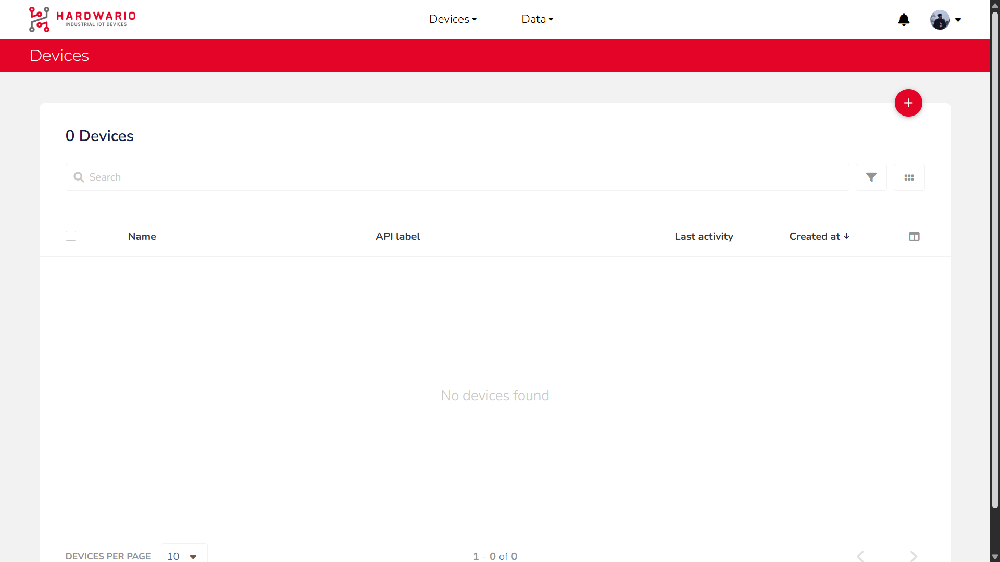
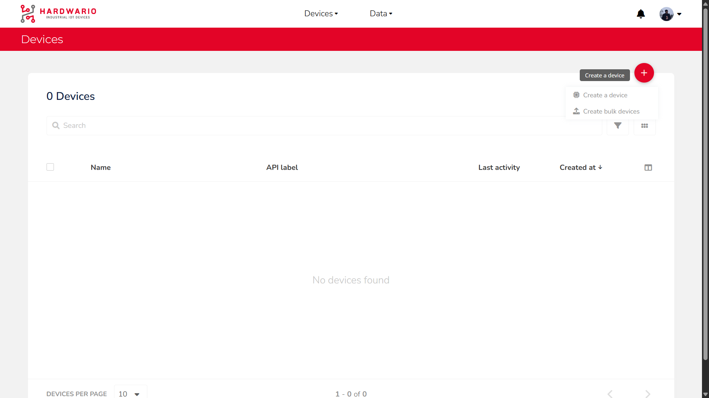
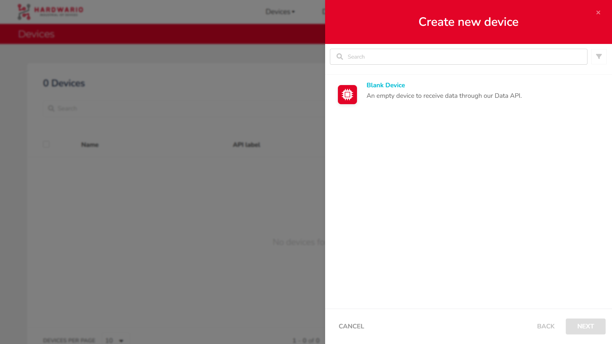
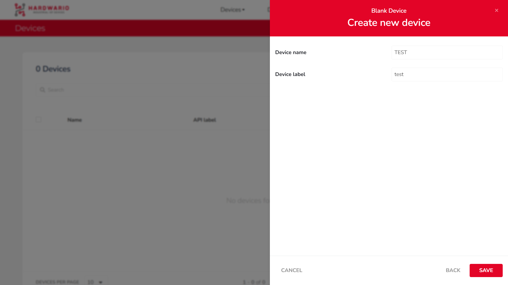
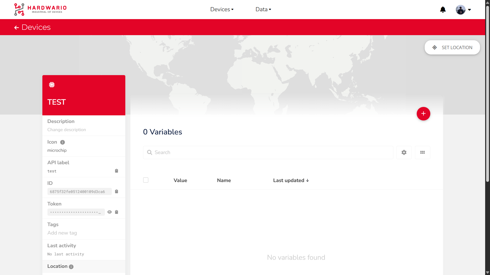

import Image from '@theme/IdealImage';

Before you can send data to [Ubidots](https://ubidots.hardwario.com/) or create dashboards, the first step is to create a new device. This tutorial will guide you through a few simple steps to help you add your first device.

---

#### Step-by-Step Instructions

1. #### **Click the Plus Button**  
   After logging into the [Ubidots web interface](https://ubidots.hardwario.com/), click the `+` button in the upper-right corner, just below your profile icon.

   

2. #### **Choose to Create a Device**  
   A dialog will appear with two options. Click on `Create a device`.

  

3. #### **Select Blank Device**  
   A new window will open. Click on the `Blank Device` option.

  

4. #### **Configure Device Name and Label**  
   You will be taken to a form where you can define:  
   • `Name` – the display name of the device  
   • `Label` – the unique identifier used in API and dashboard references  
   After filling both fields, click `SAVE`.

   

5. #### **View the Newly Created Device**  
   The new device will now appear in your device list.  
   Click on its name to open the device’s details page, where you can find additional information such as:  
   • `Description`  
   • `API Label`  
   • `ID`  
   • `Token`  
   • `Tags`  
   • and more

   

---
:::tip
Once the device is created, you can start sending data to it and add variables to visualize on your dashboards.
:::

