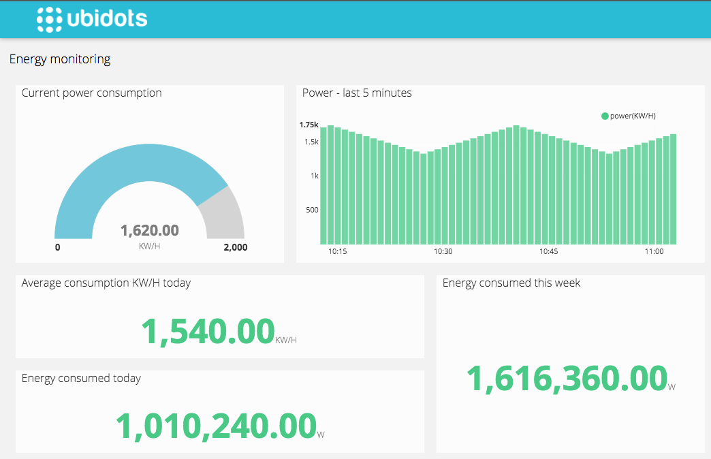

import Image from '@theme/IdealImage';

# Ubidots

Ubidots is a cloud‑based IoT application development platform that empowers developers, system integrators, businesses, and innovators to design, deploy, and scale IoT solutions with minimal coding effort. The platform delivers a comprehensive toolkit—featuring drag‑and‑drop dashboards, real‑time data visualizations, smart alerts, scheduled reporting, analytics, and white‑label capabilities—to turn raw sensor data into actionable insights quickly and efficiently

---

## Example of an IoT Data Dashboard

## Getting Started

### 1. Create a Device in Ubidots

Start by logging into [Ubidots](https://ubidots.hardwario.com/) and creating a new device.
This device will act as the endpoint that receives and stores data sent from HARDWARIO Cloud.

Here is a detailed step-by-step guide:
👉 [Adding a New Device](creating-device)

Here is a video guide:
🎥 [link to video tutorial]

### 2. Create a Connector in HARDWARIO Cloud

Next, go to [HARDWARIO Cloud](https://hardwario.cloud/) and set up a Connector that points to your Ubidots device.
This connector will securely transmit your device data from HARDWARIO Cloud to Ubidots.

Here is a detailed step-by-step guide:
👉 [Connectiong to the Cloud](cloud-connection)

Here is a video guide:
🎥 [link to video tutorial]

### 3. Create a Dashboard in Ubidots

Once the connection is established and data is flowing, create a dashboard in [Ubidots](https://ubidots.hardwario.com/).
Add widgets (such as graphs, indicators, and tables) to visualize your data in real time.

Here is a detailed step-by-step guide:
👉 [Creating a dashboard](creating-dashboard)

Here is a video guide:
🎥 [link to video tutorial]