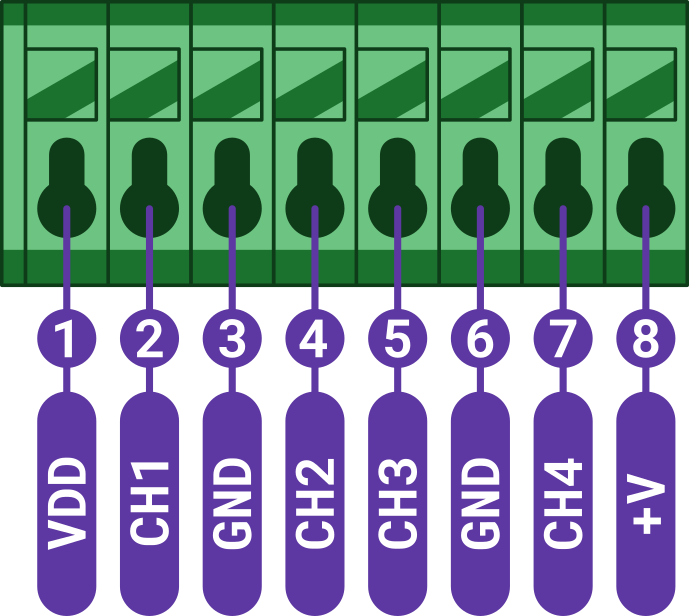

import Image from '@theme/IdealImage';

# CHESTER Control

This article describes the core functionality, hardware description, and example **JSON** message of the catalog application **CHESTER Control**.

:::caution

Some of the basics are not provided, as they are common for all CHESTER catalog applications. Please see:

- [**Getting started**](../getting-started.md) on how to connect device to Cloud.
- [**Common functionality**](common-functionality.md) to know how LED, button and network configuration works.
- [**Platform Management**](../category/platform-connectivity) on how to work with the interactive console.

:::

## Application Overview

**CHESTER Control** is based on [**CHESTER Input**](chester-input.md) (see for more details), but adds dynamic input type reconfiguration and remote control functionality of 4 transistor outputs.

Because **CHESTER Control** uses [**CHESTER-X0**](../extension-modules/chester-x0.md) input/output module, it is possible to change input behavior just by the configuration. This way you can assign any of four inputs to one of the functionalities:

- trigger (button, door contact)
- counter (count events, energy meters with S0 output)
- voltage (measure 0-28 V)
- current (measure 4-20mA current loop)

This device only supports the newer **LTEv2** stack and **HARDWARIO Cloud v2**.

## Application Variants

**CHESTER Control** can be ordered in one of these variants:

### CHESTER Control {#chester-control}

The catalog **CHESTER Control** hardware consists of the following ordering codes:

* `CHESTER-M-BCGLS` - Standard mainboard

* `CHESTER-X0B:A` - Input module (4 channels)

* `CHESTER-X4:B` - Step-down + outputs (4 channels)

See [**Ordering Codes**](../ordering-codes.md) for more details.

## Terminal Blocks

| CHESTER-X0B in left slot A- signals A1 - A8 | CHESTER-X4 in right slot B - signals B1 - B8                                                 |
| ------------------------------------------- | -------------------------------------------------------------------------------------------- |
| Use inputs **CH1** to **CH4** and **GND**   | Use **VIN** and **GND** to supply external power.                                            |
|                                             | Use **CH1** to **CH4** outputs, which supply voltage from **VIN** when the output is enabled |
|  |                                                   |


## Default Configuration

This is the default configuration (printed using the `app config show` command):

```
app config interval-report 1800
app config interval-poll 60
app config event-report-delay 5
app config event-report-rate 30
app config channel-mode-1 trigger
app config channel-mode-2 counter
app config channel-mode-3 voltage
app config channel-mode-4 current
app config trigger-input-type npn
app config trigger-duration-active 100
app config trigger-duration-inactive 100
app config trigger-cooldown-time 10
app config trigger-report-active false
app config trigger-report-inactive false
app config counter-interval-aggreg 300
app config counter-input-type npn
app config counter-duration-active 2
app config counter-duration-inactive 2
app config counter-cooldown-time 10
app config analog-interval-sample 60
app config analog-interval-aggreg 300
```

## Specific Commands

:::info

You can easily explore the whole command tree structure - start with the `help` command.

:::

:::caution

To apply a new configuration, you need to call `config save`, which applies the new configuration parameters and reboots the device.

:::

Commands are explained in the [**CHESTER Input**](chester-input.md#specific-commands) article.

**CHESTER Control** adds these commands to configure the function of each of the four inputs:

```
app config channel-mode-1 trigger
app config channel-mode-2 counter
app config channel-mode-3 voltage
app config channel-mode-4 current
```

## Output Control

Please see the Cloud documentation, specifically [Downlink data](../../cloud/cloud-v2/downlink) and [API examples](../../cloud/cloud-v2/downlink#api-examples).

You control outputs by sending this JSON to the cloud API endpoint (`https://api.prod.hardwario.cloud/v2/messages`) or in the HARDWARIO Cloud by going to the device's messages and clicking on "Create new downlink message"

```
{
  "output_1_state": 1,
  "output_2_state": 1,
  "output_3_state": 0,
  "output_4_state": 0
}
```

The JSON doesn't have to contain the output state of all four outputs. You send only `output_X_state` for outputs to be changed.

The device is polling the Cloud in an interval set by `interval-poll` parameter and if a new downlink control message is in the Cloud queue, it is sent to the device and output or multiple outputs are changed.


## Example JSON Message

```json
{
    "accelerometer": {
        "accel_x": 0,
        "accel_y": 0,
        "accel_z": 9.57,
        "orientation": 2
    },
    "counter": [
        {
            "channel": 2,
            "delta": 6,
            "measurements": [
                {
                    "timestamp": 1705328341,
                    "value": 7
                }
            ],
            "value": 7
        }
    ],
    "current": [
        {
            "channel": 4,
            "measurements": [
                {
                    "avg": 2,
                    "max": 5.03,
                    "mdn": 0,
                    "min": 0,
                    "timestamp": 1705328341
                }
            ]
        }
    ],
    "message": {
        "sequence": 1,
        "timestamp": 1705328341,
        "version": 1
    },
    "network": {
        "imei": 351358816128174,
        "imsi": 901288910100358
    },
    "thermometer": {
        "temperature": 22.75
    },
    "trigger": [
        {
            "channel": 1,
            "events": [
                {
                    "timestamp": 1705328233,
                    "type": "activated"
                },
                {
                    "timestamp": 1705328233,
                    "type": "deactivated"
                },
                {
                    "timestamp": 1705328233,
                    "type": "activated"
                },
                {
                    "timestamp": 1705328233,
                    "type": "deactivated"
                },
                {
                    "timestamp": 1705328234,
                    "type": "activated"
                },
                {
                    "timestamp": 1705328234,
                    "type": "deactivated"
                },
                {
                    "timestamp": 1705328234,
                    "type": "activated"
                },
                {
                    "timestamp": 1705328235,
                    "type": "deactivated"
                }
            ],
            "state": "inactive"
        }
    ],
    "voltage": [
        {
            "channel": 3,
            "measurements": [
                {
                    "avg": 0.27,
                    "max": 1.35,
                    "mdn": 0,
                    "min": 0,
                    "timestamp": 1705328341
                }
            ]
        }
    ]
}
```
