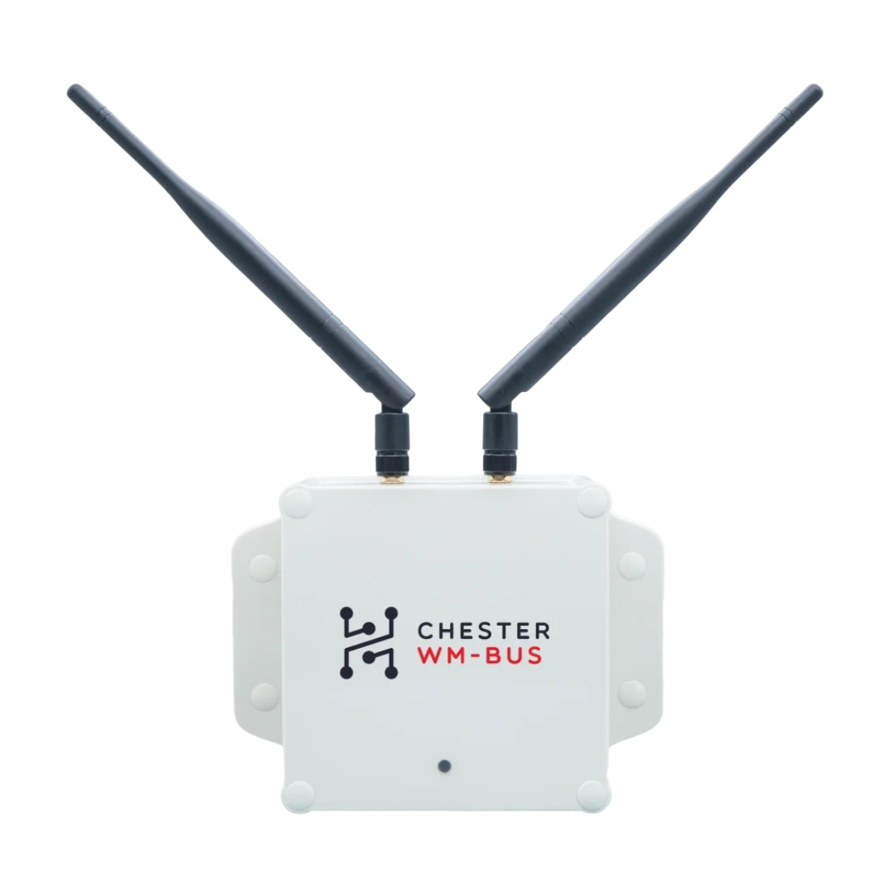

import Image from '@theme/IdealImage';

# CHESTER wM-Bus



:::caution

Some of the basics are not provided, as they are common for all **CHESTER** catalog applications. For example, see the article [**Platform Management**](../category/platform-connectivity) on how to work with the interactive console.

:::

## Application Overview

**CHESTER wM-Bus** is a **Wireless M-Bus** gateway. This device listens for configured **wM-Bus T1 and C1** devices in specific intervals, aggregates the raw received wM-Bus packets and sends them over the **NB-IoT/LTE-M** network.

It is used in homes and apartments for measuring the consumption of **heat**, **gas**, **electricity**, **water** and reading **other wM-Bus devices**.

The device has **two antennas** that can be switched during reception to achieve ideal reception for scanning in **both polarizations**.

The device can be configured to do **periodic**, **daily**, **weekly** or **monthly scans**.

The device has a sufficiently low power consumption that it can operate from batteries for many years. A version with an external power supply can also be ordered.

CHESTER wM-Bus only receives raw hexadecimal wireless M-BUS packets. The device itself or HARDWARIO Cloud doesn’t decode the wM-Bus sensors data. Each wM-Bus sensor has its own representation of encoded data, or the packets might be encrypted. Decoding of the raw hexadecimal values to meaningful units is up to the customer or integrator.

This device supports the newer **LTEv2** stack and **HARDWARIO Cloud v2**.

## Application Variants

**CHESTER wM-Bus** can be ordered in one of these variants:

### CHESTER wM-Bus

Battery powered with 6 pcs alkaline "D" cells.

The catalog **CHESTER wM-Bus** hardware consists of the following ordering codes:

* `CHESTER-M-CES` - Standard mainboard w/o supercapacitors

* `CHESTER-B1W` - B1 carrier board with wM-Bus radio.

See [**Ordering Codes**](../ordering-codes.md) for more details.

### CHESTER wM-Bus DC

Externally powered 230V DC adapter.

The catalog **CHESTER wM-Bus DC** hardware consists of the following ordering codes:

* `CHESTER-M-CS` - Standard mainboard w/ supercapacitors

* `CHESTER-B1W` - B1 carrier board with wM-Bus radio.

See [**Ordering Codes**](../ordering-codes.md) for more details.

## Scanning and Behavior

Addresses of the wM-Bus devices and device mode could be imported and reconfigured over the cloud.

The device has adjustable parameters where it can scan wM-Bus devices periodically, daily, weekly or monthly. The scan time and other parameters can also be set.

## Default Configuration

This is the default configuration (printed using the `app config show` command):

```
app config scan-timeout 130
app config season-month-start 9
app config season-month-end 3
app config scan-interval 600
app config scan-hour 12
app config scan-weekday 3
app config scan-day 15
app config scan-mode off
app config scan-ant dual
app config poll-interval 28800
app config downlink-wdg-interval 172800
```

If you have any wM-Bus addresses configured, you will also see them in the log together with the count of them.

```
app config address count 1
app config address add 81763000
```

## Specific Commands

:::info

You can easily explore the whole command tree structure - start with the `help` command.

:::

:::caution

To apply a new configuration, you need to call `config save`, which applies the new configuration parameters and reboots the device. This applies only if you configure the device over Bluetooth or J-Link.
This is not needed if you apply commands in a batch over the cloud.

:::

### Address List Configuration

This command adds the wM-Bus addresses that device scans and sends later their raw data to the cloud.

`app config address`

Lists all saved device addresses. If this listing is done via BLE and contains a large number of devices (dozens), we recommend resetting the device after this listing.

`app config address add 123456`

Adding a sensor that broadcasts all year round with the address 123456.

`app config address add 123456 S`

Adding a sensor that transmits only during the heating season with the address 123456. At the end of the line, the character S means seasonal. A season can be defined by setting the season start and end months using the season-month-start and season-month-end parameters.

`app config address remove 123456`

Removing a sensor from the list.

`app config address erase`

Removing all sensors from the list.

### Scan Configuration

Scanning indicates the time during which CHESTER captures wM-Bus packets. The scan method is set by the `scan-mode` parameter.

`app config scan-mode <mode>`

- **off** - automatic scan off, ideal for shipping or location tuning with manual scan start
- **interval** - scan in intervals. For debug only, `scan-interval` parameter (ignores set months to scan)
- **daily** - scan once a day, always at the hour set by the `scan-hour` parameter
- **weekly** - scan once a week, always at the hour and day of the week set by the `scan-hour` and `scan-weekday` parameters
- **monthly** - scan once a month, always at the hour and day of the month set by the `scan-hour` and `scan-day` parameters

`app config scan-timeout 480`

After the scan is started, it is scanned for the maximum `scan-timeout` time (adjustable in the range of 10-86400 seconds), or until packets arrive from all devices from the address list.

This is a safety timer which, in the worst case, prevents the scanning from remaining on indefinitely in case of non-acceptance/failure of the sensor. The timeout is doubled if both antennas are activated by the `scan-ant` parameter.

`app config scan-interval 600`

Fixed scan in intervals if `scan-mode` is set to **interval**, for debug only, units of seconds 0-86400.

`app config season-month-start 9`

`app config season-month-end 3`

It determines the months when it is the heating season and when the cost indicators that were set when adding via the “address” command with the “S” parameter are to be scanned. 1-12 / January-December.

The starting month must always be greater than the ending "end" month. The parameter "3" in the example above, which ends the season, means that even the third month is still the heating season, i.e. from September to March inclusive. (September 1 - March 31).

`app config scan-hour 12`

It determines the hour at which the scan should start. CHESTER device clocks operate in UTC. The device does not distinguish between time zones or daylight savings time. The correct hour must be considered with some margin if wM-Bus sensors automatically change their clocks to summer/winter time.

`app config scan-weekday 2`

Specifies the day of the week to scan for a weekly scan. 0 - Sunday, 1 - Monday, ...

`app config scan-day 2`

Specifies the day of the month when scanning 1-28 during the monthly scan

`app config scan-ant <mode>`

**single** - scan uses only one cycle with one antenna, if it receives data from all devices, it sends data immediately, if not, it sends data after the `scan-timeout` timeout

**dual** - the scan takes place twice, each time with a different antenna. If all devices are not scanned in the first cycle with antenna 1, a second scan with the second antenna is started. Each scan takes a maximum of scan-timeout seconds. The maximum time when the wM-Bus receiver is active is equal to 2x `scan-timeout`.

## Firmware

The latest firmware is available in Catalog Applications [Firmware chapter](index.md#application-firmware).

## Example JSON Message

In this example **JSON** you can see raw data from two wM-Bus sensors

Each JSON cloud message contains up to 20 wM-Bus packets. If CHESTER is configured for more than 20 devices, then the raw wM-Bus packets are split to multiple JSON messages.

```json
{
    "accelerometer": {
        "accel_x": 0.22,
        "accel_y": 0.07,
        "accel_z": 9.42,
        "orientation": 2
    },
    "battery": {
        "current_load": null,
        "voltage_load": null,
        "voltage_rest": null
    },
    "frame": {
        "protocol": 3,
        "sequence": 0,
        "timestamp": 1698660040
    },
    "network": {
        "parameter": {
            "band": 1184866148,
            "cid": 248833,
            "earfcn": -2121962691,
            "ecl": 536882852,
            "eest": 0,
            "plmn": 536882852,
            "rsrp": 384479,
            "rsrq": 508,
            "snr": 0
        }
    },
    "state": {
        "uptime": 47
    },
    "thermometer": {
        "temperature": 22.31
    },
    "wmbus": {
        "cycle": 1,
        "devices": 1,
        "packets": [
            {
                "data": "32446850003076816980a0919f2b06007007000061087c08000000000000000000000000010101020100000000000000000000",
                "rssi": -65
            },
            {
                "data": "32446850003076816980a0919f2b06007007000061087c08000000000000000000000000010101020100000000000000000000",
                "rssi": -72
            }
        ],
        "part": 0,
        "received": 1,
        "scan_time": 2
    }
}
```
