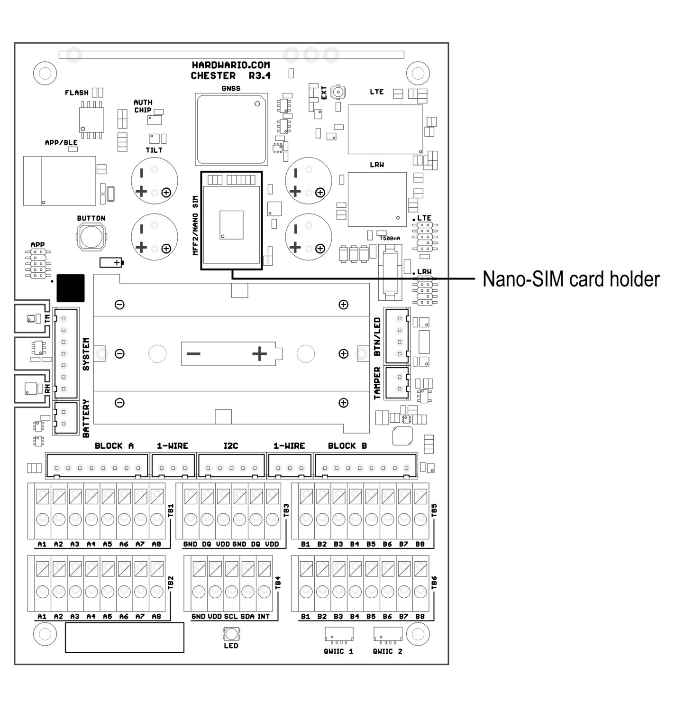
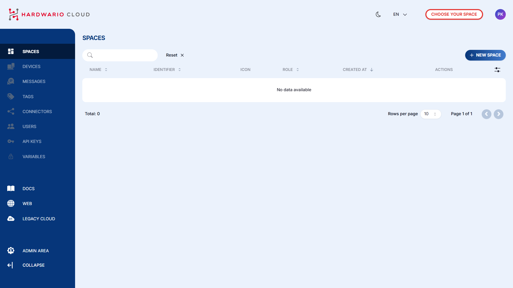
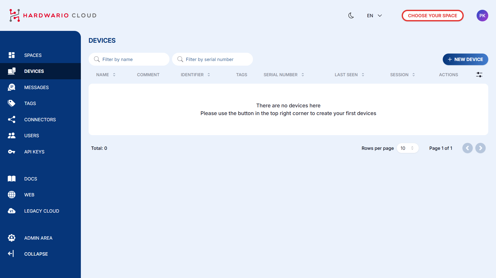

import Image from '@theme/IdealImage';
import Tabs from '@theme/Tabs';
import TabItem from '@theme/TabItem';

# Cloud v2 Migration Guide

This article walks you through the complete migration process from Cloud v1 to Cloud v2.

## 1. Update the LTE Modem

In this guide, you will set up the required software tools and hardware to work with the CHESTER device. It explains how to install and verify the HARDWARIO Command Line Tools in a Python virtual environment and how to connect the SEGGER J-Link programmer. Mainly, it walks you through erasing the application firmware, flashing the LTE modem firmware, and then reinstalling the application firmware, which is required to begin migration to HARDWARIO Cloud v2.

👉 **Step-by-Step guide: [https://docs.hardwario.com/chester/firmware-flashing/lte-modem-over-j-link](/chester/firmware-flashing/lte-modem-over-j-link.md)**

## 2. Flash the Application

In this guide, you will learn how to flash application firmware to the CHESTER device using the SEGGER J-Link programmer. It explains the required hardware and software setup, including installing Python, creating a virtual environment, and installing the HARDWARIO Command Line Tools. Mainly, it shows how to connect the J-Link, and then flash the application firmware either from a HEX file or directly using a 128-bit unique ID.

👉 **Step-by-Step guide: [https://docs.hardwario.com/chester/firmware-flashing/application-over-j-link](/chester/firmware-flashing/application-over-j-link.md)**

## 3. Insert the SIM Card

## 4. Add the Device to Cloud v2

#### 1. Go to [HARDWARIO Cloud v2](https://hardwario.cloud/)
- Open the [HARDWARIO Cloud](https://hardwario.cloud/) interface in your browser.

#### 2. Create a New Space
- First, you need to create a new Space.
Click the button in the top-right corner labeled + NEW SPACE.

#### 3. Create a New Device
- Once the Space is created, you can add a new device.
Click the button in the top-right corner labeled + NEW DEVICE.

#### 4. Enter Device Details

- Name
- Serial Number
- Claim Token
  
 (Optional: you can also add a comment and [tags](https://docs.hardwario.com/cloud/tags))

 :::info
**[Tags](https://docs.hardwario.com/cloud/tags)** group devices by firmware or functionality and can be used for filtering.  
They also link devices with **[Connectors](https://docs.hardwario.com/cloud/connectors)**, ensuring messages are routed correctly.  
Each tag has a **name** and **color**.  
:::

 

#### 5. Device Added
Your device is now **successfully added** to Cloud v2.

:::info
To visualize your incoming data, you can continue with the visualization options described here:  
👉 [HARDWARIO Apps Documentation](https://docs.hardwario.com/apps/)  
:::
