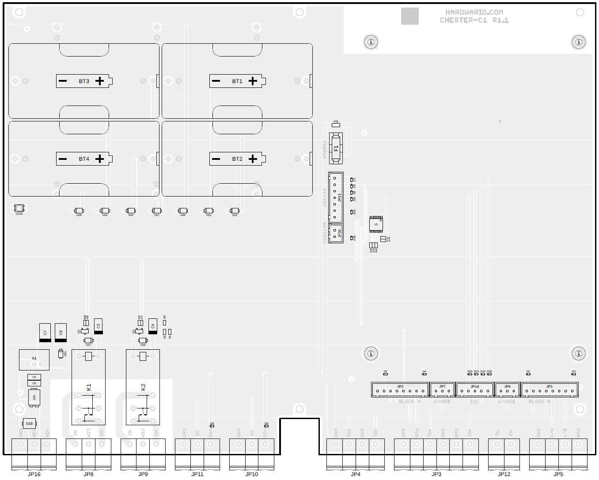
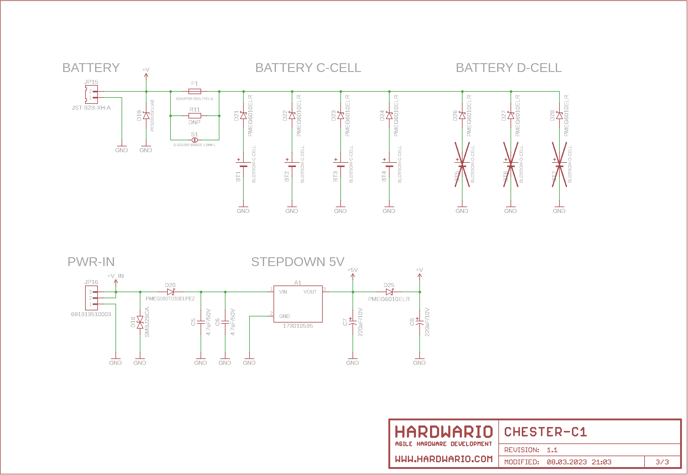

import Image from '@theme/IdealImage';

# CHESTER-B1
This article describes the **CHESTER-CB** carrier board.

## Module Overview

**CHESTER-B1** is a carrier board for **CHESTER-M** providing extra battery capacity for extend battery lifespan. It can be useful for application that needs long life time 5 - 10 years without battery replacement or for standard application thats requires short period of measuring and communication which is mor power consumption The following configurations are available:
- up to eight 3.6V lithium C cells (8P)
- up to eight 1.5V alkaline C cells (2S4P)
- up to six 3.6V D cell in parallel (6P)
- up to six 1.5V alkaline D cells (2S3P)

CHESTER-B1 with fits with the Takachi WP20-28-5Cx enclosure with C cell holders or Takachi WP20-28-57x with D cell holders.

## Technical Specification

* Input DC voltage range (VIN): **8-36 V**
* Supported C size battery: 1 x **Saft LSH14** or 1 x **Saft LS26500\***
* Up to 4 x C size or 3 x D size battery on request (Saft LSH20 or LS33000)
* Nominal battery voltage: **3.6 V**
* Battery idle current consumption **<2 μA** (without **CHESTER-M**)

_\* Saft LS26500 cannot be used with CHESTER-M-E variant (without supercapacitors)._

For more details see [**Ordering Codes**](../ordering-codes.md#chester-m).

## Module drawing

## Inputs and outputs overview

| Position | Name      | Signal Description                      |
| -------- | --------- | --------------------------------------- |
| JP4      | BATTERY   | External battery input JST connector    |
| JP5      | SYSTEM    | CHESTER SYSTEM JST connector            |

_\* CHESTER-X SLOT A is by default occupied with integrated module CHESTER-X1_

_\** Use the BYPASS BUTTON to initiate start from the battery without DC input power supply_

## Pinout Description

### Block A Connectors

### 1-Wire Connectors

### I2C Connector

### SYSTEM Connector

### Block B Connectors

## Schematic Diagram

A schematic diagram is useful if you program low-level hardware-related code or if you're just curious about how the system is designed.

- [Schematic (PDF)](schematics/hio-chester-c1-r1.1.pdf)

<!--
- [TODO Interactive PCB connector, part, testpoint and signal browser]
-->

