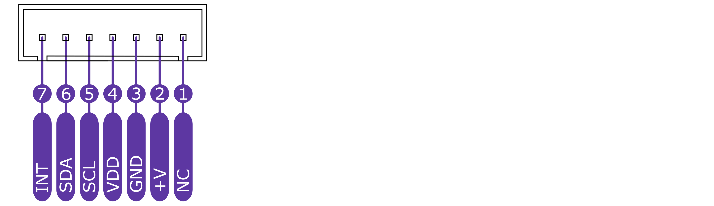

import Image from '@theme/IdealImage';

# CHESTER-C1
This article describes the **CHESTER-C1** carrier board.

## Module Overview

**CHESTER-C1** is a carrier board for **CHESTER-M** implementing:
- 4x digital/analog inputs terminal
- 2x power relay
- RS-485 interfaces terminal
- Two 1-Wire terminals
- DC/DC converter
- Battery holder for 4x C-cell sized 3.6V batteries

**CHESTER-C1** fits with the Takachi WP20-28-5Cx enclosure.

## Technical Specification

* Input DC voltage range (VIN): **8-36 V**
* Supported C size battery: 1 x **Saft LSH14** or 1 x **Saft LS26500\***
* Up to 4 x C size or 3 x D size battery on request (Saft LSH20 or LS33000)
* Nominal battery voltage: **3.6 V**
* Battery idle current consumption **<2 μA** (without **CHESTER-M**)

_\* Saft LS26500 cannot be used with CHESTER-M-E variant (without supercapacitors)._

For more details see [**Ordering Codes**](../ordering-codes.md#chester-m).

## Module drawing

## Inputs and outputs overview

| Position | Name      | Signal Description                      |
| -------- | --------- | --------------------------------------- |
| JP16     | VIN POWER | DC power supply input (VIN 8-36 V)      |
| JP8      | RELAY 1   | Relay 1 power output                    |
| JP9      | RELAY 2   | Relay 2 power output                    |
| JP11     | 1-WIRE    | 1-Wire 3-pin terminal                   |
| JP10     | 1-WIRE    | 1-Wire 3-pin terminal                   |
| JP4      | DIGITAL   | 2 x digital I/O                         |
| JP3      | ANALOG    | 2 x analog I/O + 2 x VIN                |
| JP12     | NA        | Not used                                |
| BT1-BT4  | BATTERY   | 4 x C size holder for 3.6 primary cell* |
| BT5-BT7  | BATTERY   | 3 x D size holder for 3.6 primary cell* |

_\* CHESTER-X SLOT A is by default occupied with integrated module CHESTER-X1_

_\** Use the BYPASS BUTTON to initiate start from the battery without DC input power supply_

## Pinout Description

### Block A Connectors

### 1-Wire Connectors

### I2C Connector

### SYSTEM Connector

### Block B Connectors

## Schematic Diagram

A schematic diagram is useful if you program low-level hardware-related code or if you're just curious about how the system is designed.

- [Schematic (PDF)](schematics/hio-chester-c1-r1.1.pdf)

<!--
- [TODO Interactive PCB connector, part, testpoint and signal browser]
-->

