import Image from '@theme/IdealImage';

# CHESTER-C5
This article describes the **CHESTER-C5** carrier board.

## Module Overview

**CHESTER-C5** is a custom carrier board for **CHESTER-U1** designed as a **NB-IoT / LTE-M** gateway for connecting arrays of **1-Wire sensors** (i.e. DS18B20) equipped with Lithium-Ion battery backup, implements a step-down DC/DC converter providing power from an external 6-28 VDC line (VIN) or 12V solar panel. It allows to measure input DC voltage, QWIIC interface can by used for connecting OLED display.

The board implements the Maxim DS2482S-800+ providing 8 independent 1-Wire channels on CHESTER-X slot A. Slot B can be extended with the CHESTER-X1 providing another 8-ch 1-Wire or any other CHESTER-X module.

**CHESTER-C5** fits with the Polycase WH-04-02 enclosure.

## Technical Specification

* Input DC voltage range (VIN): **6-28 VDC**, suitable also for **12-18V solar panels\***
* Nominal battery voltage: **3.7 V**
* Battery charging current: **200 mA**
* Battery idle current consumption **<10 μA** (without CHESTER-M)
* Recommended battery type for outdoor use: Samsung ICR18650-22P**
* Operating temperature: **-40 to +70°C** (without Li-Ion Battery)
* Storage temperature: **-40 to +85°C** (without Li-Ion Battery)

_\*Optimal photovoltaic solar panel for CHESTER: 12 V / 10 W_

_\**Appropriate for solar panel application, charging temperature range -20 to +45°C, discharging -20 to +70°C_

## Battery charger and protection circuit
**CHESTER-C5** implements the MCP73833 charger IC and the AP9101C protection IC protecting the battery by detecting overcharge voltage, overdischarge voltage, overcharge/discharge current.

:::caution

For initial start powering from the battery without DC input power supply** it is necessary to long pres the Bypass button (BYPASS)**.

:::

## Module drawing: top

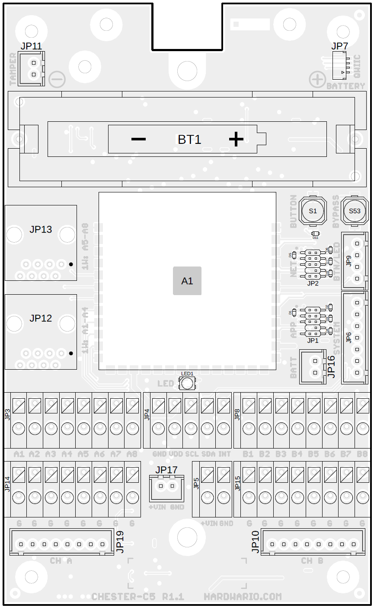

## Module drawing: bottom

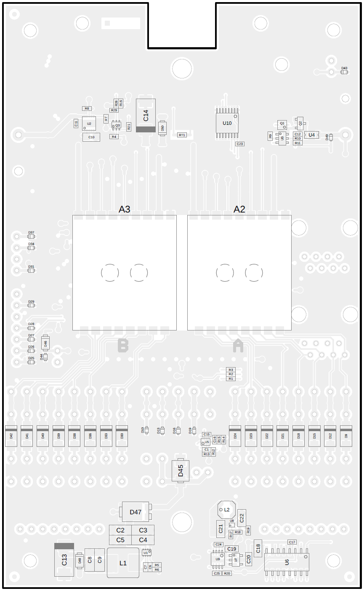

## Module drawing description

| Position | Name        | Signal Description                        |
| -------- | ----------- | ----------------------------------------- |
| A1       | CHESTER-U1  | CHESTER-U1 soldering slot                 |
| A2       | CHESTER-X A | CHESTER-X soldering slot A*               |
| A2       | CHESTER-X B | CHESTER-X soldering slot B                |
| A3       | CHESTER-U1  | CHESTER-U1 soldering slot                 |
| BT1      | BATTERY     | 18650 Li-Ion battery holder               |
| JP1      | APP SWD     | Application MCU SWD / debug connector     |
| JP2      | NET SWD     | LTE Modem SWD / debug connector           |
| JP3      | 1-Wire A    | Integrated 8-ch 1-Wire interface terminal |
| JP4      | I2C         | I2C interface terminal                    |
| JP5      | VIN         | 6-28 V DC Power Input terminal            |
| JP6      | SYSTEM      | CHESTER SYSTEM JST connector              |
| JP7      | QWIIC       | QWIIC connector (i.e. for OLED)           |
| JP8      | X slot B    | CHESTER-X slot B terminal                 |
| JP9      | BT/LED      | External Button + LED JST connector       |
| JP10     | X slot B    | CHESTER-X slot B JST con                  |
| JP11     | TAMPER      | Tamper input (normally open)              |
| JP12     | A1-A4       | 1-Wire A1-A4 + 4xGND RJ-45 con.           |
| JP13     | A5-A8       | 1-Wire A1-A4 + 4xGND RJ-45 con.           |
| JP14     | GND         | Terminal with 8xGND                       |
| JP15     | GND         | Terminal with 8xGND                       |
| JP16     | BATT        | External battery or PPK input             |
| JP17     | VIN         | 6-28 V DC Power Input JST connector       |
| JP19     | 1-Wire A    | Integrated 8-ch 1-Wire interface JST con. |
| LED      | RGY LED     | RGY LED indication                        |
| S1       | BUTTON      | CHESTER button                            |
| S53      | BYPASS      | Battery protection bypass button**        |

_\* CHESTER-X SLOT A is by default occupied with integrated module CHESTER-X1_

_\** Use the BYPASS BUTTON to initiate start from the battery without DC input power_

## Pinout Description

### BT/LED Connector

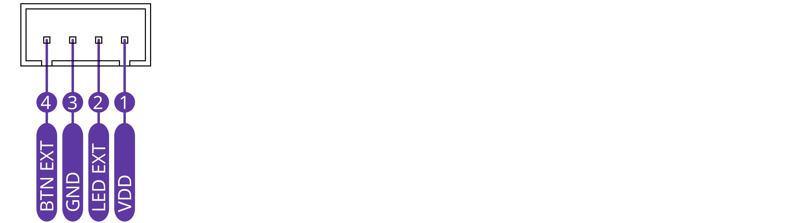

### SYSTEM Connector

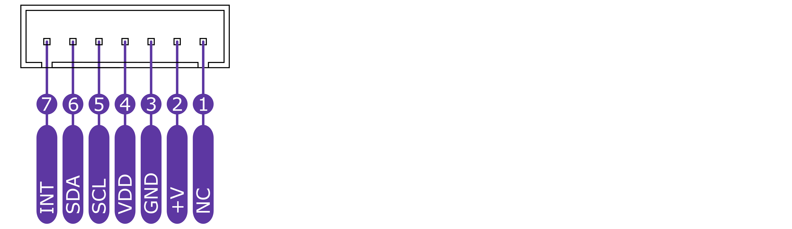

### BATTERY Connector

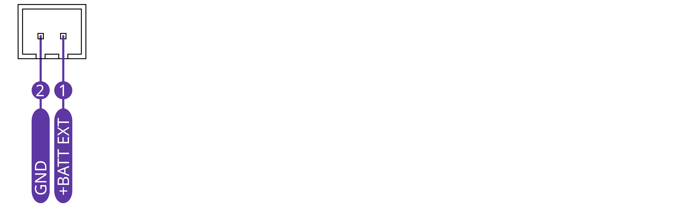

### 1-Wire RJ-45 Connectors

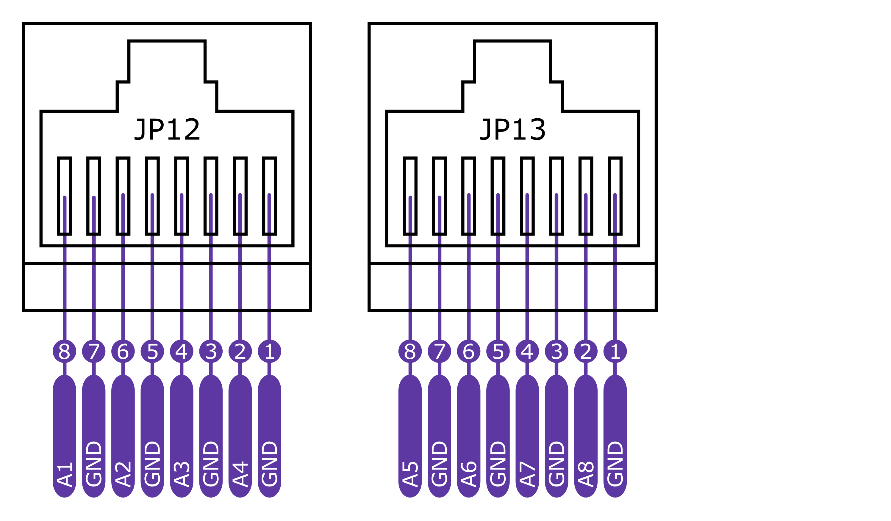

## Schematic diagram

A schematic diagram is useful if you program low-level hardware-related code or if you're just curious about how the system is designed.

- [Schematic (PDF)](schematics/hio-chester-c5-r1.1.pdf)

<!--
- [TODO Interactive PCB connector, part, testpoint and signal browser]
-->

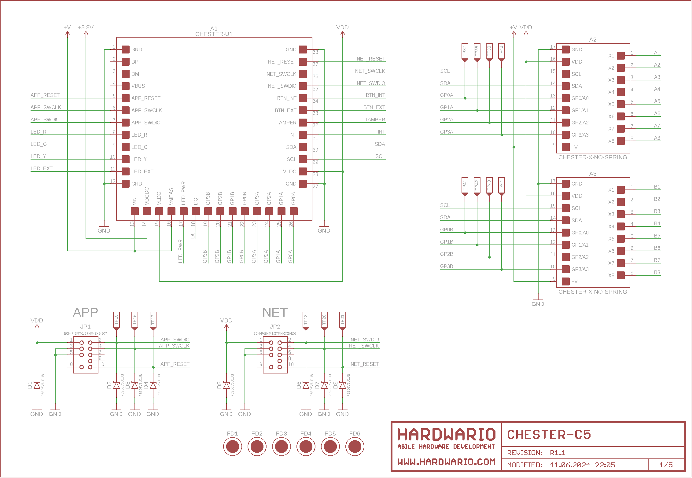
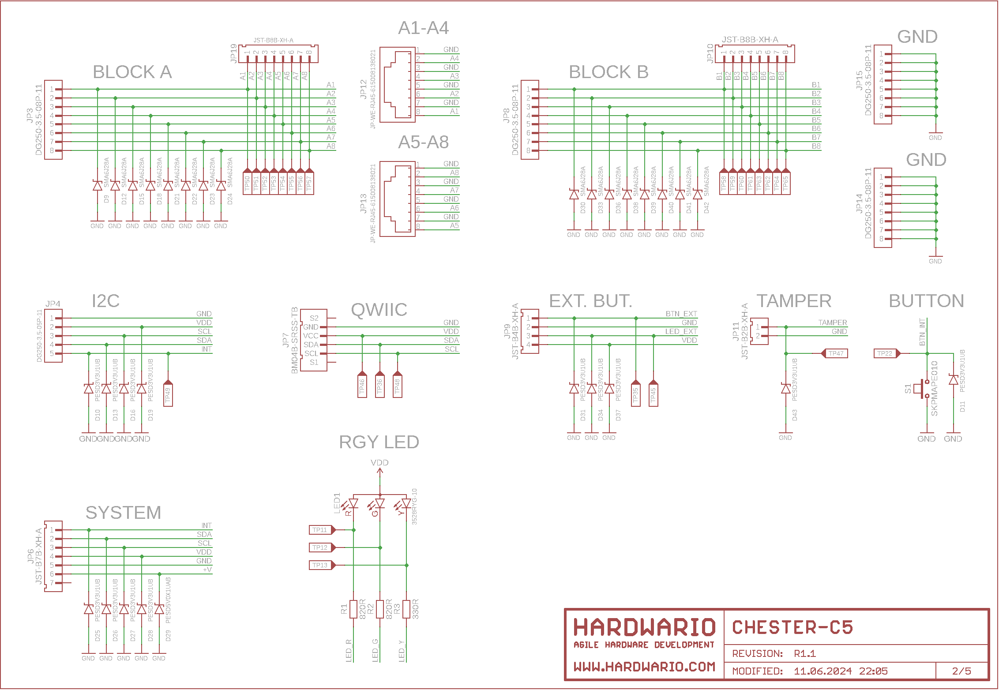
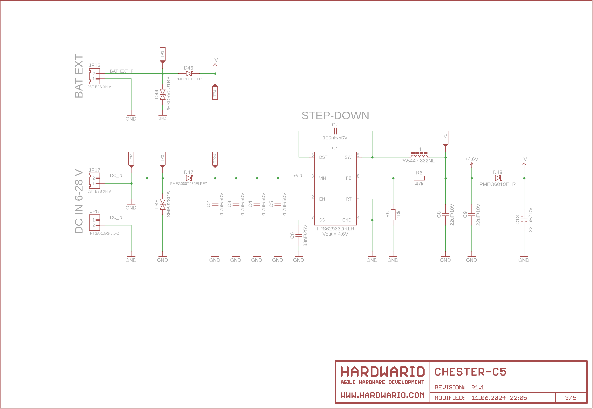
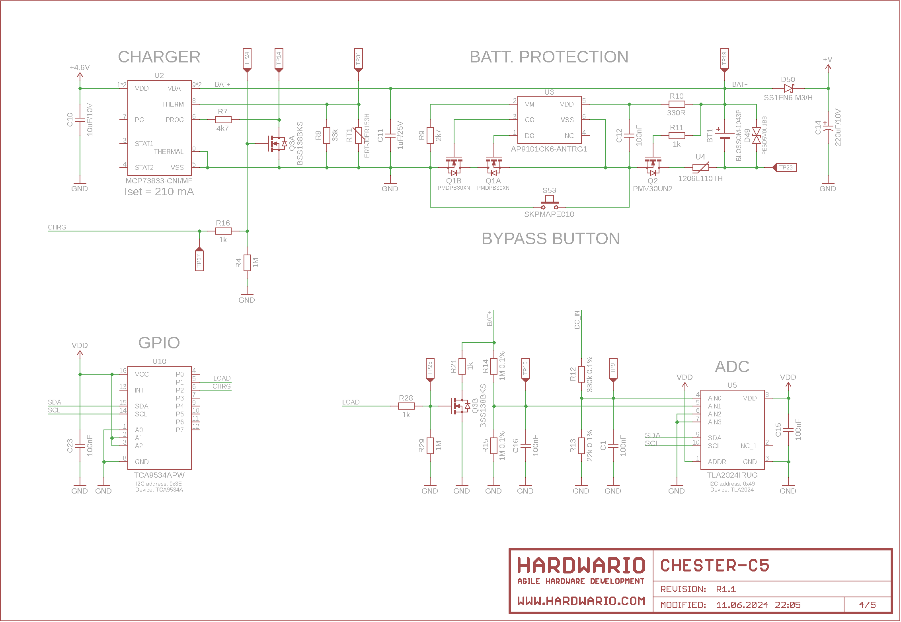
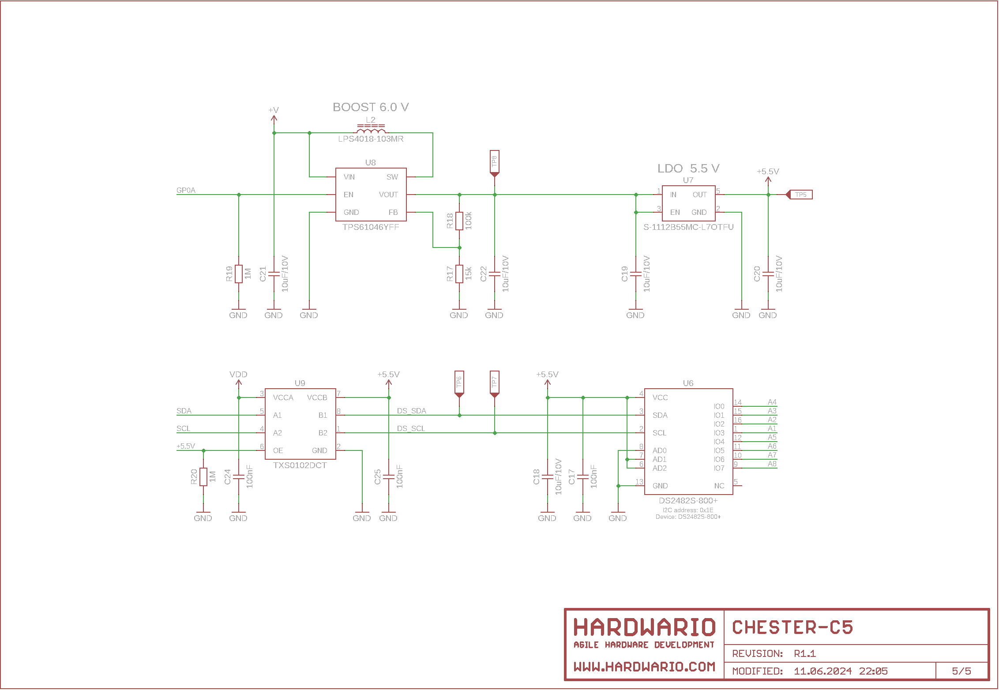

