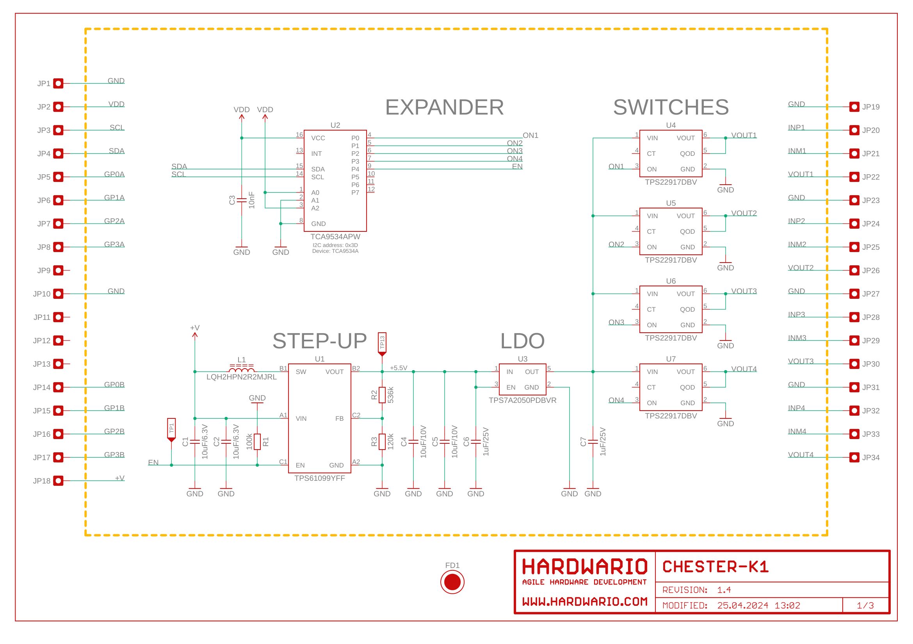
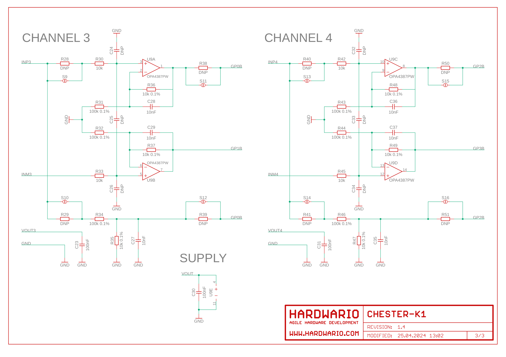

import Image from '@theme/IdealImage';

# CHESTER-K1

<Image img={require('./tb-chester-k1.png')} />

 

The extension module **CHESTER-K1** use both slots **A** and **B**. So you use the corresponding terminals **A1** to **A8** (left terminal block in the picture above) and **B1** to **B8** (right terminal block in the picture above).

## Current Transformer Signals

| Signal | Wire color |
| ------ | ---------- |
| GND    | Black      |
| INP    | White      |
| INM    | Yellow     |
| VOUT   | Red        |

## Schematic diagram

A schematic diagram is useful if you program low-level hardware-related code or if you're just curious about how the system is designed.

- [Schematic (PDF)](schematics/hio-chester-k1-r1.4.pdf)
- [Interactive PCB connector, part, testpoint and signal browser](pathname:///download/ibom/hio-chester-k1-r1.4.html)

