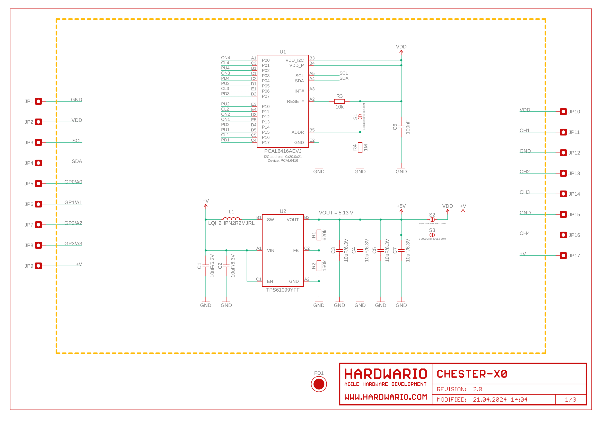
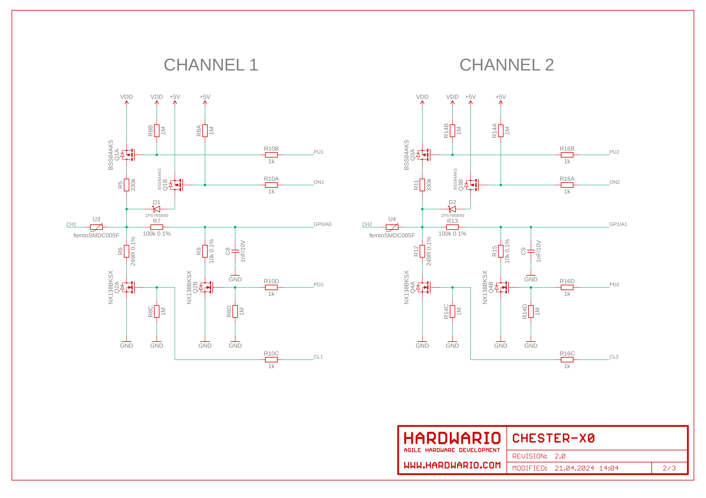
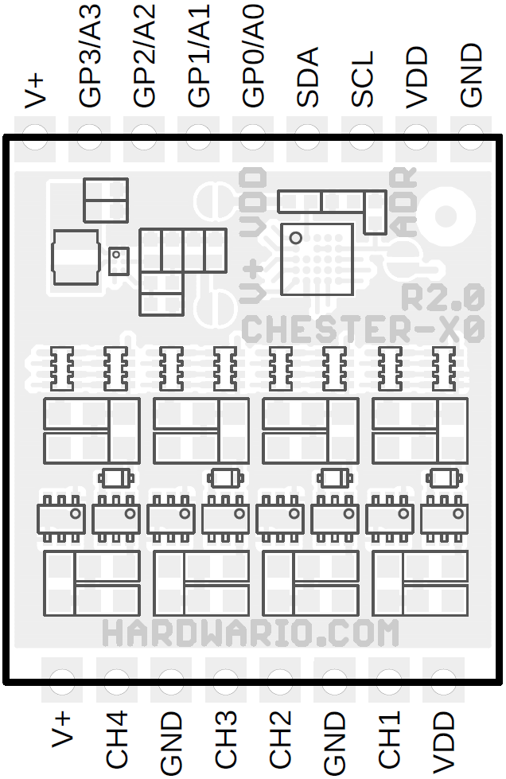

import Image from '@theme/IdealImage';

# CHESTER-X0

This article describes the CHESTER-X0 four-channel I/O extension module. Two variants are available:
* CHESTER-X0**A** including 5.0V boost converter
* CHESTER-X0**B** without 5.0V boost converter

## Module Overview

Each channel can be used for these applications:

* Digital input and output
* Analog input and output
* Voltage input 0 - 26 V**\***
* Current loop 4 - 20 mA
* Dry contact input
* NPN and PNP input
* Power output
  * **X0A** with boost converter: 5 V
  * **X0B** w/o boost converter: standard 3.0 V (VDD solder bridge) or on request V+ battery rail (V+ solder bridge)

_\* CHESTER-M main board has on Ax and Bx terminal block pins TVS protection that starts to protect GPIO above 28 V. Theoretically you can measure higher voltage than 26 V but the protection distorts measurements or you need to request or remove these TVS._

## Channel Schematic Diagram

Depending on the application these configuration options are available for each channel:

* Enable pull-up resistor 330 kΩ (PUX)
* Enable pull-down resistor 249 Ω (CLX)
* Enable voltage divider (gain 1/11) (100 kΩ, 10 kΩ) (PDX)
* Enable 5V boost converter (CHESTER-X0A only) (ONX)

This picture show the electric circuit of each channel:

## Configuration Table

The configuration depends on the application.

Signals PUx, CLx, PDx, ONx refers to the schematic above. Green tick ✅ means that the I2C GPIO expander or X0 sends a logic high signal to this configuration signal.
However, this is just to understand the modes. You only need to know which mode is set in the `ctr_x0_set_mode` table column.

| Application          | PUx | CLx | PDx | ONx | SDK `ctr_x0_set_mode`    |
| -------------------- | --- | --- | --- | --- | ------------------------ |
| Analog input 0-26 V  |     |     | ✅   |     | `CTR_X0_MODE_AI_INPUT`   |
| Dry contact          | ✅   |     |     |     | `CTR_X0_MODE_DEFAULT`    |
| NPN input            | ✅   |     |     |     | `CTR_X0_MODE_NPN_INPUT`  |
| PNP input            |     |     | ✅   |     | `CTR_X0_MODE_PNP_INPUT`  |
| Current loop 4-20 mA |     | ✅   | ✅   |     | `CTR_X0_MODE_CL_INPUT`   |
| Power source         |     |     |     | ✅   | `CTR_X0_MODE_PWR_SOURCE` |
| Analog output 0-VDD  |     |     |     |     | `CTR_X0_MODE_DEFAULT`    |
| Digital input        |     |     |     |     | `CTR_X0_MODE_DEFAULT`    |
| Digital output       |     |     |     |     | `CTR_X0_MODE_DEFAULT`    |

## CHESTER Pin Configuration Diagram

## Pin Configuration and Functions

| Position | Signal Name | Signal Description       |
| -------- | ----------- | ------------------------ |
| 1        | VDD         | System VDD rail 3.0 V    |
| 2        | CH1         | Channel 1                |
| 3        | GND         | System ground signal     |
| 4        | CH2         | Channel 2                |
| 5        | CH3         | Channel 3                |
| 6        | GND         | System ground signal     |
| 7        | CH4         | Channel 4                |
| 8        | +V          | System positive rail (*) |

*Note: The system positive rail voltage depends on CHESTER power supply option.

## Schematic diagram

A schematic diagram is useful if you program low-level hardware-related code or if you're just curious about how the system is designed.

- [Schematic R2.0 (PDF)](schematics/hio-chester-x0-r2.0.pdf)
- [Interactive PCB connector, part, testpoint and signal browser R3.4](pathname:///download/ibom/hio-chester-x0-r2.0.html)

## U1 & U2

## CHANNEL 1 & 2

## CHANNEL 3 & 4

## Module Drawing

## CHESTER SDK

### References

* [samples/chester_x0](https://github.com/hardwario/chester-sdk/tree/main/samples/chester_x0)
* [samples/ctr_edge_x0](https://github.com/hardwario/chester-sdk/tree/main/samples/ctr_edge_x0)
* [applications/input](https://github.com/hardwario/chester-sdk/tree/main/applications/input)
