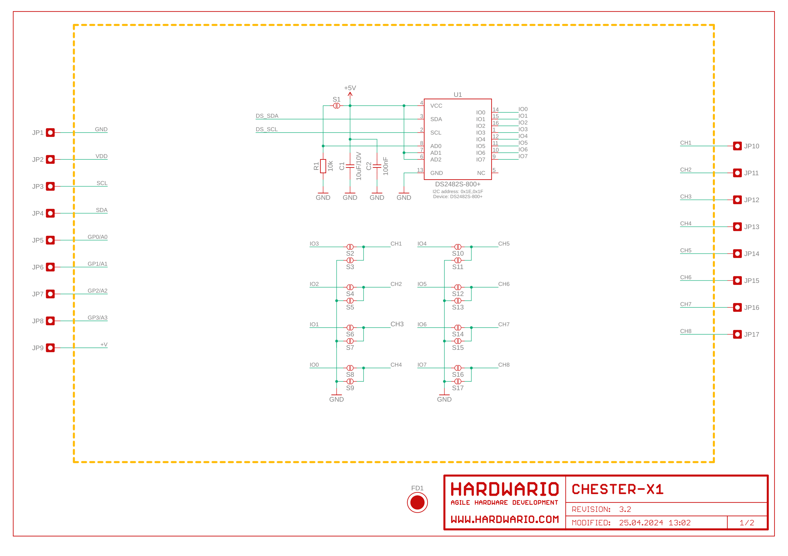
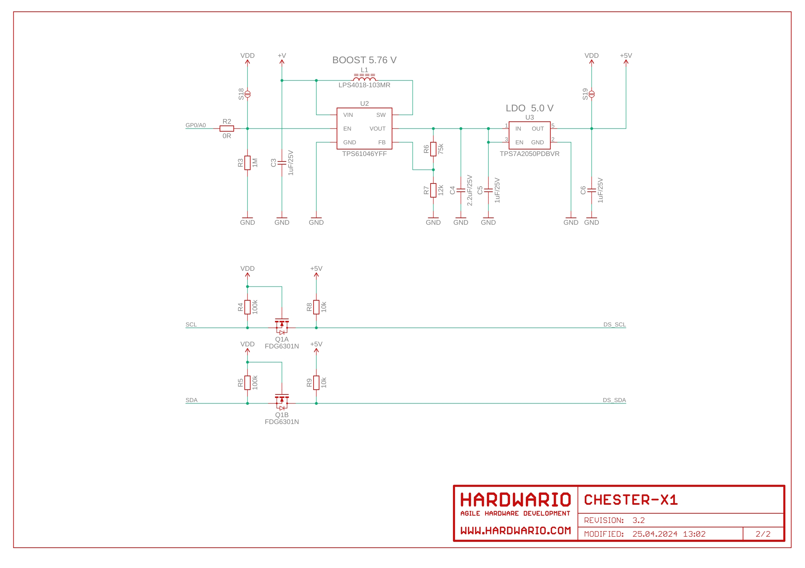

import Image from '@theme/IdealImage';

# CHESTER-X1

This article describes the CHESTER-X1 extension module.

  

    

      
<Image img={require('./chester-x1-top.png')} />

    

    

    

  

 

## Module Overview

CHESTER-X1 provides 8 independent 1-Wire channels allowing to connect digital  sensors ( e.g. Dallas DS18B20) or any other 1-Wire peripheries. The module implements Maxim DS2482S-800+ interface and also 5V boost converter to support 5V 1-Wire peripheries.

## CHESTER Pin Configuration Diagram

## Pin Configuration and Functions

| Position | Signal Name | Signal Description |
| -------- | ----------- | ------------------ |
| 1        | CH1         | Channel 1          |
| 2        | CH2         | Channel 2          |
| 3        | CH3         | Channel 3          |
| 4        | CH4         | Channel 4          |
| 5        | CH5         | Channel 5          |
| 6        | CH6         | Channel 6          |
| 7        | CH7         | Channel 7          |
| 8        | CH8         | Channel 8          |

## 1-Wire Parasitic Power Connection

CHESTER-X1 supports connection using parasitic powering method. In that case only 2 wires are necessary. In the parasitic mode 5.0V power supply is used. Standard 3 wire connection powering from VDD supports only 3.0V peripheries. This figure shows parasitic and standard powering method:

## Schematic diagram

A schematic diagram is useful if you program low-level hardware-related code or if you're just curious about how the system is designed.

- [Schematic (PDF)](schematics/hio-chester-x1-r3.2.pdf)
- [Interactive PCB connector, part, testpoint and signal browser](pathname:///download/ibom/hio-chester-x1-r3.2.html)

## Module Drawing

