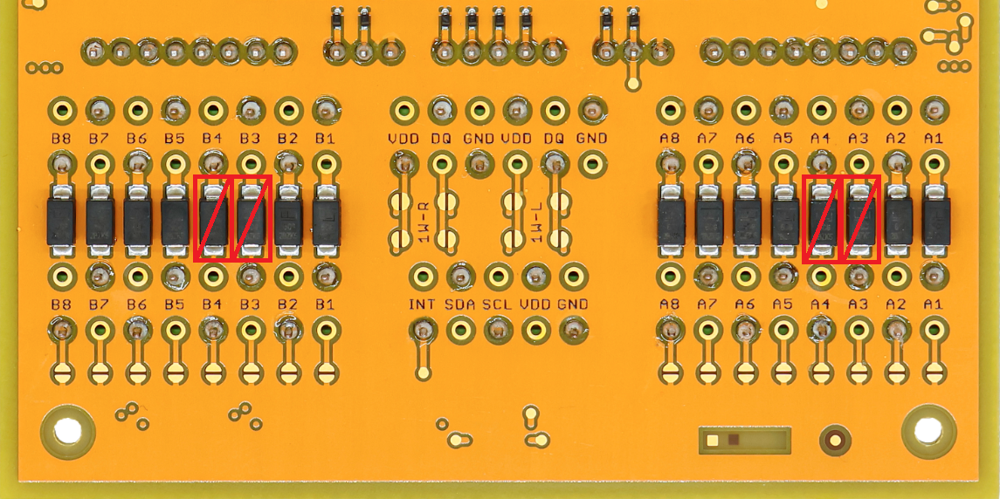
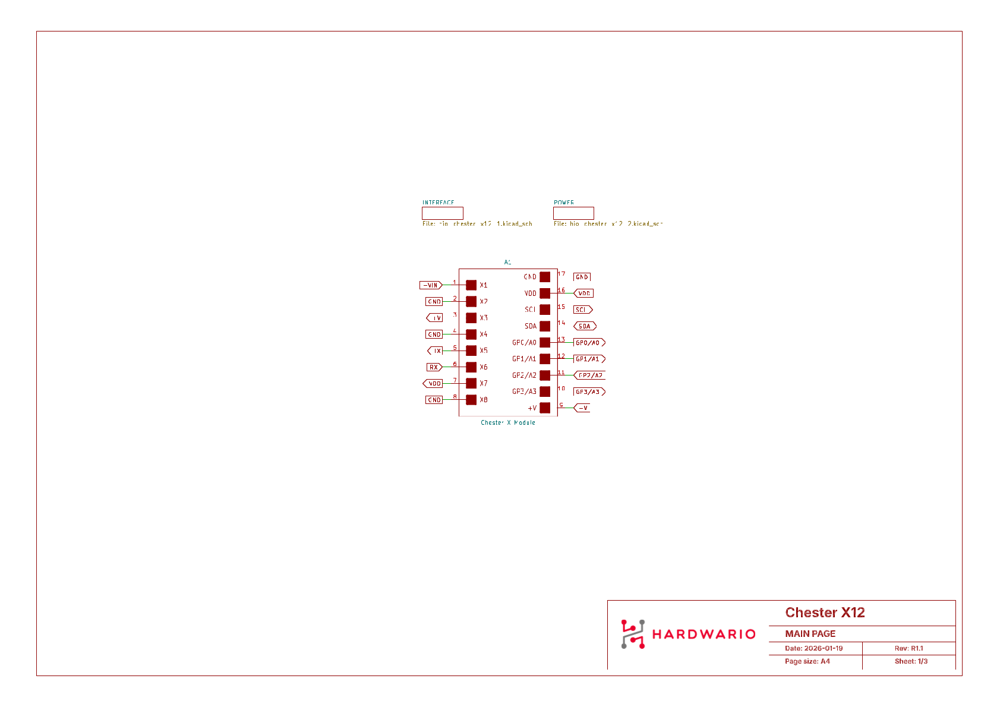

import Image from '@theme/IdealImage';

# CHESTER-X12

The **CHESTER-X12** is an extension module for the CHESTER platform that provides a serial communication interface via the **RS-232** standard.

The module features an I2C to UART bridge controller (**SC16IS740IPW**) and an RS-232 level shifter (**MAX3226EEUE+**), allowing connection to industrial serial devices and equipment. It includes a dedicated power input (5–28 V) with an efficient DC-DC converter (**TPS62933**) for powering external RS-232 devices, making it suitable for industrial automation, building management systems, and legacy equipment integration.

  

    

      
<Image img={require('./chester-x12-top.png')} />

    

    

    

  

 

:::warning ESD Protection Modification Required
The RS-232 transceiver uses negative voltage levels. CHESTER must have modified ESD protection on inputs for signals **A3** and **A4** on **slot A**, or **B3** and **B4** on **slot B**. The standard unidirectional TVS diodes (**SMA6J28A**) must be replaced with bidirectional ones (**SMA6J28CA**). If ESD protection is not required, these diodes can be removed.

:::

## Key Features

* **RS-232 Interface:** Full-duplex communication with industrial-grade levels.
* **I2C to UART Bridge:** Based on SC16IS740IPW for seamless integration with the CHESTER mainboard.
* **Wide Input Voltage:** 5–28 V DC input range for powering external devices.
* **Efficient Power:** Integrated DC-DC converter (TPS62933) for stable power delivery.
* **Protection:** ±15kV ESD protection on RS-232 I/O pins.
* **Flow Control:** Hardware flow control support (RTS/CTS).

## Typical Applications

* **Industrial Sensors:** Connection to sensors and controllers through the CHESTER platform.
* **Legacy Equipment:** Integration with existing RS-232 devices.
* **Building Automation:** HVAC systems, lighting control, and metering.
* **Commercial:** Point-of-Sale (POS) terminals and barcode scanners.
* **Utilities:** Serial console access and laboratory equipment interfaces.

---

## Technical Specifications

| Parameter | Value |
| :--- | :--- |
| **Interface Type** | RS-232 |
| **Protocol** | Full-duplex asynchronous serial |
| **Baud Rate** | Up to 250 kbps (Transceiver limit) / 3 Mbps (Bridge limit) |
| **Input Voltage (+VIN)** | 5 to 28 V DC |
| **Data Bits** | 5, 6, 7, 8 |
| **Stop Bits** | 1, 1.5, 2 |
| **Parity** | None, Even, Odd, Mark, Space |
| **Flow Control** | Hardware (RTS/CTS), Software (XON/XOFF) |
| **Connector** | Standard 2.54 mm pitch header (Soldered) |

---

## Key Components

| Component | Part Number | Description |
| :--- | :--- | :--- |
| **I2C to UART Bridge** | SC16IS740IPW | Single UART with I2C-bus/SPI interface, 64-byte FIFO |
| **RS-232 Transceiver** | MAX3226EEUE+ | True RS-232 levels, ±15kV ESD protection |
| **DC-DC Converter** | TPS62933 | Step-down converter, 5–28 V input, up to 3A output |
| **Input Protection** | PMEG6010ELRX | Schottky barrier diodes for input protection |

---

## Pin Configuration

The module uses a standardized header layout compatible with CHESTER extension slots.

### CHESTER Pin Configuration Diagram

### Pin Configuration and Functions

| Pin | Signal | Type | Description |
| :--- | :--- | :--- | :--- |
| **1** | **+VIN** | Power Input | External power input (5–28 V DC) |
| **2** | **GND** | Ground | Ground reference |
| **3** | **+V** | Power Output | Auxiliary power output for sensors (from DC-DC) |
| **4** | **GND** | Ground | Ground reference |
| **5** | **TX** | Output | RS-232 Transmit Data |
| **6** | **RX** | Input | RS-232 Receive Data |
| **7** | **VDD** | Power | 3.3 V supply from CHESTER mainboard |
| **8** | **GND** | Ground | Ground reference |

:::info
The **+VIN** terminal (Pin 1) is used to power the DC-DC converter, which subsequently powers the external devices via the **+V** terminal (Pin 3). The logic of the module itself (UART bridge) is powered by **VDD** (Pin 7) from the CHESTER mainboard.
:::

---

## Compatible CHESTER Configurations

The CHESTER-X12 module can be used with various CHESTER mainboard configurations. Below are examples of compatible setups:

  

    

      <h4>CHESTER-M (CGLS)</h4>
      
<Image img={require('./chester-x12-cgls.png')} />

    

    

      <h4>CHESTER-C4</h4>
      
<Image img={require('./chester-x12-c4.png')} />

    

  

---

## Schematic Diagrams

The following diagrams show the internal wiring of the module, including the system connection, interface logic, and power supply.

- [Schematic - Main Page (PDF)](schematics/hio-chester-x12-r1.1-main-page.pdf)
- [Schematic - Interface (PDF)](schematics/hio-chester-x12-r1.1-interface.pdf)
- [Schematic - Power (PDF)](schematics/hio-chester-x12-r1.1-power.pdf)

### Main Page

### Interface

### Power Supply

