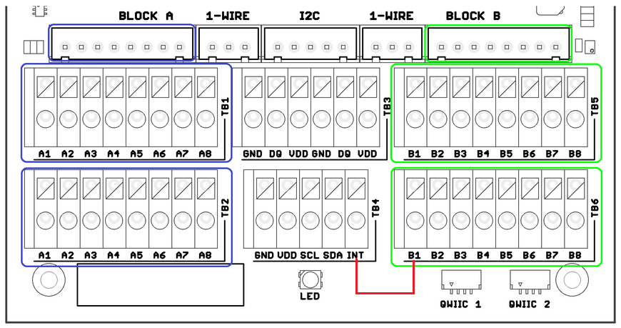

import Image from '@theme/IdealImage';

# CHESTER-X13

This article describes the CHESTER-X13 extension module.

## Module Overview

CHESTER-X13 provides a CAN Bus interface with support for CAN FD standard. It also comes with a built-in step-down with support of up to 30 V.

## CHESTER Pin Configuration Diagram

## Pin Configuration and Functions

| Position | Signal Name | Signal Description       |
| -------- | ----------- | ------------------------ |
| 1        | INT         | Interrupt signal         |
| 2        | RH          | CAN termination resistor |
| 3        | CANH        | Bus input/output         |
| 4        | CANL        | Bus input/output         |
| 5        | RL          | CAN termination resistor |
| 6        | GND         | System ground signal     |
| 7        | GND         | System ground signal     |
| 8        | +VIN        | Step-down input voltage  |

## Interrupt Pin

The module provides an interrupt output (pin 1), which needs to be connected to the INT pin on the CHESTER mainboard.

* Example of interrupt connection for module in slot B

## Termination Resistors

CAN bus is required to be terminated by placing a 120 Ohm resistor between the High and Low lines at both ends of the bus. CHESTER-X13 provides these resistors, but they are disconnected by default (as they aren't needed for a normal CAN node). The terminating resistors can be connected by connecting CANH to RH and CANL to RL (for example using jumpers on the JST connector.

## CHESTER SDK usage

CHESTER-X13 can be used as part of the CHESTER SDK using the `ctr_x13_a` and `ctr_x13_b` shields, or `hardware-chester-x13-a` and `hardware-chester-x13-b` [Project Generator](/chester/firmware-sdk/how-to-project-generator.md) features.

- [Example SDK usage](https://github.com/hardwario/chester-sdk/tree/main/samples/chester_x13)

## Schematic diagram

A schematic diagram is useful if you program low-level hardware-related code or if you're just curious about how the system is designed.

- [Schematic (PDF)](schematics/hio-chester-x13-r1.2.pdf)

## Module Drawing

