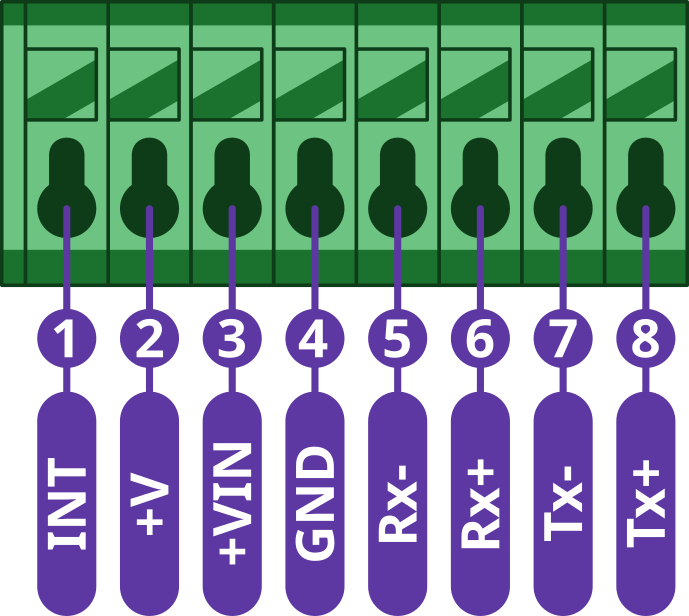

import Image from '@theme/IdealImage';

# CHESTER-X14

This article describes the CHESTER-X14 extension module.

## Module Overview

CHESTER-X13 provides support for 10/100 Ethernet connectivity. It also comes with a built-in step-down with support of up to 30 V.

## CHESTER Pin Configuration Diagram

## Pin Configuration and Functions

| Position | Signal Name | Signal Description        |
| -------- | ----------- | ------------------------  |
| 1        | INT         | Interrupt signal          |
| 2        | +V          | System positive rail (\*) |
| 3        | +VIN        | Step-down input voltage   |
| 4        | GND         | System ground signal      |
| 5        | Rx-         | Ethernet signal           |
| 6        | Rx+         | Ethernet signal           |
| 7        | Tx-         | Ethernet signal           |
| 8        | Tx+         | Ethernet signal           |

\*Note: The system positive rail voltage depends on CHESTER power supply option.

## Interrupt Pin

The module provides an interrupt output (pin 1), which needs to be connected to the INT pin on the CHESTER mainboard.

* Example of interrupt connection for module in slot B

## CHESTER SDK usage

CHESTER-X14 can be used as part of the CHESTER SDK using the `ctr_x14_a` and `ctr_x14_b` shields, or `hardware-chester-x14-a` and `hardware-chester-x14-b` [Project Generator](/chester/firmware-sdk/how-to-project-generator.md) features.

- [Example SDK usage](https://github.com/hardwario/chester-sdk/tree/main/samples/chester_x14)

## Schematic diagram

A schematic diagram is useful if you program low-level hardware-related code or if you're just curious about how the system is designed.

- [Schematic (PDF)](schematics/hio-chester-x14-r1.0.pdf)

## Module Drawing

