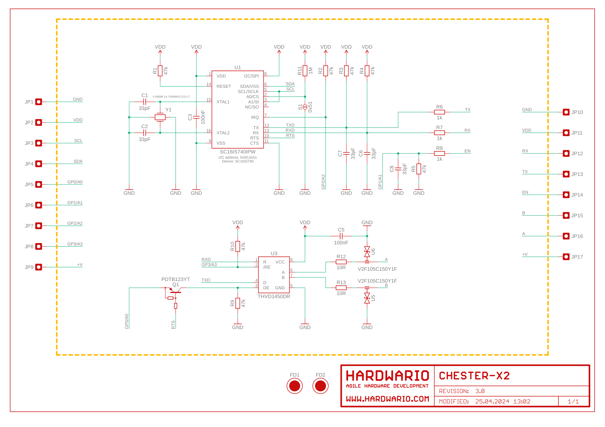

import Image from '@theme/IdealImage';

# CHESTER-X2

This article describes the CHESTER-X2 extension module.

  

    

      
<Image img={require('./chester-x2-top.png')} />

    

    

    

  

 

## Module Overview

CHESTER-X2 provides TTL/UART interface and RS-485 interface (e.g., for Modbus communication).

## CHESTER Pin Configuration Diagram

## Pin Configuration and Functions

| Position | Signal Name | Signal Description       |
| -------- | ----------- | ------------------------ |
| 1        | GND         | System ground signal     |
| 2        | VDD         | System VDD rail 3.0 V    |
| 3        | RX          | UART receiver input      |
| 4        | TX          | UART transmitter output  |
| 5        | EN          | Enable input             |
| 6        | B           | Bus input/output         |
| 7        | A           | Bus input/output         |
| 8        | +V          | System positive rail (*) |

*Note: The system positive rail voltage depends on CHESTER power supply option.

## Schematic diagram

A schematic diagram is useful if you program low-level hardware-related code or if you're just curious about how the system is designed.

- [Schematic (PDF)](schematics/hio-chester-x2-r3.0.pdf)
- [Interactive PCB connector, part, testpoint and signal browser](pathname:///download/ibom/hio-chester-x2-r3.0.html)

## Module Drawing

