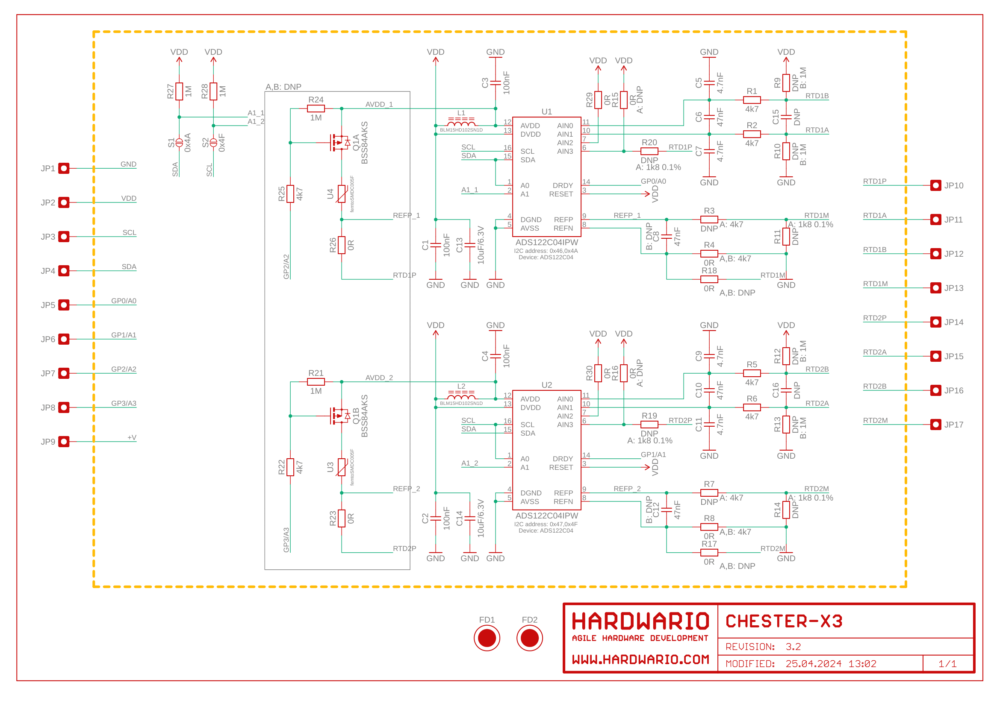
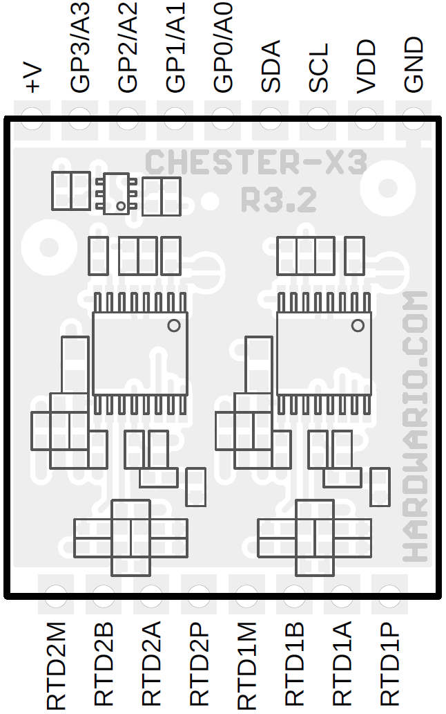

import Image from '@theme/IdealImage';

# CHESTER-X3

This article describes the CHESTER-X3A, CHESTER-X3B and CHESTER-X3C extension modules.

## CHESTER-X3A Module Overview

CHESTER-X3A provides 2 inputs for RTD (resistive temperature devices) sensors, such as Pt 100 and Pt 1000. Each input supports 4 wire sensor connection to improve the accuracy.

## CHESTER-X3B Module Overview

CHESTER-X3B allow to connect 2 thermocouples (type B/C/E/J/K/N/R/S/T) using 4 wire sensor connection.

## CHESTER-X3C Module Overview

CHESTER-X3C provides 2 inputs for load-cell (strain gauge) that can be used for weight measurements. Each channel use 4 wire connection.

## CHESTER Pin Configuration Diagram

## Pin Configuration and Functions

| Position | Signal Name | Signal Description                |
| -------- | ----------- | --------------------------------- |
| 1        | CH1P        | Channel 1: sensor positive supply |
| 2        | CH1A        | Channel 1: sensor input A         |
| 3        | CH1B        | Channel 1: sensor input B         |
| 4        | CH1M        | Channel 1: sensor negative supply |
| 5        | CH2P        | Channel 2: sensor positive supply |
| 6        | CH2A        | Channel 2: sensor input A         |
| 7        | CH2B        | Channel 2: sensor input B         |
| 8        | CH2M        | Channel 2: sensor negative supply |

## Schematic diagram

A schematic diagram is useful if you program low-level hardware-related code or if you're just curious about how the system is designed.

- [Schematic (PDF)](schematics/hio-chester-x3-r3.2.pdf)
- [Interactive PCB connector, part, testpoint and signal browser](pathname:///download/ibom/hio-chester-x3-r3.2.html)

## Module Drawing

