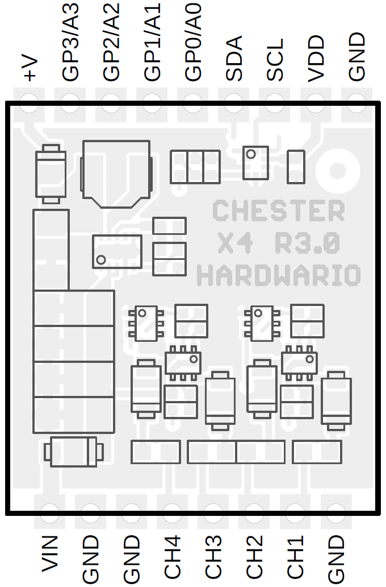

import Image from '@theme/IdealImage';

# CHESTER-X4

This article describes the CHESTER-X4 extension module.

## Module Overview
CHESTER-X4 implements a step-down DC/DC converter providing power from an external 6-28 VDC line (VIN). It allows also the input voltage measurement. This module has also 4 P-MOS switches allowing to supply of independent loads from VIN voltage input.

## Output Protection
Each of the four outputs has a resetable PTC fuse protection (femtoSMDC005F). Each output can **reliably supply 50 mA of constant current**. The trip current is around 150 mA.

## CHESTER Pin Configuration Diagram

## Pin Configuration and Functions

| Position | Signal Name | Signal Description                    |
| -------- | ----------- | ------------------------------------- |
| 1        | GND         | System ground signal                  |
| 2        | CH1         | Channel 1 voltage output switch       |
| 3        | CH2         | Channel 2 voltage output switch       |
| 4        | CH3         | Channel 3 voltage output switch       |
| 5        | CH4         | Channel 3 voltage output switch       |
| 6        | GND         | System ground signal                  |
| 7        | GND         | System ground signal                  |
| 8        | VIN         | DC power supply voltage input (6-28V) |

## Module Drawing

