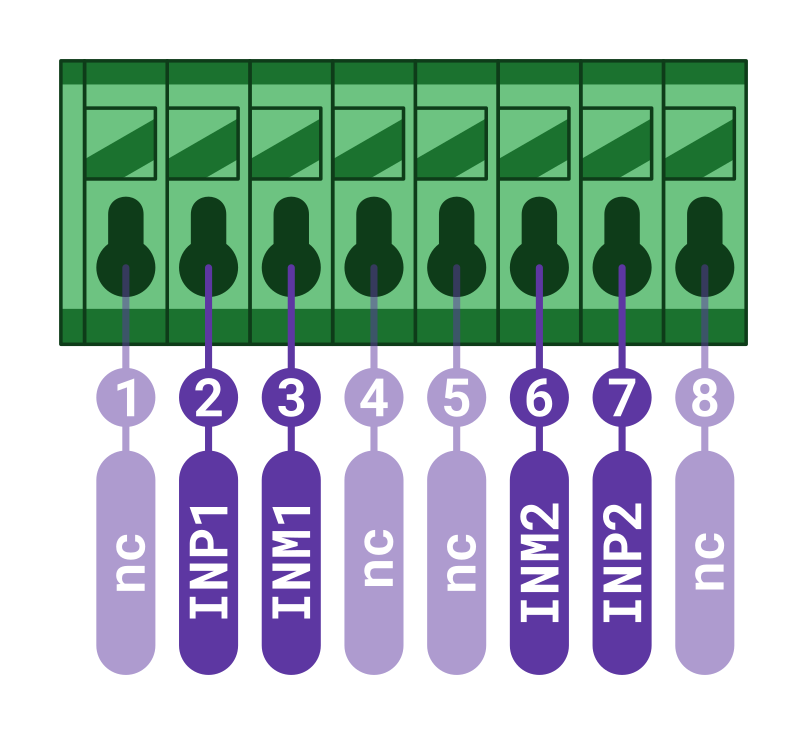
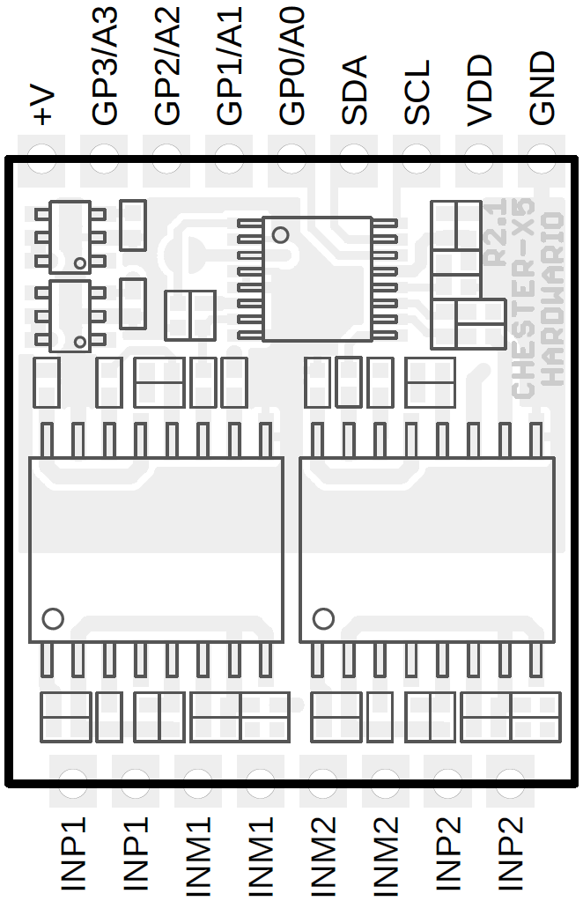

import Image from '@theme/IdealImage';

# CHESTER-X5

This article describes the CHESTER-X5 extension module.

## Module Overview

CHESTER-X5 implements two **isolated** voltage inputs. Each can measure voltage from **-50 V** to **+ 50 V**.

## CHESTER Pin Configuration Diagram

## Pin Configuration and Functions

| Position | Signal Name | Signal Description           |
| -------- | ----------- | ---------------------------- |
| 1        | DNC         | Reserved                     |
| 2        | INP1        | Channel 1 **positive** input |
| 3        | INM1        | Channel 1 **negative** input |
| 4        | DNC         | Reserved                     |
| 5        | DNC         | Reserved                     |
| 6        | INM2        | Channel 2 **negative** input |
| 7        | INP2        | Channel 2 **positive** input |
| 8        | DNC         | Reserved                     |

## Module Drawing

