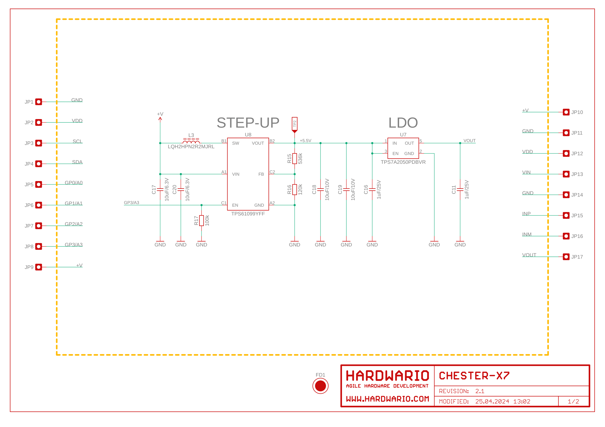
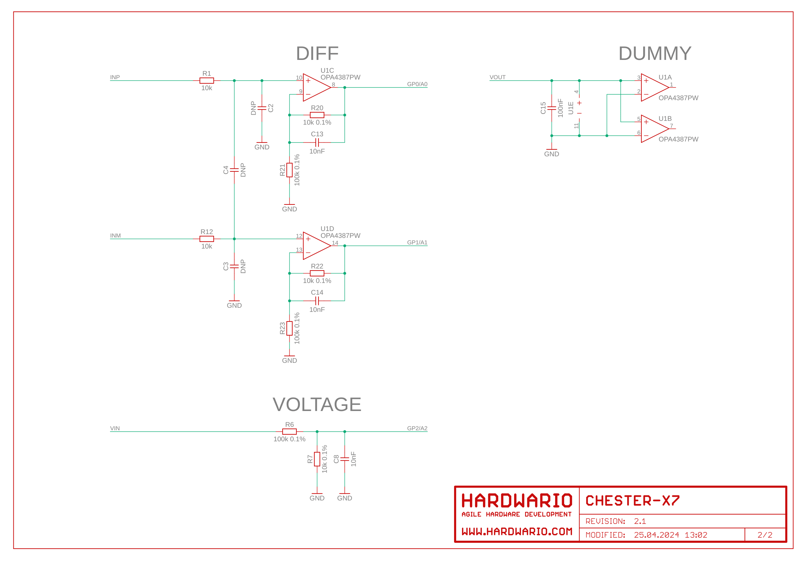

import Image from '@theme/IdealImage';

# CHESTER-X7

This article describes the CHESTER-X7 extension module.

  

    

      
<Image img={require('./chester-x7-top.png')} />

    

    

    

  

 

## Module Overview
The CHESTER-X7 provides one differential input for current probes or other industrial sensors and one single ended voltage input up to 28 V. The module implements also 5V boost converter allows powering the current probes.

## CHESTER Pin Configuration Diagram

## Pin Configuration and Functions

| Position | Signal Name | Signal Description          |
| -------- | ----------- | --------------------------- |
| 1        | +V          | System positive rail (*)    |
| 2        | GND         | System ground signal        |
| 3        | VDD         | System VDD rail 3.0 V       |
| 4        | VIN         | Voltage input (0 - 28V)     |
| 5        | GND         | System ground signal        |
| 6        | INP         | Positive differential input |
| 7        | INM         | Negative differential input |
| 8        | VOUT        | 5.0 V power supply output   |

*Note: The system positive rail voltage depends on CHESTER power supply option.

## Schematic diagram

A schematic diagram is useful if you program low-level hardware-related code or if you're just curious about how the system is designed.

- [Schematic (PDF)](schematics/hio-chester-x7-r2.1.pdf)
- [Interactive PCB connector, part, testpoint and signal browser](pathname:///download/ibom/hio-chester-x7-r2.1.html)

## Module Drawing

