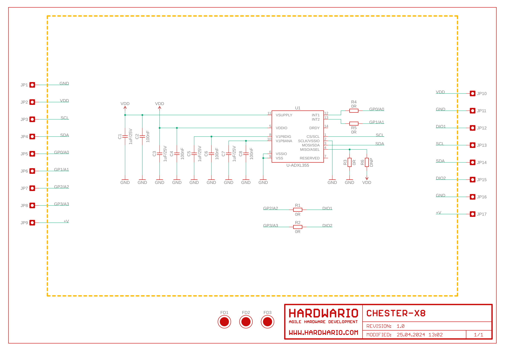
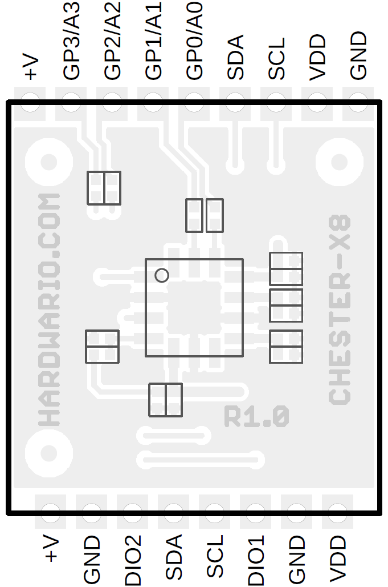

import Image from '@theme/IdealImage';

# CHESTER-X8
This article describes the CHESTER-X8 extension module.

## Module Overview
CHESTER-X8 implements precise low zero g offset 3-axis accelerometer ADXL355 providing the resolution up to 3.9 μg/LSB and measurement range ±2g, ±4g, ±8g.

## CHESTER Pin Configuration Diagram

## Pin Configuration and Functions

| Position | Signal Name | Signal Description             |
| -------- | ----------- | ------------------------------ |
| 1        | VDD         | System VDD rail 3.0 V          |
| 2        | GND         | System ground signal           |
| 3        | DIO1        | User digital input / output #1 |
| 4        | SCL         | I2C / SCL                      |
| 5        | SDA         | I2C / SDA                      |
| 6        | DIO2        | User digital input / output #2 |
| 7        | GND         | System ground signal           |
| 8        | +V          | System positive rail (*)       |

*Note: The system positive rail voltage depends on CHESTER power supply option.

## Schematic diagram

A schematic diagram is useful if you program low-level hardware-related code or if you're just curious about how the system is designed.

- [Schematic (PDF)](schematics/hio-chester-x8-r1.0.pdf)
- [Interactive PCB connector, part, testpoint and signal browser](pathname:///download/ibom/hio-chester-x8-r1.0.html)

## Module Drawing

