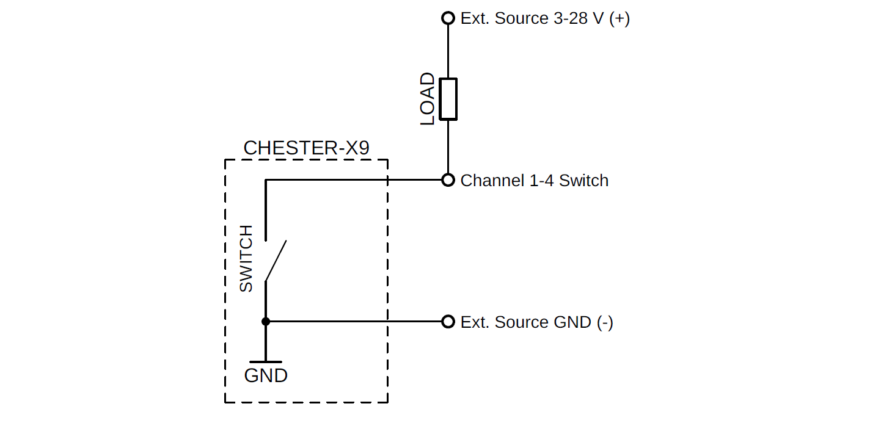
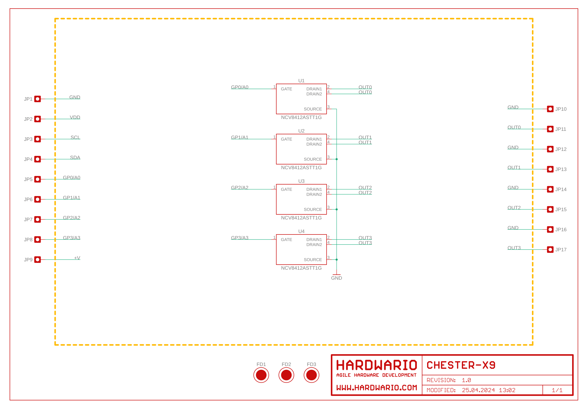
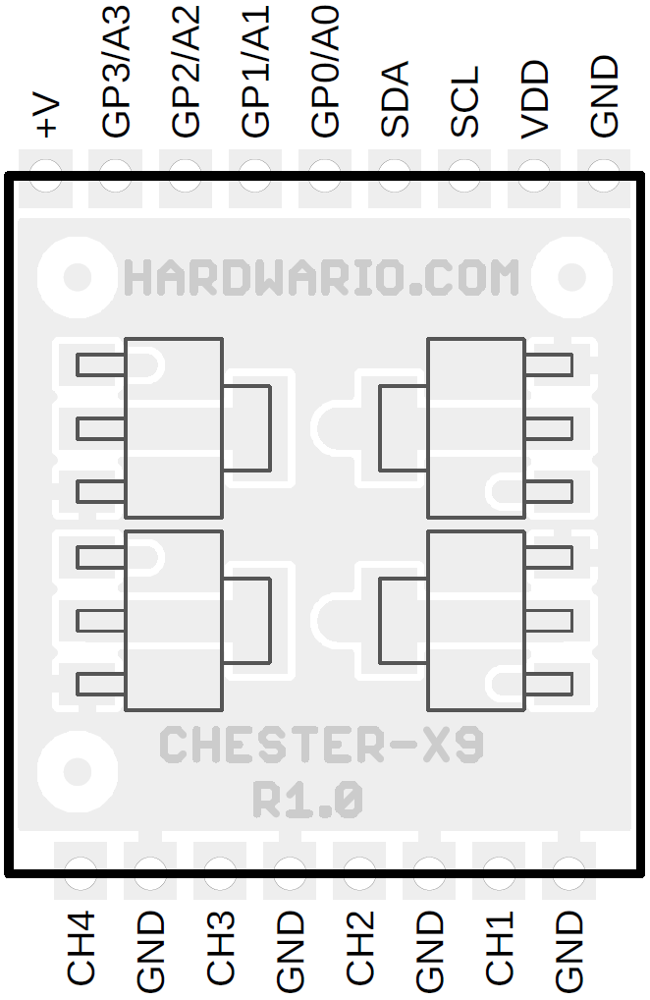

import Image from '@theme/IdealImage';

# CHESTER-X9

This article describes the CHESTER-X9 extension module.

  

    

      
<Image img={require('./chester-x9-top.png')} />

    

    

    

  

 

## Module Overview

CHESTER-X9 provides 4 low side switches witch current limit capable to control the load from an external voltage source.

## Electrical Specification

* Maximal voltage: 28 V
* Continues load current: 2 A
* Peak current limit: 5 A

## Switch Load Connection Diagram

The load have to be connected between external voltage source and the low side switch output (channel 1-4) according to the diagram:

## CHESTER Pin Configuration Diagram

## Pin Configuration and Functions

| Position | Signal Name | Signal Description      |
| -------- | ----------- | ----------------------- |
| 1        | GND         | System ground signal    |
| 2        | CH1         | Channel 1 switch output |
| 3        | GND         | System ground signal    |
| 4        | CH2         | Channel 1 switch output |
| 5        | GND         | System ground signal    |
| 6        | CH3         | Channel 1 switch output |
| 7        | GND         | System ground signal    |
| 8        | CH4         | Channel 1 switch output |

## Schematic diagram

A schematic diagram is useful if you program low-level hardware-related code or if you're just curious about how the system is designed.

- [Schematic (PDF)](schematics/hio-chester-x9-r1.0.pdf)
- [Interactive PCB connector, part, testpoint and signal browser](pathname:///download/ibom/hio-chester-x9-r1.0.html)

## Module Drawing

