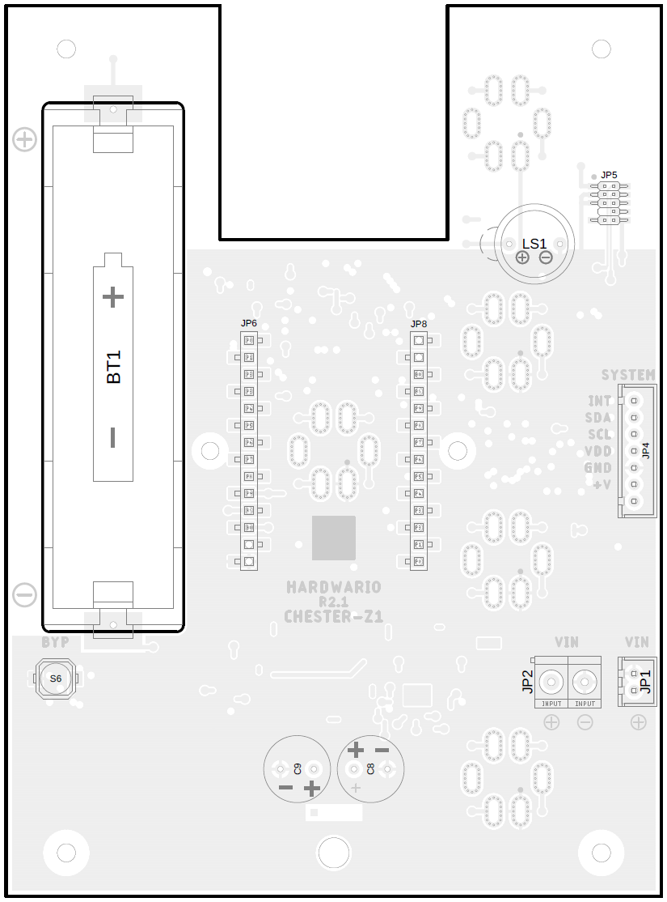
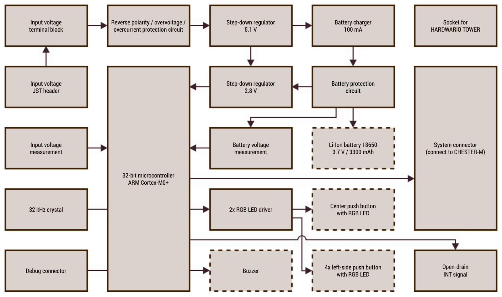
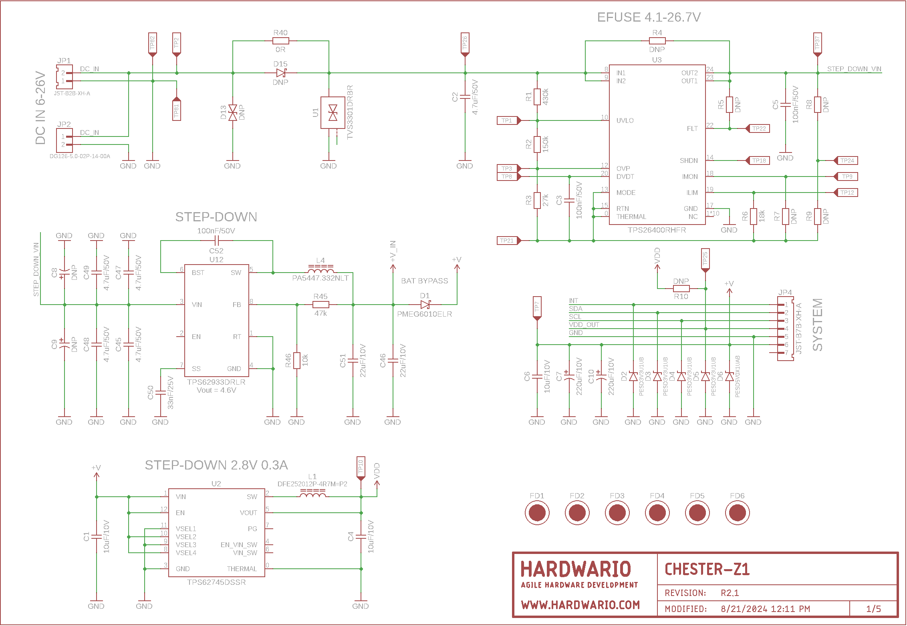
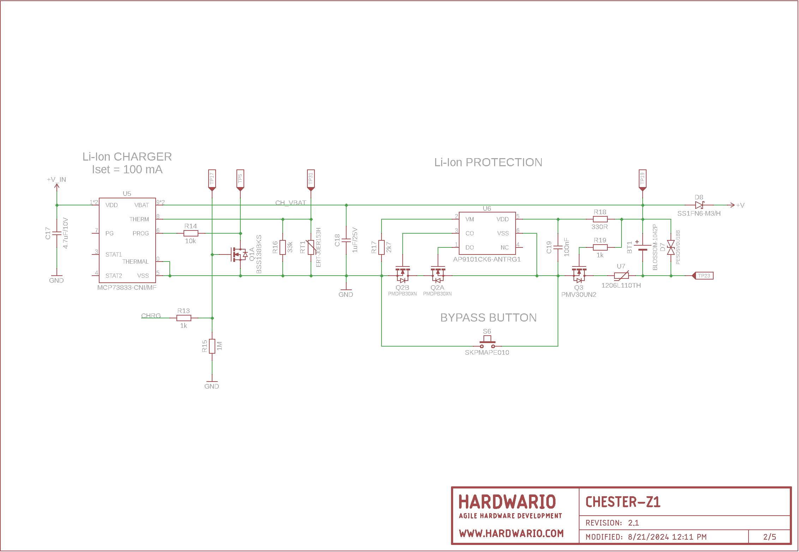
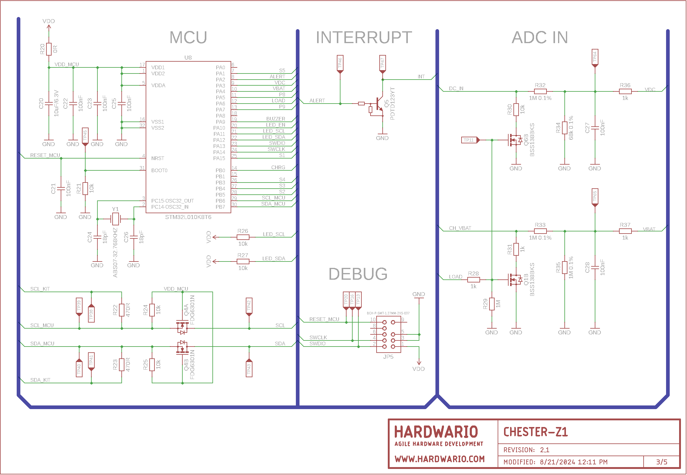
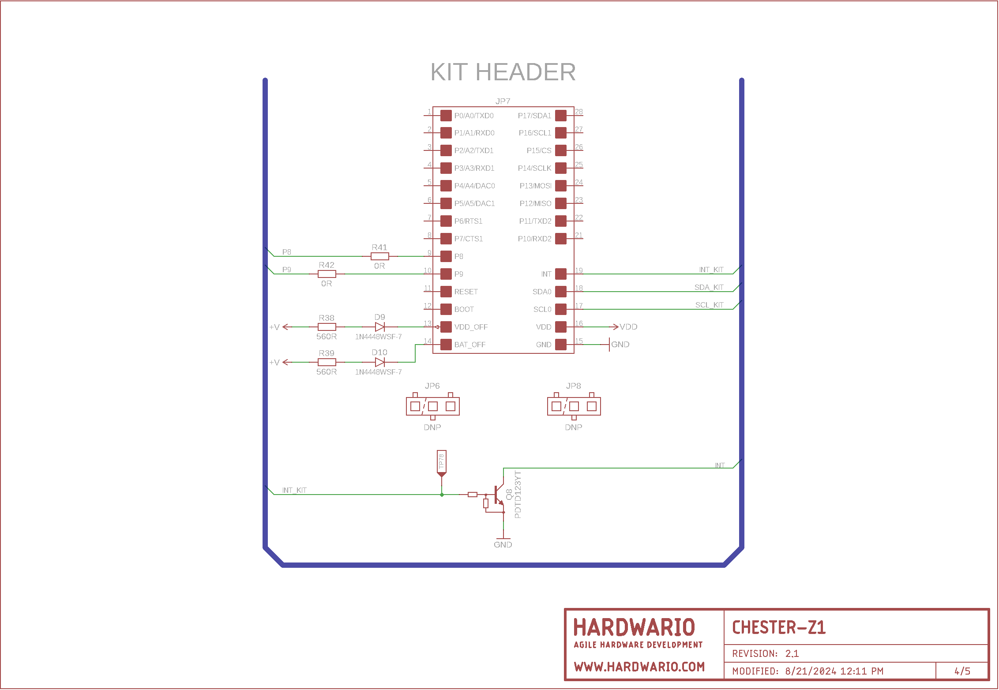
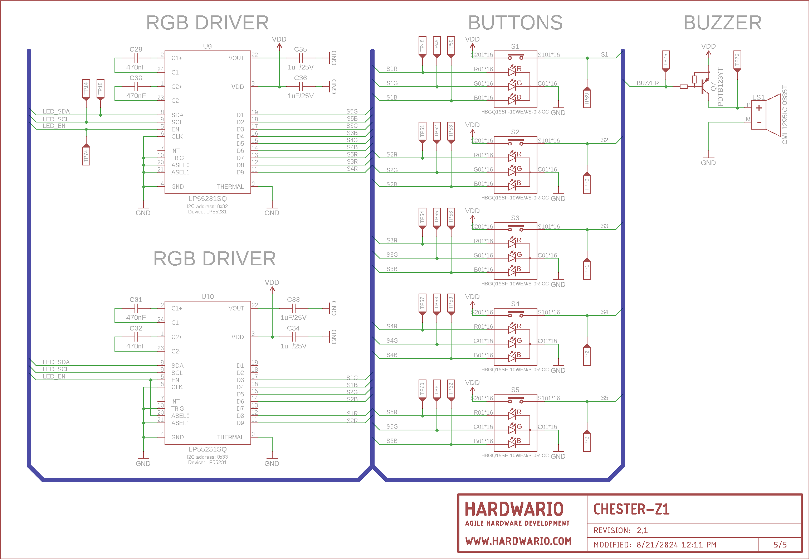

import Image from '@theme/IdealImage';

# CHESTER-Z1
This article describes the CHESTER-Z1 top-cover extension module.

## Module Overview

CHESTER-Z combines a rechargeable Lithium-Ion battery backup, wide supply voltage input, and an optional human-machine interface (HMI) with illuminated push buttons and acoustic feedback. Primarily, it is used with CHESTER-M (mainboard), but it can also be used with HARDWARIO TOWER and 3rd party ecosystems such as Raspberry Pi, Arduino, ESP, etc. The module is installed below the top cover of the Takachi WP13-18 series enclosure. 

CHESTER-Z provides a digital I2C communication interface (slave role).

The following functionality is provided through I2C:

1. HMI commands - i.e., LED and buzzer control:
   1. Single-shot foreground indication   
   2. Background continuous patterns
2. Event detection:
   1. Push buttons events (press, release, click, hold)
   2. DC line voltage events (connect, disconnect)
3. State information:
   1. DC line voltage
   2. Battery voltage
   3. Push-button state
4. Product identification and version information

These are some typical use-cases for CHESTER-Z (more scenarios are possible):

* Use-case 1 (CHESTER-Z1):
  * Photovoltaic solar panel or DC power supply with backup for CHESTER
  * System power from CHESTER-Z battery (rechargeable from photovoltaic solar panel or DC power supply 6-28 V)
* Use-case 2 (CHESTER-Z1-X):
  * Single illuminated push-button and acoustic feedback
  * System power from CHESTER-M (2x AA cells or CHESTER-X4)
* Use-case 3 (CHESTER-Z1-F):
  * Four illuminated push buttons and acoustic feedback
  * System power from CHESTER-Z battery (rechargeable from external DC line voltage)

## Technical Specification

* Input DC voltage range (VIN): 6-28 VDC, suitable also for 12-18V solar panel*
* Nominal battery voltage: 3.7 V
* Battery charging current: 100 mA
* Battery idle current consumption 55 μA (without CHESTER-M)
* Recommended battery type for outdoor use: Samsung ICR18650-22P**
* Operating temperature: -40 to +70°C (without Li-Ion Battery)
* Storage temperature: -40 to +85°C (without Li-Ion Battery)
  
_\*Optimal photovoltaic solar panel for CHESTER: 12 V / 10 W_
_\** Appropriate for solar panel application, charging temperature range -20 to +45°C, discharging -20 to +70°C_

## Battery charger and protection circuit
CHESTER-Z implements the MCP73833 charger IC and the AP9101C protection IC protecting the battery by detecting overcharge voltage, overdischarge voltage, overcharge/discharge current. For initial start powering from the battery without DC input power supply it is necessary to long pres the Bypass button (BYP).

Due to low charging current (100 mA) The charging temperature range is extended from -20 to +45°C. Optimal Li-Ion battery type for low temperature outdoor application is Samsung ICR18650-22P.

## Module Drawing

## Input / Output and Functions

| Position | Name    | Signal Description                  |
| -------- | ------- | ----------------------------------- |
| JP1      | VIN     | 6-28 V DC Power Input JST connector |
| JP2      | VIN     | 6-28 V DC Power Input terminal      |
| JP4      | SYSTEM  | CHESTER SYSTEM JST connector        |
| JP5      | SWD     | MCU SWD / debug connector           |
| BT1      | BATTERY | 18650 Li-Ion battery holder         |
| S6       | BYPASS  | Battery protection bypass button*   |

_\* Use the BYBASS BUTTON for initiate start from the battery without DC input power supply_

## SYSTEM Connector Pinout Description

## Block Diagram

## Schematic Diagram

A schematic diagram is useful if you program low-level hardware-related code or if you're just curious about how the system is designed.

- [Schematic (PDF)](schematics/hio-chester-z1-r2.1.pdf)

<!--
- [TODO Interactive PCB connector, part, testpoint and signal browser]
-->

