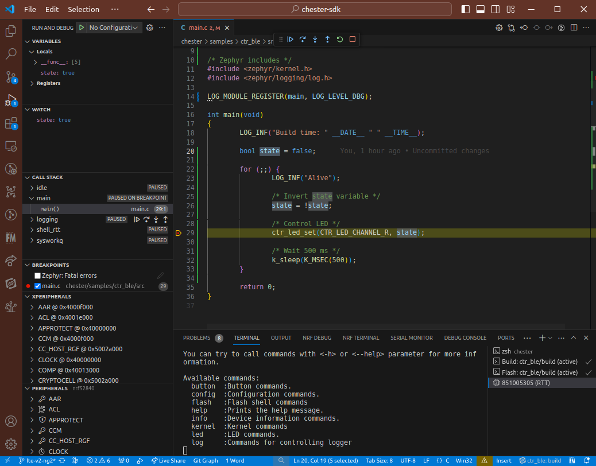

import Image from '@theme/IdealImage';

# Debug

Most of the code is possible to debug with Zephyr logging functions like `LOG_INF`, `LOG_HEXDUMP_INF` and others.

However, sometimes it is necessary to do proper low-level hardware debugging with single stepping and memory view.

You can easily do that with [**nRF Connect for VS Code**](https://marketplace.visualstudio.com/items?itemName=nordic-semiconductor.nrf-connect) extension in your VSCode.

## Install

In VSCode hit `Ctrl` + `P` and type `ext install nordic-semiconductor.nrf-connect`, hit enter.

## Debugging

1. Open the **nRF Connect for VS Code** extension, click `Open Existing Application` and choose a folder of the application, where you usually call `west build`.

2. In the project `prj.conf` comment with `#` or **remove `CONFIG_CTR_BLE=y`. BLE is timing sensitive and when enabled, debugging don't work correctly.**

3. In the left panel in **Applications** section, click **+ Add build configuration**

4. In the **Board** option select `chester_nrf52840`. Set **Optimization level** to **Optimize for debugging (-Og)**. Then click **Build Configuration** button on the bottom. The project is built.

5. In the left panel in **Actions** click on the **Debug** and start debugging your code.

:::warning

Do not use **Erase board** or any other similar option. CHESTER uses UICR region to save serial number and communication keys. If you erase that, you will need to recover [**PIB data**](../developer-tools/command-line-tools.md#product-information-block).

For erasing the board use [**HARDWARIO CLI**](../developer-tools/command-line-tools.md) erase command which keeps the UICR regions.

:::

## Shell over RTT

In the **Connected devices** left panel, you can open RTT communication with the device. It uses channel 0 which is Zehpyr shell. You can type commands to the terminal. The second RTT channel with logs is not displayed here.

## Threads

In the **NRF DEBUG** tab you can inspect threads and memory.

