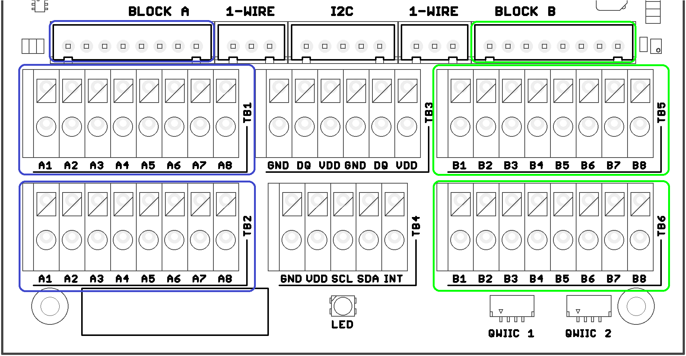

import Image from '@theme/IdealImage';

# CHESTER-M

  

    

      
<Image img={require('./chester-m-enclosure.png')} />

    

    

    CHESTER-M is a versatile mainboard with LPWAN connectivity, extendable with <b>X</b> extension modules.
    

  

 

## Block Diagram

## Basic Parameters

This article provides basic parameters of the CHESTER platform:

| Name                           | Value                      | Remark                                                        |
| :----------------------------- | :------------------------- | :------------------------------------------------------------ |
| Operating voltage range        | 2.0 to 5.25 V              | For mainboard only - can be increased using extension modules |
| Typical idle current           | 100 μA                     | Without any extension module and peripheral installed         |
| Extra current for BLE          | 50 μA                      | 1-second advertising interval                                 |
| Extra current for NB-IoT/LTE-M | 100 μA                     | For ECL=0 and 30-minute transmission interval                 |
| Extra current for LoRaWAN      | 50 μA                      | For SF12 and 30-minute transmission interval                  |
| Enclosure dimensions           | 130(w) x 175(h) x 45(d) mm | Standard enclosure                                            |
| Enclosure dimensions           | 200(w) x 280(h) x 45(d) mm | Carrier board - low profile                                   |
| Enclosure dimensions           | 200(w) x 280(h) x 65(d) mm | Carrier board - high profile                                  |
| Operating temperature range    | -30 to +60 °C              |                                                               |
| Storage temperature range      | -30 to +70 °C              |                                                               |
| Protection level               | IP 67                      | Can be immersed in 1 m depth for 30 minutes                   |

:::caution

The parameters provided above might be affected by the specific hardware configuration and application implementation.

:::

## Connector Description

### Terminal Blocks Description

The terminal block signals are defined by placing extension **X** modules on the backside of the CHESTER mainboard.
You can find more information in the [Backside Modules](../extension-modules/index.md#backside-modules) chapter.

### Terminal Block Solder Bridges

When there are no extension modules in slot A or B, the 8-pin terminal blocks can be configured using solder bridges.

Terminal block pins can have these signals based on solder bridges:

- Terminals **A1-A8** and **B1-B8** can be connected to the GND.
- Terminals **A6, A3, B6, B3** can be connected to VDD
- Terminals **A5, A2, B5, B2** can be connected to DQ (1-Wire Bus).

#### 1-Wire extension

This picture shows how to extend the 1-Wire bus to 8-pin terminal blocks A and B. Solder the highlighted solder bridges so the 1-Wire signals from the 1-Wire terminal
block are duplicated to the 8-pin terminal blocks.

Please note that the **solder bridges** are on the bottom side of the PCB. So in the picture below the blue solder bridge rectangles **on the right** of the PCB actually connects signals **to the left** 8-pin terminal blocks TB1 and TB2 when looked at the front of the PCB.

This picture shows the terminal blocks connection:

This table shows the connection of 1-Wire to terminal blocks and JST 8-pin connectors::

| Terminal BLOCK Position | Signal Name | Signal Description   |
| :---------------------: | :---------: | :------------------- |
|        A1 or B1         |    `GND`    | System ground signal |
|        A2 or B2         |    `DQ`     | 1-Wire Data          |
|        A3 or B3         |    `VDD`    | Power                |
|        A4 or B4         |    `GND`    | System ground signal |
|        A5 or B5         |    `DQ`     | 1-Wire Data          |
|        A6 or B6         |    `VDD`    | Power                |
|        A7 or B7         | `NC or GND` | Not connected or GND |
|        A8 or B8         | `NC or GND` | Not connected or GND |

### Backside Module

This section provides information on signal mapping for the two backside slots (A and B) on the **CHESTER** mainboard.

The backside slots use two rows of signals:

* **Top Row** (closer to the antenna)

  This signal row (with nine 2.54 mm distanced pins) provides power rails + digital signals with the signal definition in the table below.

* **Bottom Row** (closer to the terminal blocks)

  This signal row (with eight 2.54 mm distanced pins) directly connects to the terminal blocks, and their meaning is module-specific.

#### Top Row Signals (Slot A)

:::caution

The following table lists the signals in the left-to-right order when you flip the board (slot A is on the right side).

:::

| Position | Signal Name | Signal Description     | Connection on nRF52840 |
| :------: | :---------: | :--------------------- | :--------------------: |
|    1     |    `+V`     | System positive rail   |           -            |
|    2     |   `GP3A`    | General purpose I/O    |      `P0.31/AIN7`      |
|    3     |   `GP2A`    | General purpose I/O    |      `P0.02/AIN0`      |
|    4     |   `GP1A`    | General purpose I/O    |      `P0.29/AIN5`      |
|    5     |   `GP0A`    | General purpose I/O    |      `P0.03/AIN1`      |
|    6     |    `SDA`    | System I²C bus (data)  |           -            |
|    7     |    `SCL`    | System I²C bus (clock) |           -            |
|    8     |    `VDD`    | System VDD rail        |           -            |
|    9     |    `GND`    | System ground signal   |           -            |

#### Top Row Signals (Slot B)

:::caution

The following table lists the signals in the left-to-right order when you flip the board (slot B is on the left side).

:::

| Position | Signal Name | Signal Description     | Connection on nRF52840 |
| :------: | :---------: | :--------------------- | :--------------------: |
|    1     |    `+V`     | System positive rail   |           -            |
|    2     |   `GP3B`    | General purpose I/O    |      `P0.05/AIN3`      |
|    3     |   `GP2B`    | General purpose I/O    |      `P0.04/AIN2`      |
|    4     |   `GP1B`    | General purpose I/O    |      `P0.30/AIN6`      |
|    5     |   `GP0B`    | General purpose I/O    |      `P0.28/AIN4`      |
|    6     |    `SDA`    | System I²C bus (data)  |           -            |
|    7     |    `SCL`    | System I²C bus (clock) |           -            |
|    8     |    `VDD`    | System VDD rail        |           -            |
|    9     |    `GND`    | System ground signal   |           -            |

## Schematic Diagram

A schematic diagram is useful if you program low-level hardware-related code or if you're just curious about how the system is designed.

- [Schematic R3.4 (PDF)](hio-chester-m-r3.4.pdf)
- [Interactive PCB connector, part, testpoint and signal browser R3.4](pathname:///download/ibom/chester-m-r3.4.html)

### MCU

### LTE

### LoRaWAN

### GNSS

### Power

### Terminals

### Nets

## Layout Placement

- [Interactive PCB connector, part, testpoint and signal browser R3.4](pathname:///download/ibom/chester-m-r3.4.html)

### Top

### Bottom

