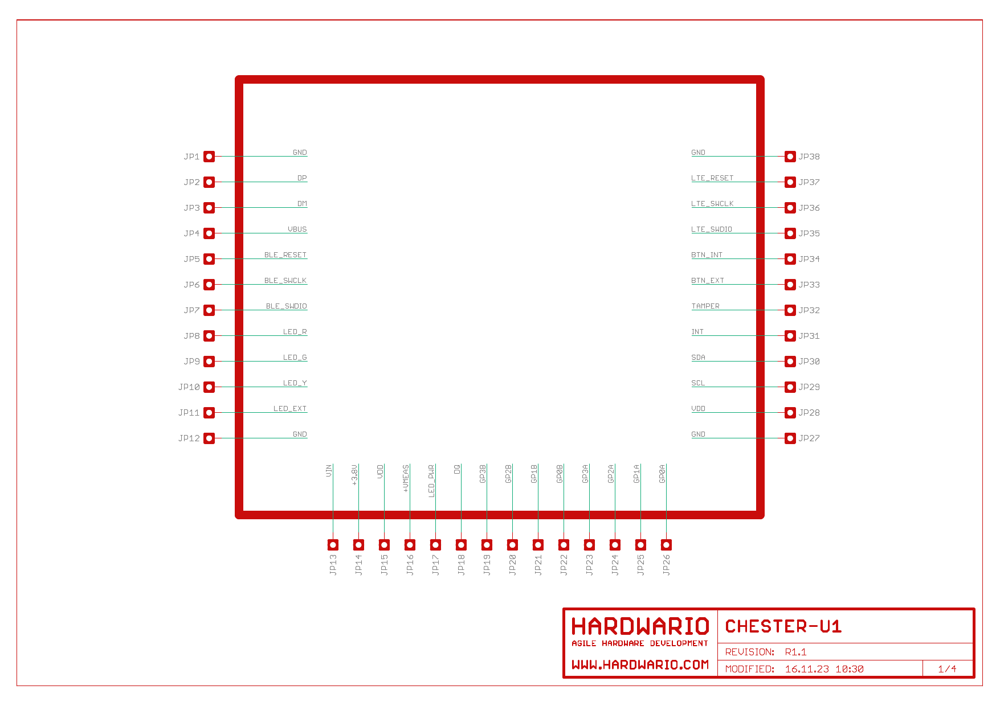
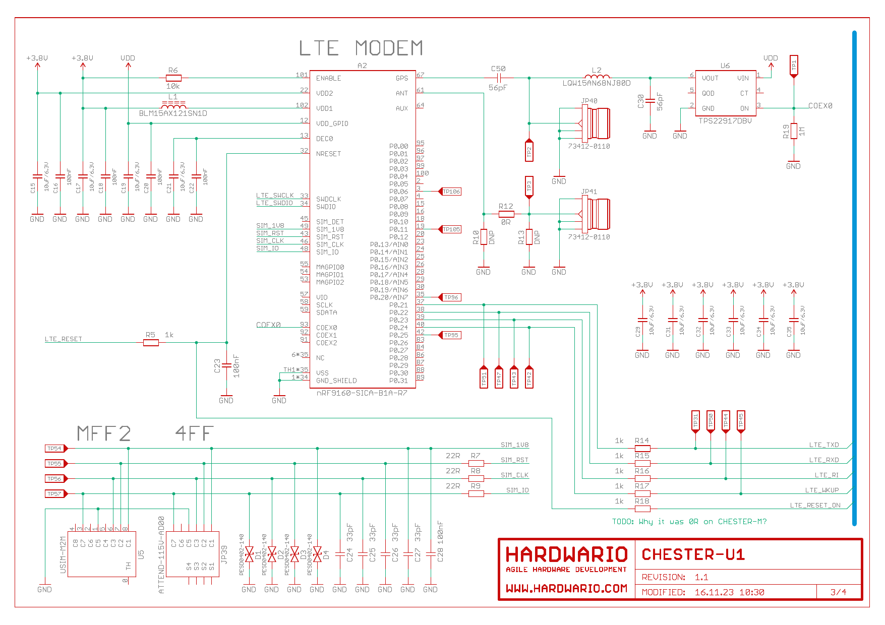
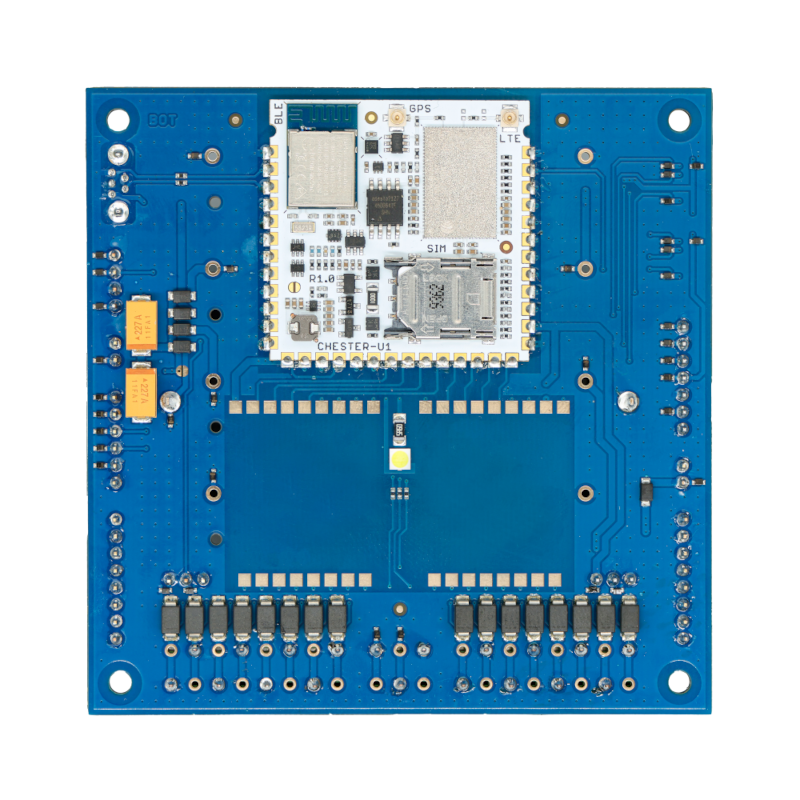
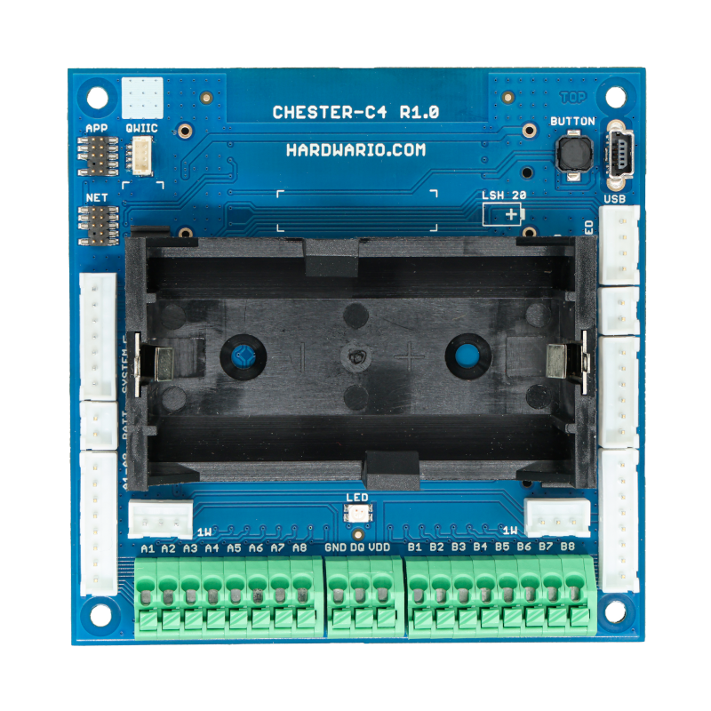

import Image from '@theme/IdealImage';

# CHESTER-U1 Module

**CHESTER-U1** is a cost-optimized **CHESTER-M** mainboard compressed to the **small 38x38mm module**.

Instead of using **CHESTER-M** and putting extension modules in it, you design a two-layer carrier board and put **CHESTER-U1** in it.

**CHESTER-U1** has these properties:

- Electrically identical to **CHESTER-M** (the same firmware binary can run without any changes)
- Cost-optimized
- Carrier board can be just a **two-layer board**
- Contains the same **Application MCU** (APP/BLE nRF52840) and **LTE** (nRF9160)
- Could be designed into **smaller enclosures**
- Can be connected to [**CHESTER-X extension**](../extension-modules/index.md) modules the same way as CHESTER-M
- Contains a **nano SIM card holder** onboard
- Connect just a **battery** and **u.Fl antenna**

## Layout

HARDWARIO can provide ECAD footprints for your integration.

## Schematics

- [Schematic R1.1 (PDF)](hio-chester-u1-r1.1.pdf)

[comment]: # (PDF to PNG convert command: pdftoppm hio-chester-u1-r1.1.pdf hio-chester-u1-r1.1 -png)

### Interface

In this view, the signals are placed exactly as you look at the module from the top side. Signal placement has been optimized so you can easily route your wires on a two-layer printed circuit board.

### MCU

### LTE

### Power

## CHESTER-C4 Carrier Board

We have carrier boards that can be used directly in your product with **CHESTER-U1** or you can base your own design on them. **Get in touch with us, we can provide you with more information.**

One of the carrier boards is **CHESTER-C4**, it contains a slot for two [**extension modules**](../extension-modules/index.md) and can have multiple battery or external power options.

### Bottom Side

### Top Side

With "D" cell option.

