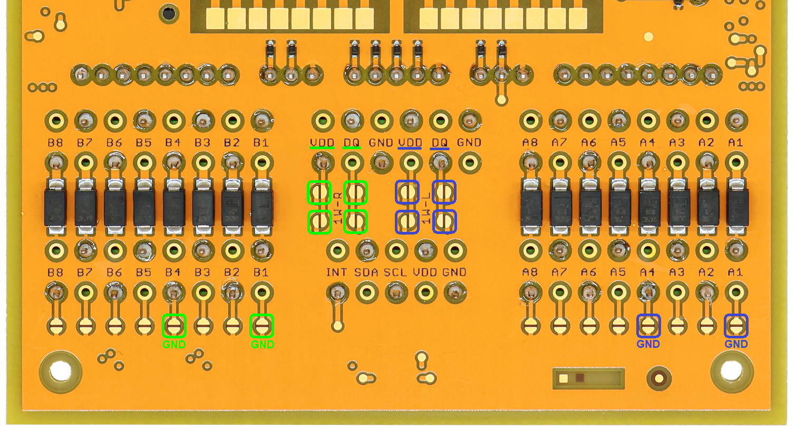
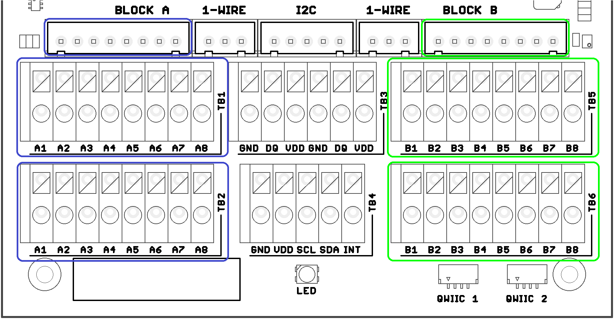

import Image from '@theme/IdealImage';

# Connector Description

## Terminal Blocks Description

## Terminal Block Solder Bridges

When there is no extension modules in the Slot A or B, 8 pin terminals blocks can by configured using solder bridges. Terminal block position A1-A8 or B1-B8 can be connected to GND. Positions A6, A3, B6, B3 can be connect to VDD and position A5, A2, B5, B2 can be connected to DQ (1-Wire Bus).

### 1-Wire extension 

This picture shows how to extend the 1-Wire bus to 8 pin terminal blocks A and B:

| Terminal BLOCK Position | Signal Name | Signal Description   |
| :---------------------: | :---------: | :------------------- |
|        A1 or B1         |    `GND`    | System ground signal |
|        A2 or B2         |    `DQ`     | 1-Wire Data          |
|        A3 or B3         |    `VDD`    | General purpose I/O  |
|        A4 or B4         |    `GND`    | System ground signal |
|        A5 or B5         |    `DQ`     | 1-Wire Data          |
|        A6 or B6         |    `VDD`    | General purpose I/O  |
|        A7 or B7         | `NC or GND` | Not connected or GND |
|        A8 or B8         | `NC or GND` | Not connected or GND |

## Backside Module

This section provides information on signal mapping for the two backside slots (A and B) on the **CHESTER** mainboard.

The backside slots use two rows of signals:

* **Top Row** (closer to the antenna)

  This signal row (with nine 2.54 mm distanced pins) provides power rails + digital signals with the signal definition in the table below.

* **Bottom Row** (closer to the terminal blocks)

  This signal row (with eight 2.54 mm distanced pins) directly connects to the terminal blocks, and their meaning is module-specific.

### Top Row Signals (Slot A)

:::caution

The following table lists the signals in the left-to-right order when you flip the board (slot A is on the right side).

:::

| Position | Signal Name | Signal Description     | Connection on nRF52840 |
| :------: | :---------: | :--------------------- | :--------------------: |
|    1     |    `+V`     | System positive rail   |           -            |
|    2     |   `GP3A`    | General purpose I/O    |      `P0.31/AIN7`      |
|    3     |   `GP2A`    | General purpose I/O    |      `P0.02/AIN0`      |
|    4     |   `GP1A`    | General purpose I/O    |      `P0.29/AIN5`      |
|    5     |   `GP0A`    | General purpose I/O    |      `P0.03/AIN1`      |
|    6     |    `SDA`    | System I²C bus (data)  |           -            |
|    7     |    `SCL`    | System I²C bus (clock) |           -            |
|    8     |    `VDD`    | System VDD rail        |           -            |
|    9     |    `GND`    | System ground signal   |           -            |

### Top Row Signals (Slot B)

:::caution

The following table lists the signals in the left-to-right order when you flip the board (slot B is on the left side).

:::

| Position | Signal Name | Signal Description     | Connection on nRF52840 |
| :------: | :---------: | :--------------------- | :--------------------: |
|    1     |    `+V`     | System positive rail   |           -            |
|    2     |   `GP3B`    | General purpose I/O    |      `P0.05/AIN3`      |
|    3     |   `GP2B`    | General purpose I/O    |      `P0.04/AIN2`      |
|    4     |   `GP1B`    | General purpose I/O    |      `P0.30/AIN6`      |
|    5     |   `GP0B`    | General purpose I/O    |      `P0.28/AIN4`      |
|    6     |    `SDA`    | System I²C bus (data)  |           -            |
|    7     |    `SCL`    | System I²C bus (clock) |           -            |
|    8     |    `VDD`    | System VDD rail        |           -            |
|    9     |    `GND`    | System ground signal   |           -            |
