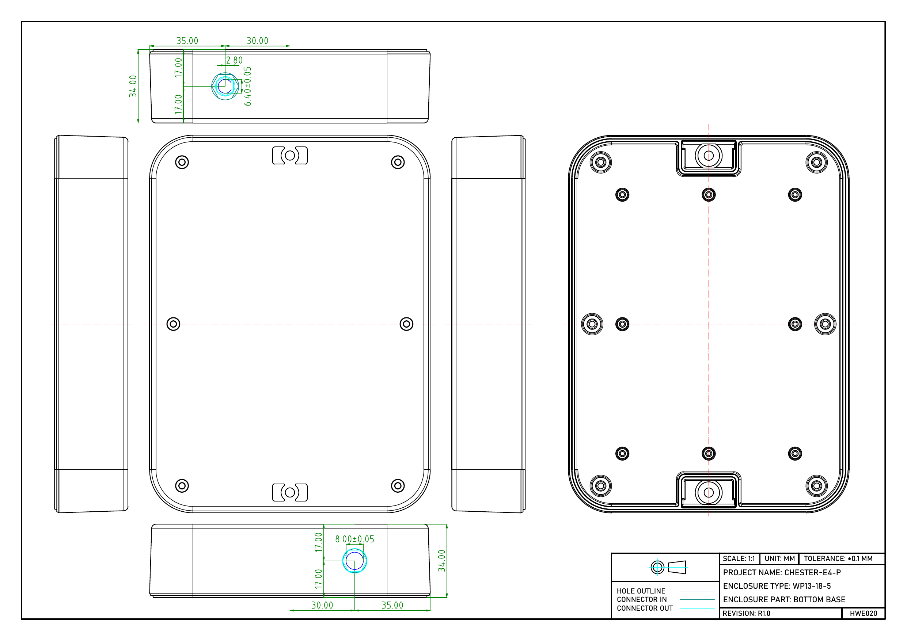
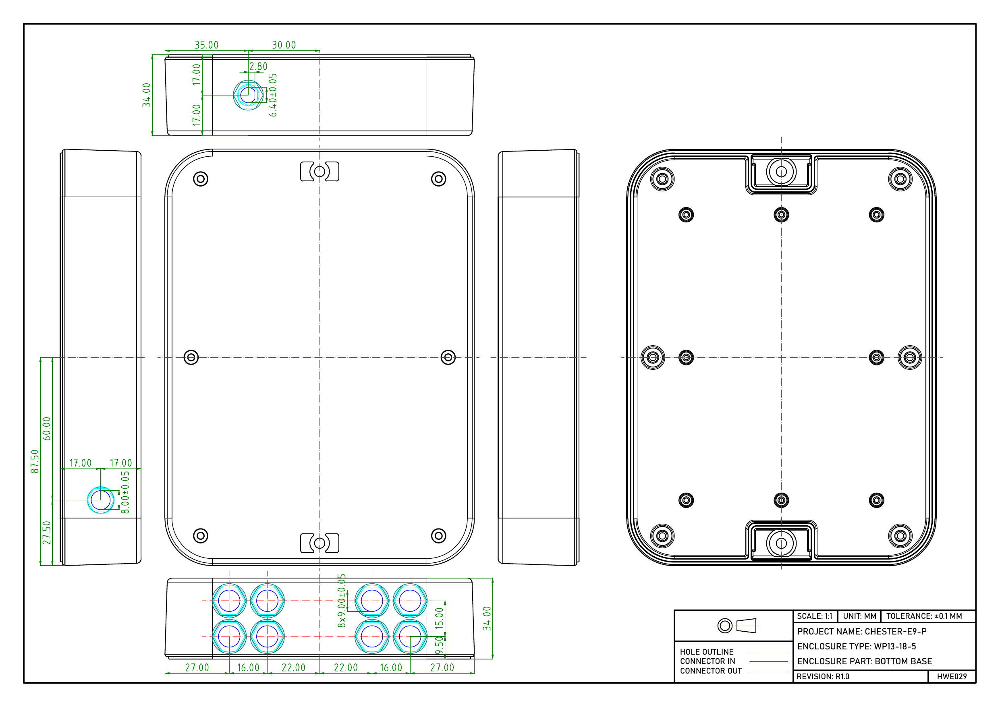
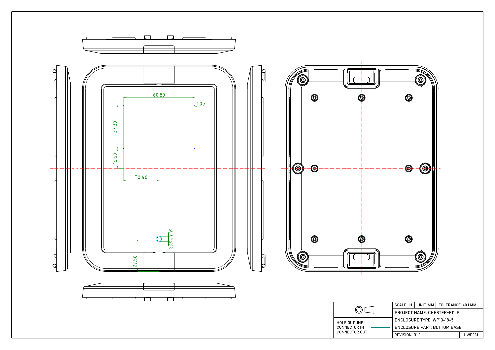
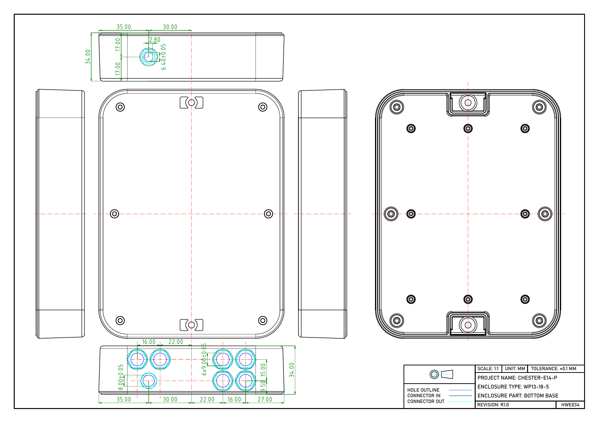

import Image from '@theme/IdealImage';

# Enclosures

Standard CHESTER housing comes in two colors - light grey and dark grey. The enclosure has dimensions of 130x175x45mm and is IP67 rated.

It can be mounted using:

* Screws through the mounting holes
* Special zip tie holders (pole is possible)
* Duck tape
* Double-sided sticker (e.g., 3M Dual-Lock)

:::tip

You can also place the CHESTER device in an alternative enclosure. HARDWARIO produces carrier boards for larger housings - those can bring the benefit of bigger battery packs and other electrical interfaces. See the article [**Power Management**](../power-management.md).

:::

## List of Enclosures

| Ordering Code                   | Application                    | Drawings                                                                                            | Dimensions   | Note    |
| ------------------------------- | ------------------------------ | --------------------------------------------------------------------------------------------------- | ------------ | ------- |
| [CHESTER-E1-P](#chester-e1-p)   | CHESTER Clime                  | [PDF, DWG](https://drive.google.com/drive/folders/1qrTh-ESyX5Gc5wvI4ei5ch4PCqS_13PQ?usp=share_link) | 130x175x45mm |         |
| [CHESTER-E2-P](#chester-e2-p)   | CHESTER Counter                | [PDF, DWG](https://drive.google.com/drive/folders/1fY_ZctK-RikWE9OMBusjhma8NF4d71MC?usp=share_link) | 130x175x45mm |         |
| [CHESTER-E3-P](#chester-e3-p)   | CHESTER Input/Current          | [PDF, DWG](https://drive.google.com/drive/folders/1qQTzODZX1Zhrws0NxXroMBXYKcKpPybQ?usp=share_link) | 130x175x45mm |         |
| [CHESTER-E4-FP](#chester-e4-fp) | CHESTER Push                   | [PDF, DWG](https://drive.google.com/drive/folders/1WD288IwSFsNtj_xP8cecr3PGVlytVS_F?usp=share_link) | 130x175x45mm |         |
| [CHESTER-E5-P](#chester-e5-p)   | CHESTER Scale                  | [PDF, DWG](https://drive.google.com/drive/folders/1g_SvJHfd3WRkuh3e0XdgdiKIFF9hFwKg?usp=share_link) | 130x175x45mm |         |
| [CHESTER-E6-P](#chester-e6-p)   | CHESTER Scan, Signal and Track | [PDF, DWG](https://drive.google.com/drive/folders/15kpHDrVu1uCxgZAEZ0312XfH3SvxBV_G?usp=share_link) | 130x175x45mm |         |
| [CHESTER-E7-P](#chester-e7-p)   | CHESTER Clime IAQ              | [PDF, DWG](https://drive.google.com/drive/folders/1X3-ttePwM-r7DTpEgl4R3vjnLez9Xbuo?usp=share_link) | 130x175x45mm | S1      |
| [CHESTER-E8-P](#chester-e8-p)   | CHESTER Input 8x               | [PDF, DWG](https://drive.google.com/drive/folders/1vnReX3ubZRE3E8DyG23fBtbP4V3IYmj5?usp=share_link) | 130x175x45mm |         |
| [CHESTER-E9-P](#chester-e9-p)   | CHESTER Input 8x + DC          | [PDF, DWG](https://drive.google.com/drive/folders/1x-SX5Ptp0Lycv_McHSDl3HfBxE19uJYR?usp=share_link) | 130x175x45mm |         |
| [CHESTER-E10-P](#chester-e10-p) | CHESTER Meteo                  | [PDF, DWG](https://drive.google.com/drive/folders/15jU-lIsX8j2Crkn0YvmLnRR6PslmCMx8?usp=share_link) | 130x175x45mm |         |
| [CHESTER-E11-P](#chester-e11-p) | CHESTER + D1                   | [PDF, DWG](https://drive.google.com/drive/folders/1hhhFRvVTi9v6qCXk2hwuyPyHJzZwHnLd?usp=share_link) | 130x175x45mm | Display |
| [CHESTER-E12-P](#chester-e12-p) |                                | [PDF, DWG](https://drive.google.com/drive/folders/1mrVGtLleTyA_AE5TrVoSKhX6zAlAR4gJ?usp=share_link) | 130x175x45mm |         |
| [CHESTER-E13-P](#chester-e13-p) |                                | [PDF, DWG](https://drive.google.com/drive/folders/1PhwrrDn9ESvsTwKnC4Y0oqstHBXrwB2Q?usp=share_link) | 130x175x45mm |         |
| [CHESTER-E14-P](#chester-e14-p) |                                | [PDF, DWG](https://drive.google.com/drive/folders/1V43HZY4Kir_8Ix0yqivcA9rbry8Jqe1o?usp=share_link) | 130x175x45mm |         |
| [CHESTER-E15-P](#chester-e15-p) |                                | [PDF, DWG](https://drive.google.com/drive/folders/1LfwICFUwUvjgLA2I4hvRNlb83CDk9iRv?usp=share_link) | 130x175x45mm |         |
| [CHESTER-E16-P](#chester-e16-p) |                                | [PDF, DWG](https://drive.google.com/drive/folders/1W2w6jxQ_UlKVscmqSJ1KXJq_TzT0NKdh?usp=share_link) | 130x175x45mm |         |
| [CHESTER-E17-P](#chester-e17-p) | CHESTER with C1 (Ekoterm)      | [PDF, DWG](https://drive.google.com/drive/folders/11rrDZNTAP2kITCBA1Y_r4zJ28U3h6vg-?usp=share_link) | 200x280x65mm |         |
| [CHESTER-E18-P](#chester-e18-p) | CHESTER with C2 (Axilera)      |                                                                                                     | 200x280x65mm |         |
| [CHESTER-E19-P](#chester-e19-p) | CHESTER with B1 (wM-BUS)       |                                                                                                     | 200x280x65mm |         |

## Ordering Codes

Suffix explanation:

- `-L` Light color enclosure
- `-P` SMA Pigtail for optional external LTE antenna
- `-F` Is a code for buttons in the E4 top cover enclosure. See its usage in [CHESTER-Z Ordering Codes](../ordering-codes.md#chester-z) (`1`-`F` or `X`).

### CHESTER-E1-P

### CHESTER-E2-P

### CHESTER-E3-P

### CHESTER-E4-FP

### CHESTER-E5-P

### CHESTER-E6-P

### CHESTER-E7-P

### CHESTER-E8-P

### CHESTER-E9-P

### CHESTER-E10-P

### CHESTER-E11-P

### CHESTER-E12-P

### CHESTER-E13-P

### CHESTER-E14-P

### CHESTER-E15-P

### CHESTER-E16-P

### CHESTER-E17-P

### CHESTER-E18-P

### CHESTER-E19-P
