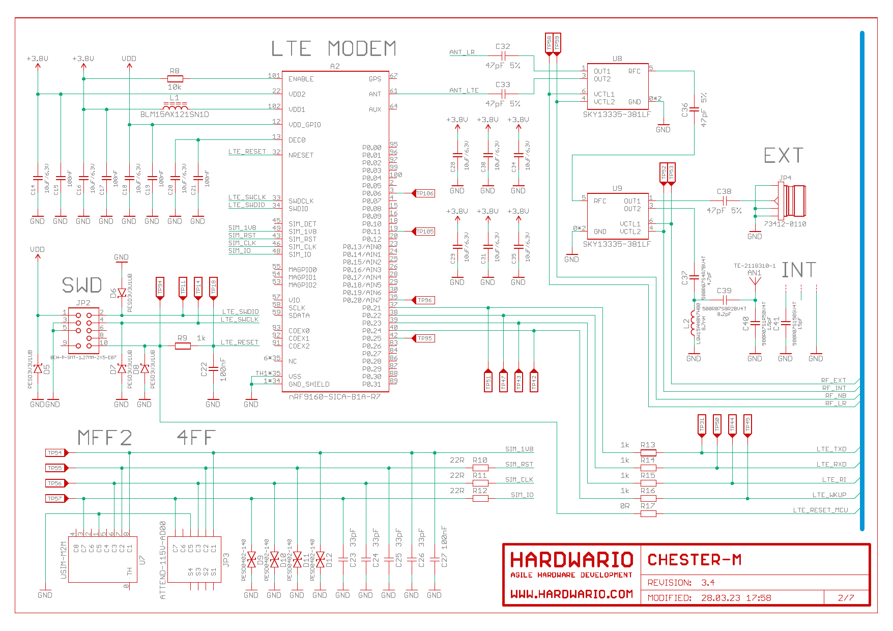
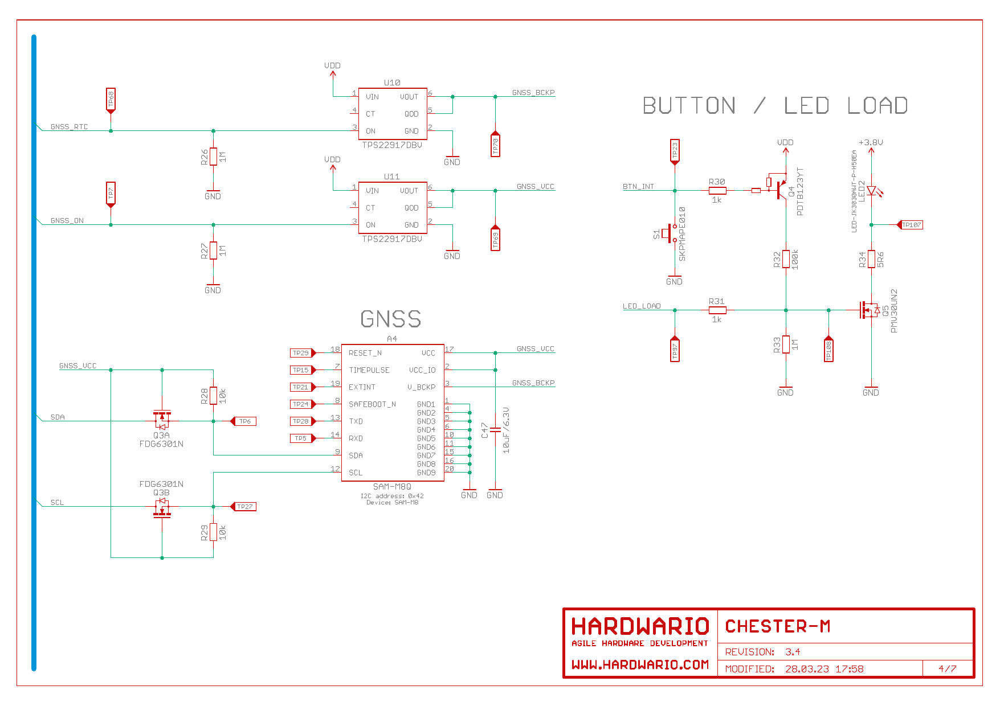
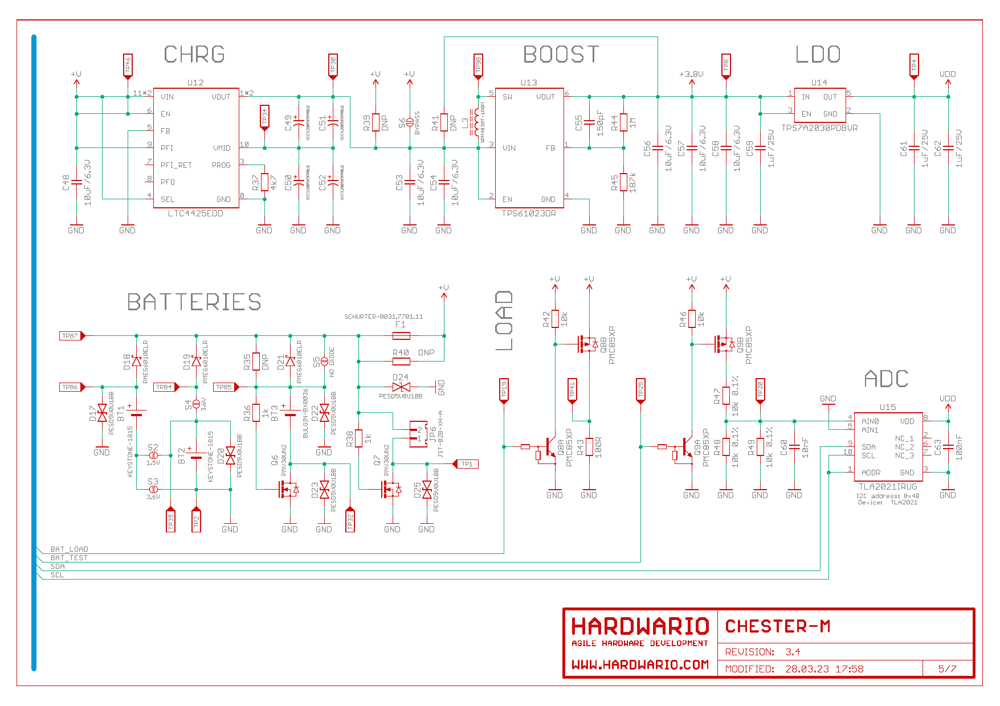
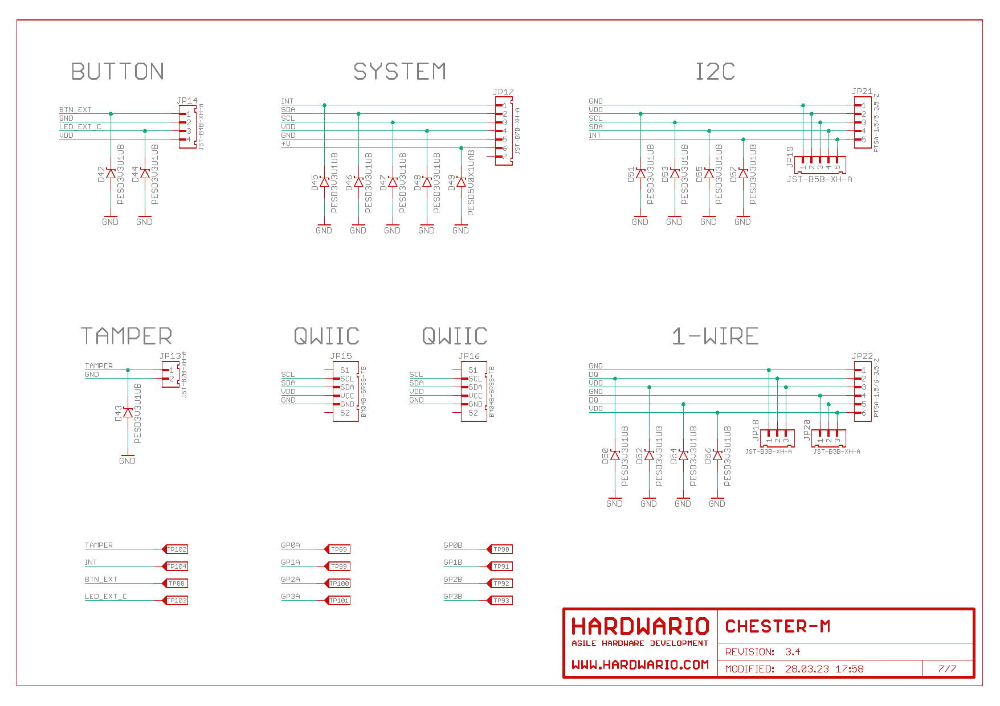

import Image from '@theme/IdealImage';

# Schematic Diagram

A schematic diagram is useful if you program low-level hardware-related code or if you're just curious about how the system is designed.

- [Schematic R3.4 (PDF)](hio-chester-m-r3.4.pdf)
- [Interactive PCB connector, part, testpoint and signal browser R3.4](pathname:///download/ibom/chester-m-r3.4.html)

## MCU

## LTE

## LoRaWAN

## GNSS

## Power

## Terminals

## Nets

