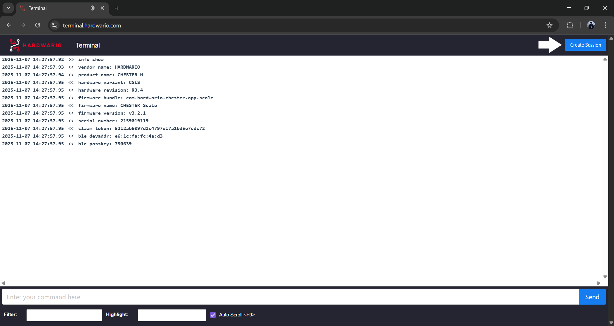
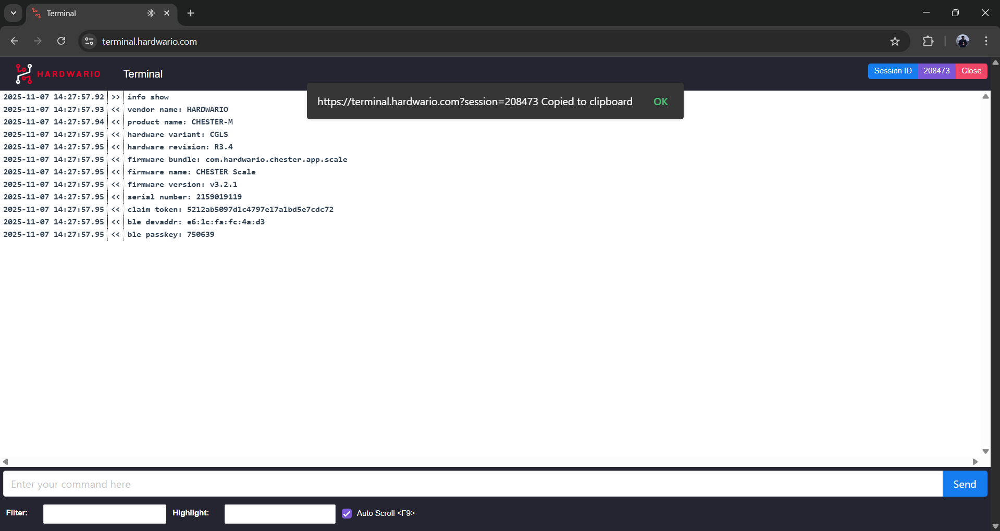

import Image from '@theme/IdealImage';

The [**HARDWARIO Terminal**](https://terminal.hardwario.com/)   is a Google Chrome-based terminal tool that allows users to interact directly with HARDWARIO devices and modules through their browser, all **without the need** to install **additional software**.

**Available here:** [**https://terminal.hardwario.com/**](https://terminal.hardwario.com/)  

:::info
**Please note**: the HARDWARIO terminal works **only in Google Chrome**.
:::

---

### Remote Support and Quick Assistance

A key advantage of the Chrome Terminal is its built-in **remote session** feature.  
Using **“Create Session”** (found in the **top-right corner**), our support team can quickly connect to your device for **fast remote troubleshooting and assistance**.

### How to Create a Remote Session

1. Click **“Create Session”** in the **top-right corner**.  
2. A **Session ID** will appear in the top-right corner (as shown in the screenshot below).  
3. Click the **Session ID** to copy the unique link to your clipboard.  
4. Send this link to the remote user/support engineer.  
5. Then the remote user/support engineer can open the link in **Google Chrome** to access your device remotely.  
6. Both sides can see all commands in real time

