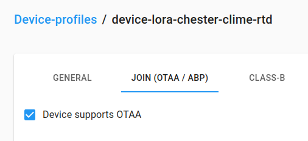

import Image from '@theme/IdealImage';

CHESTER-M mainboard contains also LoRaWAN radio. [Catalog applications](catalog-applications/index.md) have both NB-IoT/LTE-M and LoRaWAN radio populated. Thanks to this you can easily switch to different radio just by a software reconfiguration.

CHESTER is using **CMWX1ZZABZ-078** module from **Murata**. This module has manufacturer firmware that takes care of all the LoRaWAN communication. It is also possible to flash our own [lora-modem](https://github.com/hardwario/lora-modem) open-source firmware, which is backward-compatible with the manufacturer's, but also adds more functionality and higer LoRaWAN version support. It is also [very well documented](https://github.com/hardwario/lora-modem/wiki/AT-Command-Interface), however this AT communication is handled by CHESTER so all you need is to set-up keys as explained below.

The standard **CMWX1ZZABZ-078** module from **Murata** uses LoRaWAN standard 1.0.2 release B.

---

## Network Mode Configuration

Some catalog firmwares allows configuration to use NB-IoT/LTE or LoRaWAN network. This firmware after power-up is not sending data, the **LED is blinking yellow** and you need to configure correct radio mode.

This `app mode` configuration is needed currently for these catalog applications:

- [CHESTER Clime]([chester-clime.md](https://docs.hardwario.com/chester/catalog-applications/chester-clime))
- [CHESTER Current]([chester-current.md](https://docs.hardwario.com/chester/catalog-applications/chester-current))
- [CHESTER Push]([chester-push.md](https://docs.hardwario.com/chester/catalog-applications/chester-push))

The default functionality is that a device **does not use any radio** (mode `none`) and you need to set configuration parameter **mode**.

- `app config mode lte` for NB-IoT/LTE network
- `app config mode lrw` for LoRaWAN network

Then apply changes by typing `config save`. The device will reboot and use the correct network.

---

## EMBER LoRaWAN Gateway

We also offer **LoRaWAN gateway EMBER** ([EMBER docs](../../ember), [EMBER e-shop](https://shop.hardwario.com/ember/)). This gateway can manage LoRaWAN communication with CHESTER and network software could be running in our HARDWARIO Cloud, or completely in your infrastructure. LoRaWAN network is very flexible, reliable with long range and we use it in big factories or large open areas.

EMBER is using [CHIRPSTACK](https://www.chirpstack.io/) and [Node-RED](https://nodered.org/) for device management and further integrations.

---

## CHESTER LoRaWAN Configuration

Here is an example configuration parameters that CHESTER supports. You can use these tools to configure network keys and configuration:
- [HARDWARIO Manager](../platform-connectivity/hardwario-manager.md)
- [HARDWARIO Terminal](https://terminal.hardwario.com/) experimental Chrome BLE console
- J-Link with [HARDWARIO CLI Console](../developer-tools/command-line-tools.md#interactive-console)

:::tip

Not all catalog firmwares support switching NB-IoT/LTE-M to LoRaWAN radio over config. Please let us know so we can build firmware exactly for your needs.

:::

There are a lot of configurations like **ABP** or **OTAA** authentication. The modem can be also set to fixed datarate to get the longest range. It also supports class **A** and **C** modes for receiving downlink messages.

To show the current configuration, type `lrw config show` to print a complete configuration.

```
lrw config test false
lrw config antenna int
lrw config band eu868
lrw config chmask
lrw config class a
lrw config mode otaa
lrw config nwk private
lrw config adr true
lrw config datarate 0
lrw config dutycycle true
lrw config devaddr 66445903
lrw config deveui 0000000000000000
lrw config joineui 0000000000000000
lrw config appkey 00000000000000000000000000000000
lrw config nwkskey 00000000000000000000000000000000
lrw config appskey 00000000000000000000000000000000
```

To see the difference between OTAA and ABP we suggest reading [The Thing Industries ABP vs OTAA article](https://www.thethingsindustries.com/docs/devices/abp-vs-otaa/).

### OTAA Configuration

Keys are exchanged automatically during **Join** process when the CHESTER boots up.
This configuration is easiest to set-up and use.

In the **CHIRPSTACK** device profile in the **JOIN (OTAA/ABP)** tab enable **Device supports OTAA**.


When you create a device, in CHIRPSTACK you can auto-generate keys and save them to the device.

When you copy Appkey from the CHIRPSTACK, click on the **eye symbol** to show the key and copy it manually - select the key by mouse and choose copy. Do not use copy button in the older CHIRPSTACKs, there is a bug.

Also, the key has spaces so in the CHESTER shell you have to put key in quotation marks **"11 22 33 ... ee ff"**.

```
lrw config mode otaa
lrw config nwk private
lrw config dutycycle false

lrw config deveui <your-deveui>
lrw config appkey "<your-appkey>"

config save
```

### ABP Configuration

Keys are entered manually. In some cases, this is a better solution in fixed installation when the device signal is on the edge.
We use this configuration with **ADR** (Automatic data rate) disabled to the network has a fixed communication speed.

In the CHIRPSTACK device profile in the JOIN (OTAA/ABP) tab **disable** Device supports OTAA and enter these configuration parameters for EU868:

- RX1 delay: `0`
- RX1 data-rate offset: `0`
- RX2 data-rate: `3`
- RX2 channel frequency (Hz): `869525000`
- Factory-preset frequencies (Hz): `868100000, 868300000, 868500000, 867100000, 867300000, 867100000, 867700000, 867900000`

For generating keys you can this [online generator tool](https://loratools.nl/#/keys) for testing and development, for production use an offline generator just to be safe.

Then you configure CHESTER

```
lrw config mode abp
lrw config nwk private
lrw config dutycycle false

lrw config deveui <deveui>
lrw config devaddr <devaddr>
lrw config nwkskey <nwkskey>
lrw config appskey <appskey>
```


You might also disable adaptive data rate and set fixed one ([EU868 data rates](https://www.thethingsnetwork.org/docs/lorawan/regional-parameters/#eu863-870-data-rates)):

```
lrw config adr false
lrw config datarate 3

config save
```

Note, that lower data rate means a lower payload that can reach [as low as 51 bytes](https://www.thethingsnetwork.org/docs/lorawan/regional-parameters/#eu863-870-maximum-payload-size). This is 51 bytes for a complete LoRaWAN packet, not only your useful payload.

### CHIRPSTACK Configuration 

The following table provides a summary of the recommended configuration parameters for CHESTER devices within the ChirpStack v4 environment.

| **Parameter** | **Value** |
|----------------|-----------|
| **General – MAC version** | **LoRaWAN 1.0.4** |
| **General – Regional parameters revision** | **A** |
| **General – ADR algorithm** | **Default ADR algorithm (LoRa only)** |
| **Join (OTAA/ABP) – Device supports OTAA** | **ON** |
| **Class-B – Device supports Class-B** | **OFF** |
| **Class-C – Device supports Class-C** | **OFF** |

:::info
If you are unsure about the **ChirpStack setup** or **configuration**, please refer to the following guide, which provides detailed instructions for installing and configuring ChirpStack v4: [**Getting Started with ChirpStack v4**](https://docs.hardwario.com/apps/chirpstack/index#getting-started-with-chirpstack-v4)
:::

## Decoders and Codecs

To correctly decode RAW binary data you have to use a decoder that outputs values with JSON.

HARDWARIO is using decoders that can be used in CHIRPSTACK or Node-RED. Let's take a look for example at CHESTER Clime [codec](https://github.com/hardwario/chester-sdk/tree/main/applications/clime/codec) folder.

It contains files:

- [cs-decoder.js](https://github.com/hardwario/chester-sdk/blob/main/applications/clime/codec/cs-decoder.js) - CHIRPSTACK decoder
- [nr-decoder.js](https://github.com/hardwario/chester-sdk/blob/main/applications/clime/codec/nr-decoder.js) - Node-RED decoder

### CHIRPSTACK Decoder

You can set the decoder in Device-profile in the **Codec** tab.

### Node-RED Decoder

For Node-RED we use connecting directly to the CHIRPSTACK MQTT broker with a MQTT out node that has set the MQTT topic to `application/<application-id>/device/+/event/up`.

Replace the `<application-id>` with your application ID. In older CHIRPSTACK it is a **0..n number**, in newer versions it is a **unique ID**.

---

## Troubleshooting

### Public vs Private Network

LoRaWAN network can be set to be private or public. It doesn't mean that the network is visible or not. It simply means that radio packets are using different preamble.

If your network or gateway does not see a single packet, it is usually because of this.

In your (Mikrotik) gateway check **Network** configuration option, then configure CHESTER with `lrw config nwk private` or `lrw config nwk public`.

Then go to the Mikrotik **Traffic** tab and see if you can see the **JOIN** packet from your device with **Dev Addr**. In this tab you see RAW encrypted packets from all devices around.
But it is useful to check if the device and gateway is using the same private/public packet prefix.

If you see packets arriving, then you might troubleshoot issues further in the CHIRPSTACK Gateways and **Live LoraWAN Frames** tab. Then only after here you can see packets, go to the Applications and look for decoded packets and troubleshoot for example wrong keys if the device's packets are not visible there.

**Netmore** is using the **public** network. To make your device's network type public, use the command `lrw config nwk public`.
